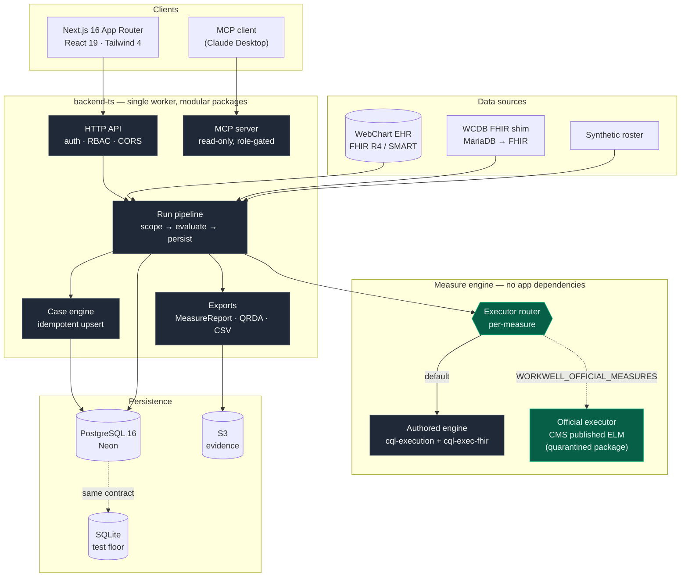
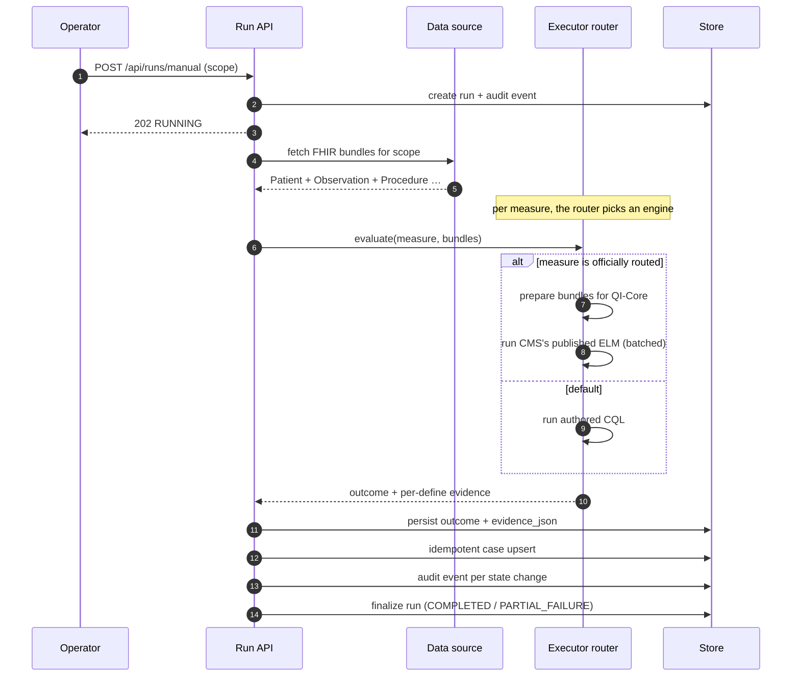

# WorkWell Measure Studio

[](https://github.com/Taleef7/workwell/actions/workflows/ci.yml)
[](https://github.com/Taleef7/workwell/actions/workflows/deploy-twh-mieweb.yml)
[](LICENSE)
[](backend-ts/package.json)
[](frontend/package.json)
[](docs/STANDARDS_CONFORMANCE.md)
[](backend-ts)

**A clinical quality measure engine that runs CMS's *own published* eCQM artifacts — not a reimplementation of them.**

WorkWell Measure Studio is an occupational-health compliance platform for **Total Worker Health**: it authors quality measures, evaluates them against FHIR patient data with a CQL engine, opens and tracks the resulting cases, and exports the evidence auditors ask for. It is built to plug into a real EHR — and does, against a live [WebChart](https://www.mieweb.com/webchart/) tenant.

> **The interesting engineering problem.** A quality measure like *"CMS125: Breast Cancer Screening"* has an official, published definition. Most systems reimplement it and hope the reimplementation agrees. This one runs the published artifact **verbatim** — the same ELM CMS ships to MADiE — and keeps a second, independently-authored implementation alongside it as a correctness oracle. Where the two disagree, the disagreement is measured, written down, and turned into a test before anything ships.

---

## Contents

- [What it does](#what-it-does) · [Architecture](#architecture) · [How a measure is evaluated](#how-a-measure-is-evaluated)
- [Standards](#standards-and-conformance) · [Engineering practices](#engineering-practices) · [Quick start](#quick-start)
- [Repository layout](#repository-layout) · [API](#api-highlights) · [Docs](#documentation-map)

---

## What it does

| | |
|---|---|
| **Author** | Measure lifecycle `Draft → Approved → Active → Deprecated`, with CQL compilation and fixture validation gating activation. Monaco-based authoring, an ELM explorer, and a no-code rule builder that *compiles to CQL* (CQL stays canonical — [ADR-015](docs/DECISIONS.md)). |
| **Evaluate** | JVM-free CQL→ELM at build time; `cql-execution` + `cql-exec-fhir` at runtime. Scoped runs (`ALL_PROGRAMS`, `MEASURE`, `SITE`, `EMPLOYEE`, `CASE`), incremental re-evaluation, and measure-major batching. |
| **Act** | Idempotent case management — outreach, assign/escalate, rerun-to-verify, full timeline. Multi-channel campaigns. Standing-order proposals and immunization forecasting behind ports. |
| **Prove** | Per-define evidence for every outcome, an append-only audit ledger, auditor packets, CSV exports, FHIR `MeasureReport`, and QRDA-III. |
| **Integrate** | FHIR R4 ingest from a live WebChart tenant over SMART Backend Services, a SQL-backed FHIR shim, a read-only MCP server (13 role-gated tools), and a MAT-compatible measure export. |

**Guardrail, enforced structurally:** AI never decides compliance. It drafts CQL and test fixtures; the CQL engine is the sole authority on outcome status. See [`docs/AI_GUARDRAILS.md`](docs/AI_GUARDRAILS.md).

---

## Architecture



**Three boundaries are enforced by tests, not convention:**

1. **The eval core is a package with two dependencies** — `packages/measure-engine/` (`@work-well/measure-engine`) depends on exactly **`cql-execution` and `cql-exec-fhir`**, uses no `node:` built-ins, and ships **no WorkWell measure content**: the catalog, the compiled ELM and the value-set expansions are constructor input, so a consumer gets the engine without our occupational-health catalog (ADR-059). Three tests hold the line — the package's own import closure, an app-side check that nothing deep-imports past its single entry point, and a containment test on what remains in `src/engine/` (content, ingress, the synthetic corpus, the CLI edge), which now *refuses* the CQL runtime and `@cqframework/cql` alike.
2. **`fqm-execution` lives in exactly one package** — `packages/official-executor/`, reached only through a lazy `await import`, policed by five boundary tests. The heavyweight official-execution dependency can never leak into the request path.
3. **Storage is a port with two adapters** — a Postgres *ceiling* and a SQLite *floor* that satisfy the same contract test, so the whole suite runs with no database.

---

## How a measure is evaluated



Every state change writes an `audit_event` — no exceptions. Case upsert is keyed `(employee, measure_version, evaluation_period)`, so a nightly re-run updates rather than duplicates, and never clobbers an operator's in-progress work.

---

## Standards and conformance

This project is deliberately careful about what it claims. [`docs/STANDARDS_CONFORMANCE.md`](docs/STANDARDS_CONFORMANCE.md) states, per surface, what is *executed and verified* versus what is *structurally aligned*.

| Surface | Standard | Level |
|---|---|---|
| Measure logic | HL7 **CQL** / ELM | Executed — JVM-free, build-time translation |
| Patient data | **FHIR R4**, US Core / **QI-Core** | Executed — official artifacts evaluate real QI-Core bundles |
| Known-answer gate | Official **MADiE** test cases (8 measures) | **410/410 exact** — a permanent CI gate |
| Terminology | **VSAC** value sets | The artifact's *own* expansions, fetched at build and pinned by SHA-256 |
| Reporting | FHIR **MeasureReport**, **QRDA-I**, **QRDA-III** | MeasureReport **validator-verified at 0 base-R4 errors**; both QRDA-I and QRDA-III at **0 findings** against the HL7 base IG |
| Second opinion | **`cqf-fhir-cr`** (HAPI, Java) over the same artifacts | **255/278 agree across six measures**, three of them 100% — the first execution of our artifacts by an engine that is not ours |
| EHR integration | **SMART Backend Services** (`private_key_jwt`) | Executed against a live tenant |

**No measure may be routed to its official artifact without a green MADiE gate.** That is a construction-time refusal, not a review convention.

---

## Engineering practices

The parts of this repo worth reading if you care about how it is built:

- **53 Architecture Decision Records** ([`docs/DECISIONS.md`](docs/DECISIONS.md)) — every non-obvious decision, with the alternatives and the consequences. Several record a decision being *reversed* by measurement or review, with the original reasoning kept rather than deleted.
- **Measure-first, then decide.** Repeatedly, a planned refusal or guard was killed because measuring showed it would fire on correct inputs. Those reversals are documented as such — the reasoning that was wrong is the useful part.
- **Guards are mutation-tested.** A check that cannot fail is worse than no check, because it reads as covered. New safety conditions are verified by breaking them and confirming exactly the intended test fails.
- **Vacuous-guard hunting.** Tests that self-skip when a fixture is missing are treated as a defect class in their own right — a suite that reads green because it never ran is worse than a red one. The sidecar-dependent gates are named explicitly in a CI step so they cannot silently drop out, and the flip checklist tells the operator to read the `skipped` count, not just `fail`.
- **Ports and adapters throughout** — measure executor, data source, value-set resolver, outreach channel, immunization forecaster, evidence bucket, store layer. Each defaults to an inert simulated implementation and is *inert unless configured*.
- **Reversibility as a design constraint.** Every seam is switchable by env var, and every switch is byte-identical to the previous behaviour when unset.
- **1604 backend tests** on the SQLite floor with no external services (1590 pass, 14 self-skip without a local Postgres or the gitignored terminology sidecar); a Postgres contract suite that runs against a local `postgres:16` when present; and Playwright E2E.

---

## Quick start

**Prerequisites** — Node.js **22.16+** (24 recommended; `pnpm install` enforces it), pnpm via Corepack, and Git submodules — `@mieweb/cloud` is vendored as one.

```bash
git clone https://github.com/Taleef7/workwell.git && cd workwell
git submodule update --init --recursive     # @mieweb/cloud — the backend will not install without it

# Backend — API, engine, exports  (http://localhost:8080)
cd backend-ts
pnpm install
pnpm typecheck && pnpm test
pnpm dev

# Frontend — dashboard, Studio, admin  (http://localhost:3000)
cd ../frontend
pnpm install
pnpm dev
```

No database or cloud account is needed: the SQLite floor and the synthetic roster make the whole app runnable offline.

### Evaluate a patient from the command line

```bash
cd backend-ts
pnpm evaluate --patient ./bundle.json --measure audiogram
```

### Compare the authored engine against CMS's published artifact

```bash
# both engines, same bundles, per-subject diff + before/after distribution
pnpm flip-snapshot --measure cms125 --source synthetic
```

---

## Repository layout

```
backend-ts/          API worker, CQL engine, run pipeline, cases, exports, MCP, stores
  src/engine/          measure content, data ingress, synthetic corpus, CLI edge (boundary-tested)
  src/wiring/          executor router, official artifacts, terminology
  packages/            measure-engine — the content-free eval core (2 deps)
                       official-executor — the sole home of fqm-execution
  measures/            authored CQL + vendored official artifacts
frontend/            Next.js 16 dashboard, Studio, admin
wcdb-fhir-shim/      standalone MariaDB → FHIR R4 shim (owns the DB driver)
docs/                architecture, data model, ADRs, deploy, conformance, journal
e2e/                 Playwright end-to-end tests
```

---

## Key routes

`/compliance` roster grid · `/programs` overview · `/programs/[id]` trend + risk outlook · `/programs/hierarchy` enterprise→location→provider→patient drill-down · `/runs` history · `/cases` worklist · `/campaigns` bulk outreach · `/measures` catalog · `/studio/[id]` authoring · `/people` cross-system identity · `/admin` integration + scheduler

## API highlights

```http
POST /api/runs/manual                                  # scoped evaluation run
GET  /api/runs/{id}/measure-report?type=summary        # FHIR MeasureReport
GET  /api/runs/{id}/qrda?format=xml                    # QRDA-III
GET  /api/runs/{id}/qrda1                              # QRDA-I export (per-subject patient data)
POST /api/runs/{id}/evaluate                           # evaluate one subject; body {measureId, qrda1} = QRDA-I import
GET  /api/measures/{id}/fidelity                       # authored vs official spec diff
GET  /api/measures/{id}/fidelity/diff                  # executed outcome diff
GET  /api/auditor/cases/{id}/packet?format=json|html   # auditor evidence packet
GET  /api/cases?status=open                            # case worklist
GET  /api/exports/outcomes?format=csv                  # evidence export
GET  /api/identity/duplicates                          # cross-system identity
```

Full surface in [`docs/ARCHITECTURE.md`](docs/ARCHITECTURE.md).

---

## Current focus

Running CMS's official published artifacts in place of the authored implementations, one measure at a time, behind `WORKWELL_OFFICIAL_MEASURES`. **CMS122 and CMS125 are routed and live in production** (2026-07-30) — both evaluate CMS's published QI-Core artifacts verbatim. CMS122 shipped a PR later than CMS125: its official numerator counts *poor* glycemic control, so the MeasureReport canonical, `improvementNotation` and population membership all had to switch together first (ADR-046), and a self-contradictory report is worse than a delayed one. Six more measures — CMS2, CMS68, CMS130, CMS138, CMS165, and CMS951 — are vendored and MADiE-gated but not routed. CMS2, CMS130, CMS138, CMS165, and CMS951 are routable but not yet routed; CMS68 is additionally not routable yet — it is an episode-of-care measure (population basis = Encounter), and the official executor's one-population-vector-per-subject mapping does not support episodes (ADR-047).

The current verification bar is the FHIR-column set in [`docs/ROADMAP_2026-08-04.md`](docs/ROADMAP_2026-08-04.md) §4; the ADR run 036–058 is in [`docs/DECISIONS.md`](docs/DECISIONS.md) and the running narrative in [`docs/JOURNAL.md`](docs/JOURNAL.md) (newest first).

**Cypress CVU+ has now run (2026-08-02).** 22 submissions of 12 generated documents to a local Cypress v7.5.1: **both QRDA Category I and Category III validate with 0 findings against the HL7 base IG** — CDA schema and Schematron alike — for CMS122 and CMS125 across the five-target synthetic corpus. It took 240 findings to get there, and two are worth stating plainly because they are the kind a matrix hides. Our own Schematron checker had **no XSD layer**, so its "0 base-HL7 errors" was true and *narrower than it read*, with 76 findings in the gap. And Category III had every required population element attached to the **wrong template** — `…27.3.3` is Aggregate Count and sat on the outer observation — so the validator reported those elements missing while the ones that satisfied the rules were validated as nothing at all.

**This is not the bar, and as of 2026-08-04 the bar itself changed.** That run measured the **export leg** over synthetic data. The Cypress **Calculation Check** path did later run, offline, and our numbers matched Cypress's own expected results exactly (64/64 and 150/150 subjects). The *submission* still came back red — and reading Cypress's source gave the reason: `extract_results_by_ids` short-circuits on measure identity. Cypress holds **CMS125v14 (QDM)**; we run **CMS125FHIR v1.0.000 (QI-Core)**, and the QI-Core artifact has no per-population UUIDs for QRDA III's identity model to carry. **QRDA Category III is an HQMF/QDM-identity format**, and no FHIR-lineage grader exists — MITRE's `cvu-fhir` was abandoned in April 2023. So **a Cypress Calculation Check green is retired as a goal** ([ADR-058](docs/DECISIONS.md)); relabelling to obtain one stays forbidden. QRDA I/III are kept as an interoperability bridge, still at 0 findings. Evidence: [`CVU_VALIDATION_RUN_2026-08-02.md`](docs/evidence/CVU_VALIDATION_RUN_2026-08-02.md), [`CVU_C2_SUBMISSION_2026-08-03.md`](docs/evidence/CVU_C2_SUBMISSION_2026-08-03.md).

**What replaced it.** A named set of FHIR-column checks, each with its scope and limits written next to it. Two ran on 2026-08-04: our MeasureReports validate at **0 base-R4 errors** with the DEQM STU5 gap measured at exactly 3 per report ([`DEQM_VALIDATION_2026-08-04.md`](docs/evidence/DEQM_VALIDATION_2026-08-04.md)), and the official artifacts were cross-executed through **HAPI's `cqf-fhir-cr`** — a genuinely independent engine, unlike `fqm-testify` and `deqm-test-server`, which both wrap the library we already run. **255/278 cases agree across six measures**, and the largest group of exceptions is isolated by construction to one CQL conjunct ([`CROSS_ENGINE_2026-08-04.md`](docs/evidence/CROSS_ENGINE_2026-08-04.md)). Those findings are written up for the HL7 CMS7-FQR track in [`CONNECTATHON_DISCREPANCIES_2026-08-04.md`](docs/evidence/CONNECTATHON_DISCREPANCIES_2026-08-04.md).

## Documentation map

| | |
|---|---|
| [Architecture](docs/ARCHITECTURE.md) | system boundaries, module map |
| [Decisions](docs/DECISIONS.md) | 53 ADRs, newest first |
| [Data Model](docs/DATA_MODEL.md) | tables, idempotency + evidence contracts |
| [Measures](docs/MEASURES.md) | the TWH measure catalog in plain English |
| [Standards Conformance](docs/STANDARDS_CONFORMANCE.md) | what we may and may not claim |
| [WebChart Mapping](docs/WEBCHART_FHIR_MAPPING.md) | EHR → FHIR crosswalk |
| [AI Guardrails](docs/AI_GUARDRAILS.md) | prompts, fallbacks, the hard rule |
| [Deploy](docs/DEPLOY.md) | environments, secrets, rollback |
| [Production Readiness](docs/PRODUCTION_READINESS_2026-07.md) | PHI/HIPAA posture, gap list |
| [Journal](docs/JOURNAL.md) | the running engineering narrative |

## Contributing

[Contributing Guide](CONTRIBUTING.md) · [Security Policy](SECURITY.md) · [Code of Conduct](CODE_OF_CONDUCT.md) · [Support](SUPPORT.md)

## License

[Apache License 2.0](LICENSE).

---

<sub>Built as an engineering collaboration with [MIE](https://www.mieweb.com/) around WebChart and Enterprise Health. Not an ONC-certified product; see [Standards Conformance](docs/STANDARDS_CONFORMANCE.md) for exactly what is and is not claimed.</sub>
