# WorkWell Measure Studio

[](https://github.com/Taleef7/workwell/actions/workflows/ci.yml)
[](https://github.com/Taleef7/workwell/actions/workflows/deploy-twh-mieweb.yml)
[](LICENSE)
[](backend-ts/package.json)
[](frontend/package.json)
[](docs/STANDARDS_CONFORMANCE.md)
[](backend-ts)

**A clinical quality measure engine that assists [WebChart](https://www.mieweb.com/webchart/) and runs CMS's own FHIR measure artifacts, not a reimplementation of them.**

WorkWell Measure Studio evaluates patients against quality measures with a CQL engine, shows who has an open care gap and why, opens and tracks the follow-up work, and exports the evidence auditors ask for.

**It assists WebChart; it does not replace it.** WebChart is the ONC-certified record that calculates and submits the practice's reported quality results. Where WebChart reports the rates, as for the Maui pilot, WorkWell's rates are an estimate, and the screens say so. WorkWell does not pursue ONC certification.

**One product, several instances.** Each deployment is configured for its setting:

- **Maui**: a sandbox for a primary-care group entering a Medicare Shared Savings Program ACO (performance year 2027). Its subjects are patients, and it runs six CMS measures on CMS's FHIR drafts.
- **TWH**: the occupational instance, for Total Worker Health. Its subjects are employees, and it runs WorkWell's own occupational and wellness measures alongside two CMS measures.

A staging stack reads FHIR from a live WebChart trial tenant. All three run on synthetic data.

**Where it sits in the JS ecosystem.** It **composes** [`fqm-execution`](https://github.com/projecttacoma/fqm-execution) and [`cql-execution`](https://github.com/cqframework/cql-execution) rather than competing with them: CMS's FHIR draft measures run through `fqm-execution` where they are routed, the authored engine runs on `cql-execution`, and the packaging ([`@work-well/measure-engine`](https://www.npmjs.com/package/@work-well/measure-engine), [`docs/PACKAGES.md`](docs/PACKAGES.md)) exists so a consumer can take the engine without WorkWell's measure catalog.

> **The interesting engineering problem.** A quality measure like *"CMS125: Breast Cancer Screening"* has an official definition. Most systems reimplement it and hope the reimplementation agrees. This one runs CMS's own logic unchanged: the ELM of CMS's FHIR draft (`CMS125FHIR` v1.0.000, posted for public comment in January–February 2026), with only its source-position markers stripped to make it deployable. For CMS122 and CMS125 it also keeps a second, independently authored implementation as a correctness oracle. Where the two disagree, the disagreement is measured, written down, and turned into a test before anything ships.

---

## Contents

- [What it does](#what-it-does) · [A tour of the product](#a-tour-of-the-product) · [Architecture](#architecture) · [How a measure is evaluated](#how-a-measure-is-evaluated)
- [What runs where](#what-runs-where) · [Standards](#standards-and-conformance) · [Engineering practices](#engineering-practices) · [Quick start](#quick-start)
- [Repository layout](#repository-layout) · [Integration surface](#the-integration-surface) · [Docs](#documentation-map)

---

## What it does

| | |
|---|---|
| **Author** | Measure lifecycle `Draft → Approved → Active → Deprecated`, with CQL compilation and fixture validation gating activation. Monaco-based authoring, an ELM explorer, and a no-code rule builder that *compiles to CQL* (CQL stays canonical). |
| **Evaluate** | JVM-free CQL→ELM at build time; `cql-execution` + `cql-exec-fhir` at runtime. Scoped runs (`ALL_PROGRAMS`, `MEASURE`, `SITE`, `EMPLOYEE`, `CASE`), incremental re-evaluation, and measure-major batching. |
| **Act** | Idempotent case management — outreach, assign/escalate, rerun-to-verify, full timeline. Multi-channel campaigns. Standing-order proposals and immunization forecasting behind ports. |
| **Prove** | Per-define evidence for every outcome, an append-only audit ledger, auditor packets, CSV exports, FHIR `MeasureReport`, and QRDA-III. |
| **Integrate** | FHIR R4 ingest from a live WebChart tenant over SMART Backend Services, a SQL-backed FHIR shim, a read-only MCP server (13 role-gated tools), and a MAT-compatible measure export. |

**Guardrail, enforced structurally:** AI never decides compliance. It drafts CQL and test fixtures; the CQL engine is the sole authority on outcome status. See [`docs/AI_GUARDRAILS.md`](docs/AI_GUARDRAILS.md).

---

## A tour of the product

The screenshots are from the TWH instance, where the subjects are employees. On Maui the subjects are patients.

| | |
|---|---|
| 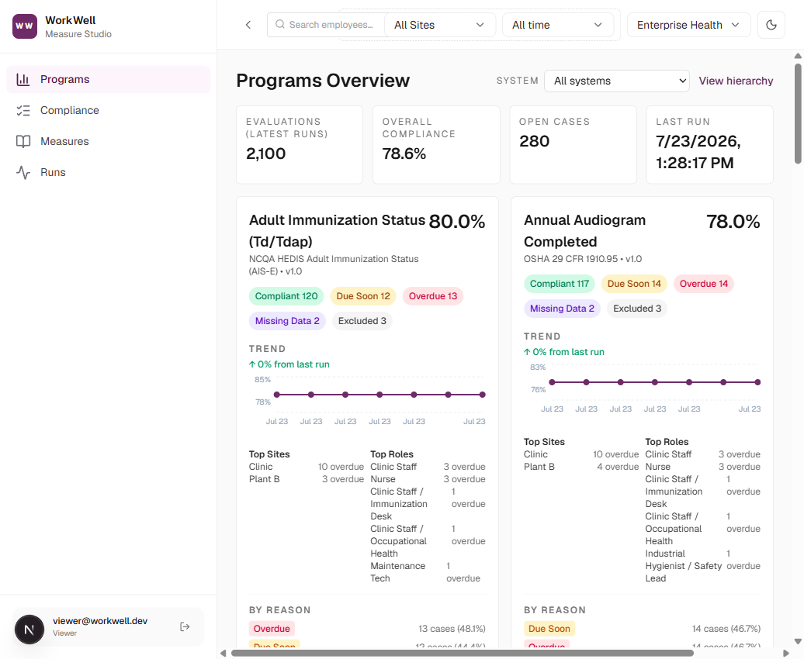 **Programs** — every measure's compliance at a glance: status buckets, trend since last run, top sites and roles, and the reasons cases are open. | 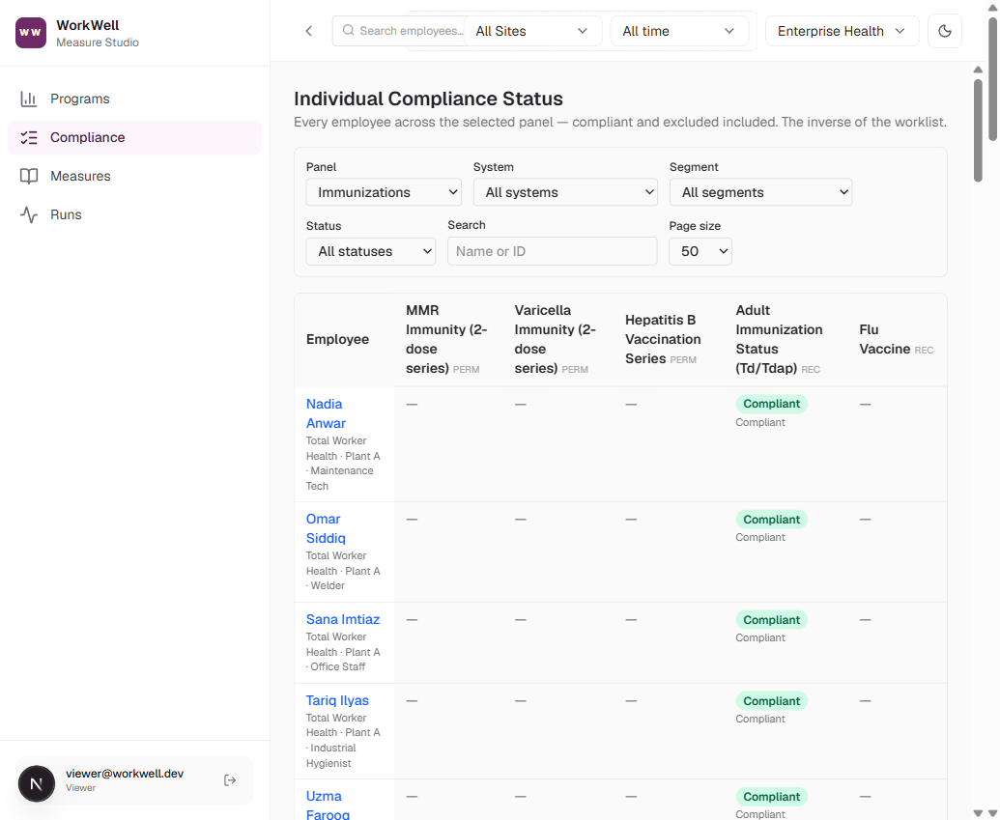 **Compliance** — the roster grid: every employee × every measure, each cell clickable through to the evidence that produced it. |
| 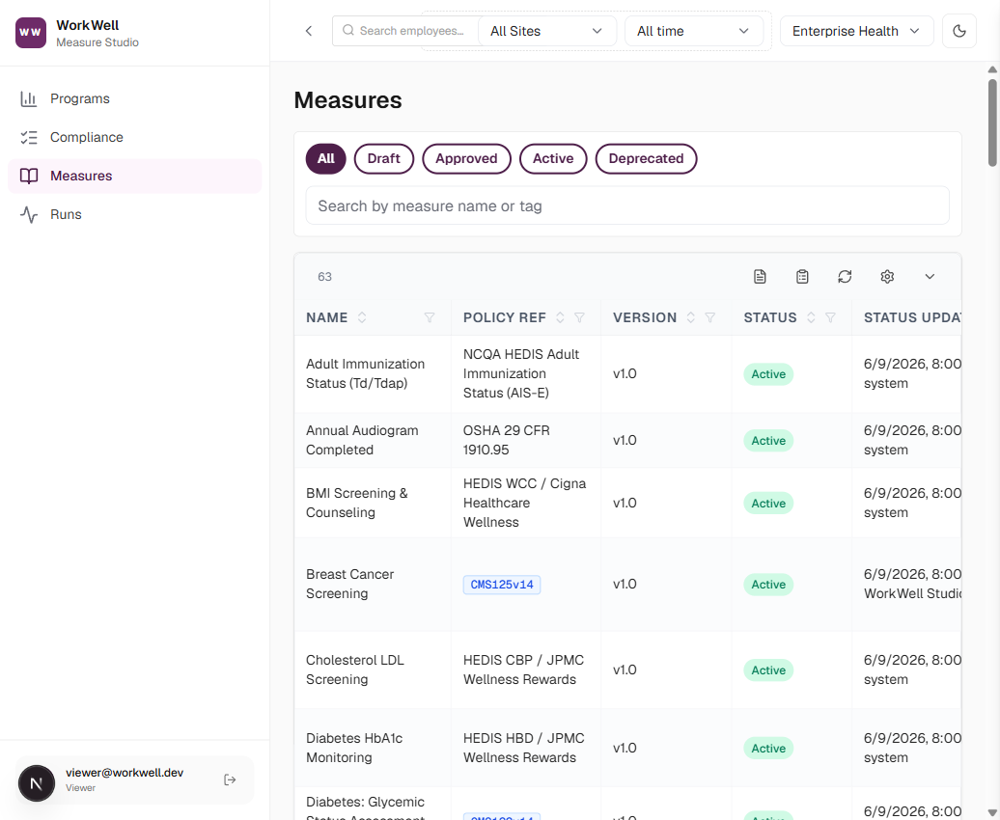 **Measures** — the catalog with lifecycle states (`Draft → Approved → Active`); each measure opens into the Studio for CQL authoring with live compilation. | 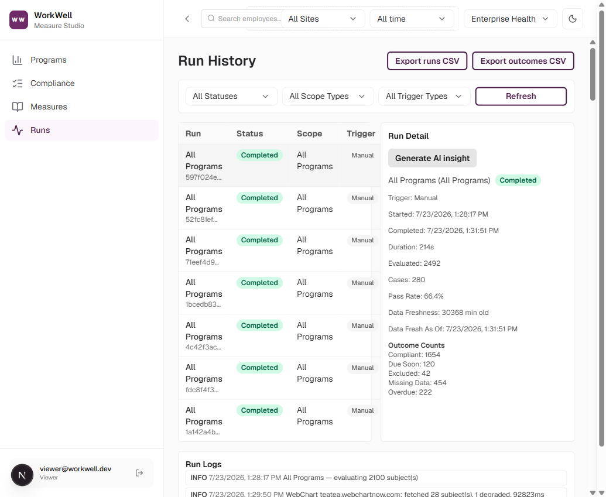 **Runs** — every evaluation run with its scope, trigger, duration, and outcome distribution; large scopes run in the background. |
| 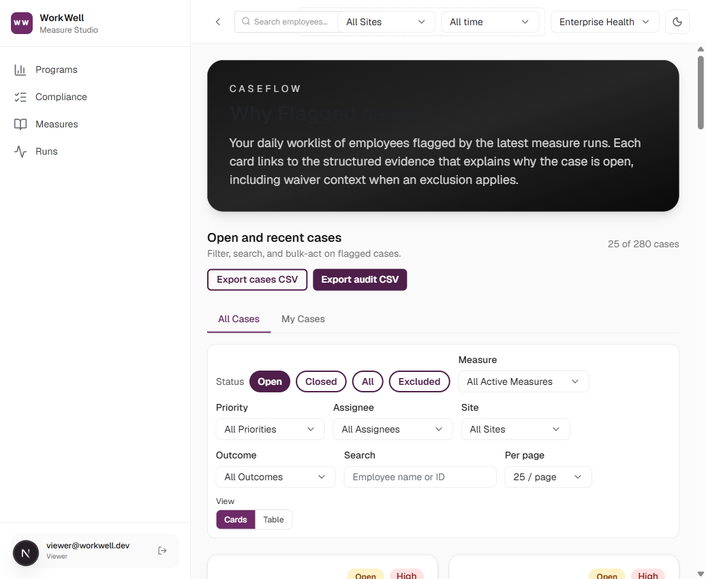 **Cases** — the daily worklist of flagged employees; filter, assign, bulk-act, export, with structured evidence and waiver context on every card. | 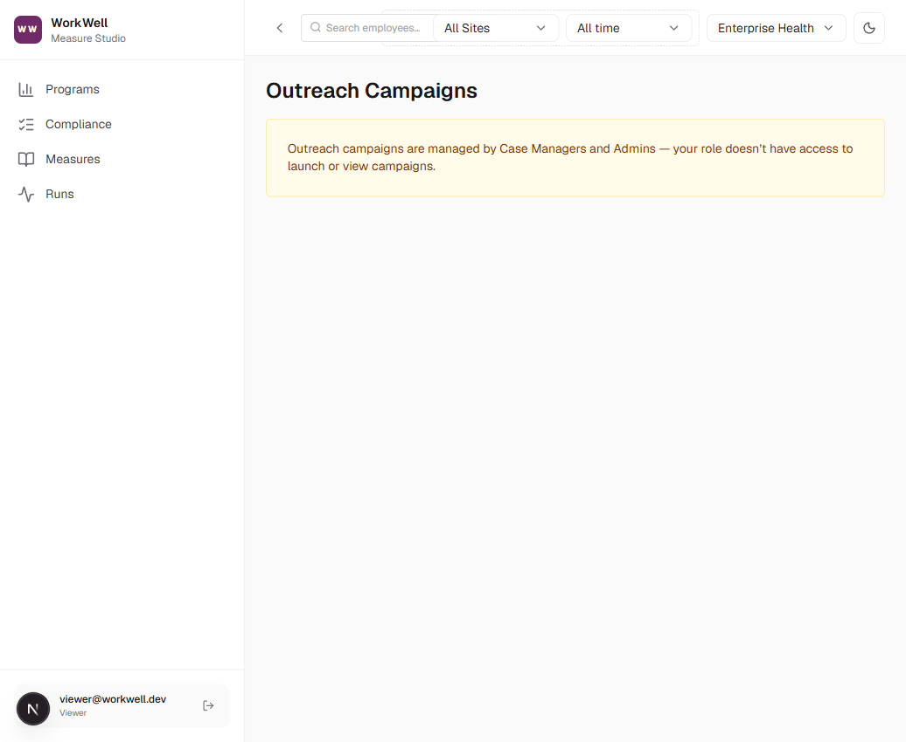 **Campaigns** — bulk outreach over a filtered case set, preview-then-confirm, with delivery status recorded per recipient. |
| 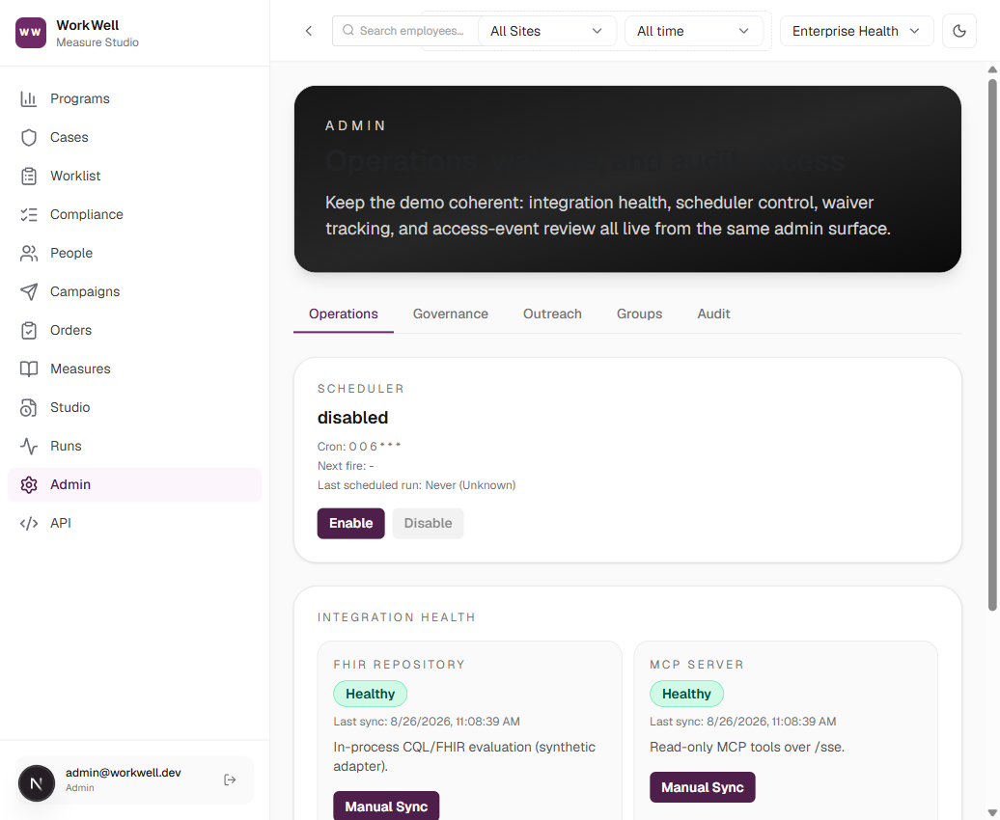 **Admin** — integration settings, the nightly scheduler, and the email provider; every setting is an audited write. (The runtime brand switcher lives in the dashboard header as a per-browser preference, not here.) | 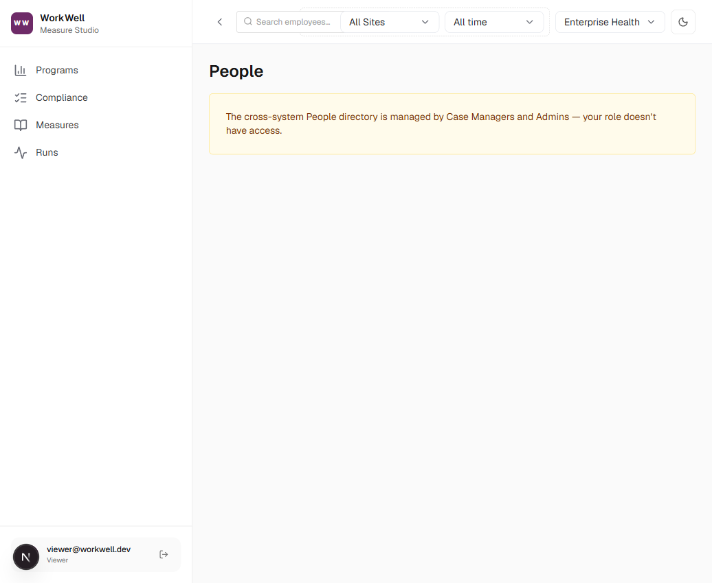 **People** — cross-system identity: potential duplicates are surfaced for human review, never auto-merged. |
| 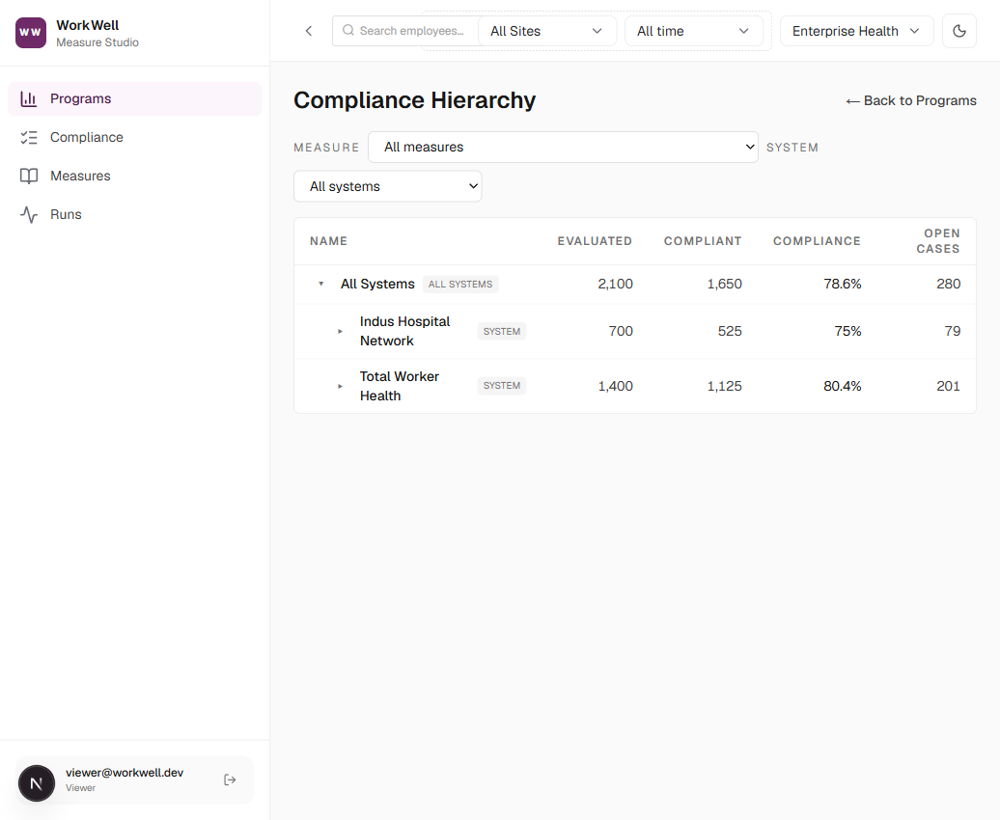 **Hierarchy** — the enterprise → location → provider → patient drill-down a multi-site quality manager works from. | |

---

## Architecture

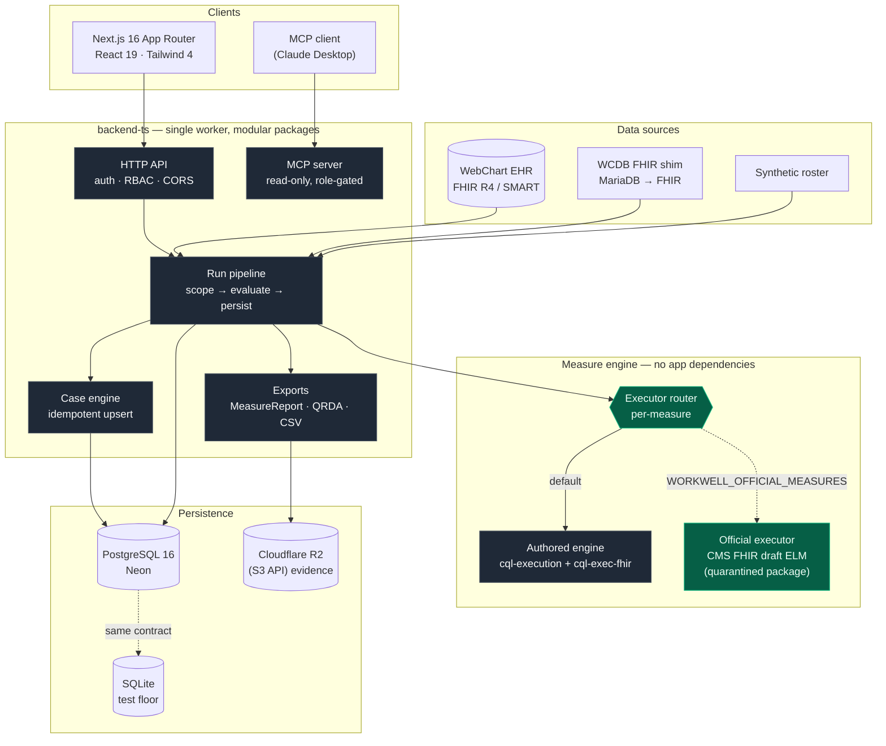
```mermaid
flowchart TB
    subgraph clients["Clients"]
        UI["Next.js 16 App Router<br/>React 19 · Tailwind 4"]
        MCP["MCP client<br/>(Claude Desktop)"]
    end

    subgraph worker["backend-ts — single worker, modular packages"]
        API["HTTP API<br/>auth · RBAC · CORS"]
        RUN["Run pipeline<br/>scope → evaluate → persist"]
        CASE["Case engine<br/>idempotent upsert"]
        EXPORT["Exports<br/>MeasureReport · QRDA · CSV"]
        MCPS["MCP server<br/>read-only, role-gated"]
    end

    subgraph engine["Measure engine — no app dependencies"]
        ROUTER{{"Executor router<br/>per-measure"}}
        AUTH["Authored engine<br/>cql-execution + cql-exec-fhir"]
        OFF["Official executor<br/>CMS FHIR draft ELM<br/>(quarantined package)"]
    end

    subgraph data["Data sources"]
        WC[("WebChart EHR<br/>FHIR R4 / SMART")]
        SHIM["WCDB FHIR shim<br/>MariaDB → FHIR"]
        SYN["Synthetic roster"]
    end

    subgraph store["Persistence"]
        PG[("PostgreSQL 16<br/>Neon")]
        SQLITE[("SQLite<br/>test floor")]
        S3[("Cloudflare R2<br/>(S3 API) evidence")]
    end

    UI --> API
    MCP --> MCPS
    API --> RUN --> ROUTER
    ROUTER -->|default| AUTH
    ROUTER -.->|"WORKWELL_OFFICIAL_MEASURES"| OFF
    WC & SHIM & SYN --> RUN
    RUN --> CASE --> PG
    RUN --> EXPORT --> S3
    RUN --> PG
    PG -.->|"same contract"| SQLITE

    classDef dark fill:#1f2937,stroke:#4b5563,color:#f9fafb
    classDef accent fill:#065f46,stroke:#10b981,color:#ecfdf5
    class ROUTER,OFF accent
    class API,RUN,CASE,EXPORT,MCPS,AUTH dark
```

**Three boundaries are enforced by tests, not convention:**

1. **The eval core is a package with two dependencies** — `packages/measure-engine/` (`@work-well/measure-engine`) depends on exactly **`cql-execution` and `cql-exec-fhir`**, uses no `node:` built-ins, and ships **no WorkWell measure content**: the catalog, the compiled ELM and the value-set expansions are constructor input, so a consumer gets the engine without WorkWell's measure catalog. Three tests hold the line — the package's own import closure, an app-side check that nothing deep-imports past its single entry point, and a containment test on what remains in `src/engine/` (content, ingress, the synthetic corpus, the CLI edge), which now *refuses* the CQL runtime and `@cqframework/cql` alike.
2. **`fqm-execution` lives in exactly one package** — `packages/official-executor/`, reached only through a lazy `await import`, policed by five boundary tests. The heavyweight official-execution dependency can never leak into the request path.
3. **Storage is a port with two adapters** — a Postgres *ceiling* and a SQLite *floor* that satisfy the same contract test, so the whole suite runs with no database.

---

## How a measure is evaluated

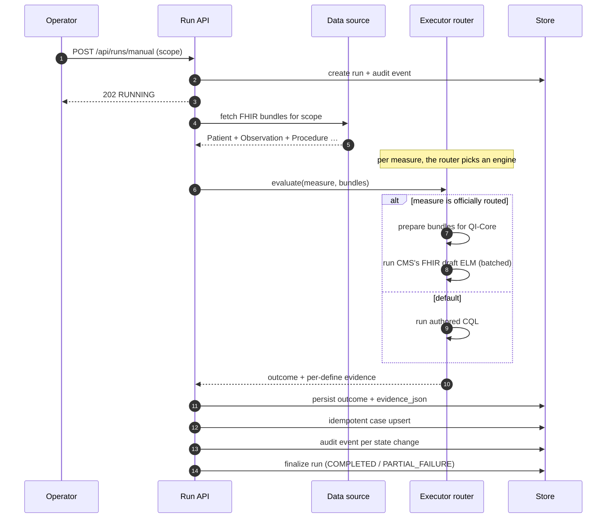
```mermaid
sequenceDiagram
    autonumber
    participant OP as Operator
    participant API as Run API
    participant SRC as Data source
    participant ENG as Executor router
    participant DB as Store

    OP->>API: POST /api/runs/manual (scope)
    API->>DB: create run + audit event
    API-->>OP: 202 RUNNING

    API->>SRC: fetch FHIR bundles for scope
    SRC-->>API: Patient + Observation + Procedure …

    Note over ENG: per measure, the router picks an engine
    API->>ENG: evaluate(measure, bundles)
    alt measure is officially routed
        ENG->>ENG: prepare bundles for QI-Core
        ENG->>ENG: run CMS's FHIR draft ELM (batched)
    else default
        ENG->>ENG: run authored CQL
    end
    ENG-->>API: outcome + per-define evidence

    API->>DB: persist outcome + evidence_json
    API->>DB: idempotent case upsert
    API->>DB: audit event per state change
    API->>DB: finalize run (COMPLETED / PARTIAL_FAILURE)
```

Every state change is meant to write an `audit_event`, but that is not yet true on every path: a few write it after the change, best-effort, so a failed write leaves the change without its event. [`docs/DATA_MODEL_CONTRACTS.md`](docs/DATA_MODEL_CONTRACTS.md) §4 lists them. Case upsert is keyed `(subject, measure, evaluation_period)`, so a nightly re-run updates rather than duplicates, and never clobbers an operator's in-progress work.

---

## What runs where

Per priority measure, three different claims — **gated** (its official MADiE test cases are a permanent CI gate), **routable** (the router's construction-time checks pass), and **routed** (a deployed environment actually runs the official artifact). Each is strictly stronger than the last, and the differences are the point:

| Measure | MADiE gate | Routable | Routed on |
|---|---|---|---|
| CMS122 (Diabetes: HbA1c > 9%) | 55/55 | ✓ | **✓ TWH** (2026-07-30) · **✓ Maui** |
| CMS125 (Breast Cancer Screening) | 66/66 | ✓ | **✓ TWH** (2026-07-30) · **✓ Maui** |
| CMS2 (Depression Screening) | 36/36 | ✓ | **✓ Maui** (2026-09-08) |
| CMS68 (Documentation of Medications) | 19/19 | **✗ episode-of-care** | — |
| CMS130 (Colorectal Cancer Screening) | 64/64 | ✓ | **✓ Maui** (2026-09-08) |
| CMS137 (SUD Treatment Initiation & Engagement) | 45/45 | ✓ multi-rate | **✓ Maui** (2026-09-08) |
| CMS138 (Tobacco Screening & Cessation) | 47/47 * | **✗ no numerator semantics** | — |
| CMS165 (Controlling High Blood Pressure) | 68/68 | ✓ | **✓ Maui** (2026-09-08) |
| CMS951 (Kidney Health Evaluation) | 55/55 | ✓ | — |

CMS68 is refused at **construction time**, not by convention: it declares `populationBasis: Encounter`, and the executor maps one population vector per subject, which cannot represent episodes. \* CMS138's green is a weaker claim than the other eight — upstream ships its bundle one value set short, so four codes are sourced from VSAC by us rather than shipped by CMS. CMS138 is refused too: it has no recorded numerator semantics yet. Only CMS122 and CMS125 also have an authored implementation, so no instance evaluates CMS68, CMS138 or CMS951 today.

**Maui is a sandbox, not a submission.** The six measures run there over a 20,000-patient generated corpus; running a real measurement year against real data is a later, separately gated decision ([`docs/PRODUCTION_READINESS_2026-07.md`](docs/PRODUCTION_READINESS_2026-07.md)). Two conditions gate the real-data phase, not the sandbox: CMS137 stays only if Quality ID 305 survives the CY2027 final rule, and CMS165 needs blood pressures profile-stamped at ingest.

**Alerting today is WorkWell-screens-only.** The CDS Hooks service is live and follows the CDS Hooks 2.0.1 shapes (self-graded), but nothing in WebChart calls it yet, and whether a WebChart client can is an open question to MIE; cards render the most recent finalized run when asked ([`docs/CDS_HOOKS.md`](docs/CDS_HOOKS.md), [guide ch. 10](docs/guide/10-scenarios.md)).

---

## Standards and conformance

This project is deliberately careful about what it claims. [`docs/STANDARDS_CONFORMANCE.md`](docs/STANDARDS_CONFORMANCE.md) states, per surface, what is *executed and verified* versus what is *structurally aligned*.

| Surface | Standard | Level |
|---|---|---|
| Measure logic | HL7 **CQL** / ELM | Executed — JVM-free, build-time translation |
| Patient data | **FHIR R4**, US Core / **QI-Core** | Executed — official artifacts evaluate synthetic QI-Core bundles |
| Known-answer gate | Official **MADiE** test cases (9 measures) | **455/455 exact**, every rate of the multi-rate CMS137 compared — a permanent CI gate |
| Terminology | **VSAC** value sets | The artifact's *own* expansions, fetched at build and pinned by SHA-256 |
| Reporting | FHIR **MeasureReport**, **QRDA-I**, **QRDA-III** | MeasureReport **validator-verified at 0 base-R4 errors**; both QRDA-I and QRDA-III at **0 findings** against the HL7 base IG |
| Second opinion | **`cqf-fhir-cr`** (HAPI, Java) over the same artifacts | **362/387 agree across eight measures**, three of them 100% and the multi-rate CMS137 at 44/45 on both rates — the first execution of our artifacts by an engine that is not ours. **one function is implicated in 22 of the 25 disagreements** across four measures — the two engines read a medication order's period differently (`CumulativeMedicationDuration.medicationRequestPeriod`). 8 of those are proven by single-variable mutation and 14 are consistent-with by inventory; 2 remain unexplained, and CMS137's one is a separate, diagnosed period boundary. CMS165 was swept too and is deliberately excluded from the total until its result is understood |
| EHR integration | **SMART Backend Services** (`private_key_jwt`) | Executed against a live tenant |

**No measure may be routed to its official artifact without a green MADiE gate.** That is a construction-time refusal, not a review convention.

---

## Engineering practices

The parts of this repo worth reading if you care about how it is built:

- **Measure-first, then decide.** Repeatedly, a planned refusal or guard was killed because measuring showed it would fire on correct inputs. Those reversals are documented as such — the reasoning that was wrong is the useful part.
- **Guards are mutation-tested.** A check that cannot fail is worse than no check, because it reads as covered. New safety conditions are verified by breaking them and confirming exactly the intended test fails.
- **Vacuous-guard hunting.** Tests that self-skip when a fixture is missing are treated as a defect class in their own right — a suite that reads green because it never ran is worse than a red one. The sidecar-dependent gates are named explicitly in a CI step so they cannot silently drop out, and the flip checklist tells the operator to read the `skipped` count, not just `fail`.
- **Ports and adapters throughout** — measure executor, data source, value-set resolver, outreach channel, immunization forecaster, evidence bucket, store layer. Each defaults to a simulated, store-backed or empty implementation and is *inert unless configured*; a default never invents clinical data.
- **Reversibility as a design constraint.** Every seam is switchable by env var, and every switch is byte-identical to the previous behaviour when unset.
- **3,268 backend tests** in CI across three shards (2026-10-03: 3,207 pass, 61 self-skip), runnable on the SQLite floor with no external services. A test self-skips when an optional input it needs is absent: in CI that is mostly the gitignored terminology sidecar, plus the live HAPI, ICE and shim endpoints; locally, without a `postgres:16`, the Postgres contract suite self-skips too. There is also a Postgres contract suite that runs against a local `postgres:16` when present, and Playwright E2E.

---

## Quick start

**Prerequisites** — Node.js **22.16+** (24 recommended; `pnpm install` enforces it), pnpm via Corepack, and Git submodules — `@mieweb/cloud` is vendored as one.

```bash
git clone https://github.com/Taleef7/workwell.git && cd workwell
git submodule update --init --recursive     # @mieweb/cloud — the backend will not install without it

# Backend — API, engine, exports  (http://localhost:8080)
cd backend-ts
pnpm install
pnpm typecheck && pnpm test
pnpm dev

# Frontend — dashboard, Studio, admin  (http://localhost:3000)
cd ../frontend
pnpm install
pnpm dev
```

No database or cloud account is needed: the SQLite floor and the synthetic roster make the whole app runnable offline.

### Evaluate a patient from the command line

```bash
cd backend-ts
pnpm evaluate --patient ./bundle.json --measure audiogram
```

### Compare the authored engine against CMS's FHIR draft artifact

```bash
# both engines, same bundles, per-subject diff + before/after distribution
pnpm flip-snapshot --measure cms125 --source synthetic
```

---

## Repository layout

```
backend-ts/          API worker, CQL engine, run pipeline, cases, exports, MCP, stores
  src/engine/          measure content, data ingress, synthetic corpus, CLI edge (boundary-tested)
  src/wiring/          executor router, official artifacts, terminology
  packages/            measure-engine — the content-free eval core (2 deps)
                       official-executor — the sole home of fqm-execution
  measures/            authored CQL + vendored official artifacts
frontend/            Next.js 16 dashboard, Studio, admin
wcdb-fhir-shim/      standalone MariaDB → FHIR R4 shim (owns the DB driver)
docs/                architecture, data model, deploy, conformance, journal
e2e/                 Playwright end-to-end tests
```

---

## Key routes

`/compliance` roster grid · `/programs` overview · `/programs/[id]` trend + risk outlook · `/programs/hierarchy` enterprise→location→provider→patient drill-down · `/runs` history · `/cases` worklist · `/campaigns` bulk outreach · `/measures` catalog · `/studio/[id]` authoring · `/people` cross-system identity · `/admin` integration + scheduler

## The integration surface

The surfaces another system can use, each documented and refusing dishonest answers rather than guessing. The card service is how WorkWell is meant to reach WebChart; the compliance API is a kept, versioned surface, not the integration contract ([`docs/LOCKED_DECISIONS.md`](docs/LOCKED_DECISIONS.md) §4A.4):

| Surface | What it is |
|---|---|
| [CDS Hooks 2.0.1](docs/CDS_HOOKS.md) — `GET /cds-services`, invoke, feedback | Care-gap **cards** into a clinician's workflow: summary, plain-English reason, provenance, and a draft-order `suggestion` the clinician accepts — never `systemActions`, never `critical`. Nothing in WebChart calls it yet. |
| [`GET /api/v1/compliance/{subject}/{measure}`](docs/COMPLIANCE_API.md) | One subject, one measure, one stable answer — status, population membership, and `populationsSource` saying where the booleans came from. **404 when no run has covered the subject**, never an empty 200. |
| `GET /api/v1/openapi.json` · public `/api-docs` | Hand-authored OpenAPI 3.1.1 over the **promised** surface only, guarded by a two-way routed-path test. |
| [MCP server](docs/MCP.md) | 13 read-only, role-gated tools (`/sse` stream + `/mcp/**` message endpoint) — an AI client reads compliance state; nothing mutates. |
| [`@work-well/measure-engine`](https://www.npmjs.com/package/@work-well/measure-engine) · [`@work-well/measure-codegen`](https://www.npmjs.com/package/@work-well/measure-codegen) | The content-free eval core and codegen on the public registry, with SLSA provenance ([`docs/PACKAGES.md`](docs/PACKAGES.md)). |

### Internal API highlights

```http
POST /api/runs/manual                                  # scoped evaluation run
GET  /api/runs/{id}/measure-report?type=summary        # FHIR MeasureReport
GET  /api/runs/{id}/qrda?format=xml                    # QRDA-III
GET  /api/runs/{id}/qrda1                              # QRDA-I export (per-subject patient data)
POST /api/runs/{id}/evaluate                           # evaluate one subject; body {measureId, qrda1} = QRDA-I import
POST /$cql                                             # CQL IG Evaluation Service — data-free expression evaluation
GET  /api/measures/{id}/fidelity                       # authored vs official spec diff
GET  /api/measures/{id}/fidelity/diff                  # executed outcome diff
GET  /api/auditor/cases/{id}/packet?format=json|html   # auditor evidence packet
GET  /api/cases?status=open                            # case worklist
GET  /api/exports/outcomes?format=csv                  # evidence export
GET  /api/identity/duplicates                          # cross-system identity
```

Full surface in [`docs/ARCHITECTURE.md`](docs/ARCHITECTURE.md).

---

## Current focus

**The Maui sandbox, before performance year 2027 starts on 2027-01-01.** The six ACO measures (CMS122, CMS125, CMS2, CMS130, CMS165 and CMS137) run there on CMS's FHIR drafts. The work is the GitHub milestone "Ready for January", and [`docs/JOURNAL.md`](docs/JOURNAL.md) (newest first) is the running log. The owner's locked decisions are in [`docs/LOCKED_DECISIONS.md`](docs/LOCKED_DECISIONS.md).

**2027 logic.** CMS has not published FHIR versions of the 2027 measures, so WorkWell translates them itself, one measure at a time. A translation is labelled as WorkWell's own, never under a CMS eCQM id, and scores only the year it covers. CMS137's and CMS130's (both ww-2027.1) are routed on Maui; a measure without one still scores a 2027 period with its 2026 draft, and the measure page says which logic scored a result. On the 2027 Cypress test deck (bundle 2026.1.0), the drafts as the live stacks run them agree patient by patient for CMS122 (64/64), CMS125 (155/155), CMS130 (269/269) and CMS137 (36/36, both rates). CMS2 agrees for 375 of 379; its four differences are in the draft's logic, not the import. CMS165 cannot be loaded that way yet, because it reads only profile-tagged blood pressures.

**Cypress is evidence, not the bar.** Both QRDA Category I and III validate at 0 findings against the HL7 base IG in a local Cypress v7.5.1 ([`CVU_VALIDATION_RUN_2026-08-02.md`](docs/evidence/CVU_VALIDATION_RUN_2026-08-02.md)). A Cypress Calculation Check green was retired as a goal on 2026-08-04: Cypress grades by the QDM measure identity (`CMS125v14`), WorkWell runs the FHIR artifact (`CMS125FHIR`), and relabelling one as the other is forbidden ([`CVU_C2_SUBMISSION_2026-08-03.md`](docs/evidence/CVU_C2_SUBMISSION_2026-08-03.md)). The bar is a named set of FHIR-column checks ([`docs/ROADMAP_2026-08-04.md`](docs/ROADMAP_2026-08-04.md) §4). Among them, MeasureReports validate at 0 base-R4 errors ([`DEQM_VALIDATION_2026-08-04.md`](docs/evidence/DEQM_VALIDATION_2026-08-04.md)), and HAPI's `cqf-fhir-cr`, an engine that is not ours, agrees with ours on 362 of 387 cases across eight measures (the `CROSS_ENGINE_*` reports in [`docs/evidence/`](docs/evidence/), from [`CROSS_ENGINE_2026-08-04.md`](docs/evidence/CROSS_ENGINE_2026-08-04.md) on).

## Documentation map

| | |
|---|---|
| **[The guide](docs/guide/README.md)** | **start here — the whole system explained, chapter by chapter, with a diagram per flow** |
| [What WorkWell is](docs/WHAT_WORKWELL_IS.md) | one-page stakeholder explainer for non-engineers |
| [Normalization](docs/guide/normalization-for-quality-teams.md) | how clinical records move from the clinic EHR to a quality result |
| [Architecture](docs/ARCHITECTURE.md) | system boundaries, module map |
| [Data contracts](docs/DATA_MODEL_CONTRACTS.md) | idempotency, evidence and CSV contracts |
| [Measures](docs/MEASURES.md) | the measure catalog in plain English (TWH and Maui) |
| [Standards Conformance](docs/STANDARDS_CONFORMANCE.md) | what we may and may not claim |
| [WebChart Mapping](docs/WEBCHART_FHIR_MAPPING.md) | EHR → FHIR crosswalk |
| [AI Guardrails](docs/AI_GUARDRAILS.md) | prompts, fallbacks, the hard rule |
| [Deploy](docs/DEPLOY.md) | environments, secrets, rollback |
| [Production Readiness](docs/PRODUCTION_READINESS_2026-07.md) | PHI/HIPAA posture, gap list |
| [Journal](docs/JOURNAL.md) | the running engineering narrative |

## Contributing

[Contributing Guide](CONTRIBUTING.md) · [Security Policy](SECURITY.md) · [Code of Conduct](CODE_OF_CONDUCT.md) · [Support](SUPPORT.md)

## License

[Apache License 2.0](LICENSE).

---

<sub>Built as an engineering collaboration with [MIE](https://www.mieweb.com/) around WebChart and Enterprise Health. Not an ONC-certified product; see [Standards Conformance](docs/STANDARDS_CONFORMANCE.md) for exactly what is and is not claimed.</sub>
