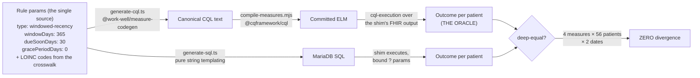
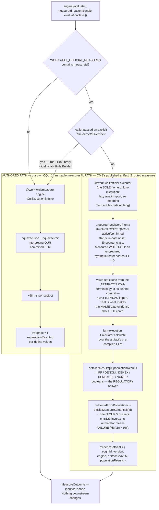
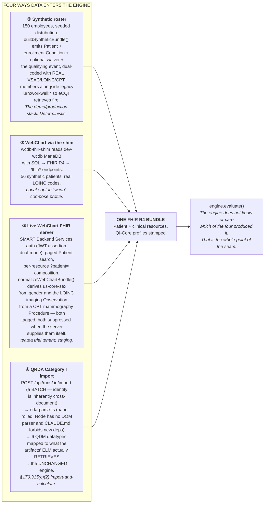

# WorkWell Measure Studio — the whole system, step by step

**Date:** 2026-08-08 · **Audience:** Doug · **Purpose:** answer the nine questions from the 2026-08-07
call with mechanism rather than labels.

> **How to read this.** Every claim here points at a file, a command, or a measured number. Where
> something is not built, or is built and then not carried forward, it says so in the same sentence.
> Section 1 answers the direction question first, because the rest only makes sense after it.
>
> **The one distinction that unlocks everything else:** there are **two clocks** in this system.
> A *build-time* clock, where CQL text becomes ELM and CMS artifacts get vendored, and a *run-time*
> clock, where nothing is translated and nothing is compiled — an interpreter walks a committed tree.
> The previous diagram drew both on one canvas with no marker between them, which is why the middle
> looked like magic. It wasn't magic; it was two different days of work drawn as one arrow.

---

## Table of contents

0. [What is borrowed, and from whom](#0-toolkit)
1. [Direction: what changed, when, and why — and what did not](#1-direction)
2. [Where SQL is, all three of them](#2-sql)
3. ["Get the CQL for a CMS measure" — the 12 steps that phrase hides](#3-vendoring)
4. ["Run the CQL" — the 21 steps that phrase hides](#4-running)
5. [The router: how one run uses two engines](#5-router)
6. [Data in: the four sources](#6-data-in)
7. [What is in Postgres, table by table, and who writes each row](#7-postgres)
8. [Exports: every one, from what, at which step, and why](#8-exports)
9. [Where in the app you can see CQL, ELM, FHIR and SQL](#9-where-to-see)
10. [The npm packages: what they do and what they refuse to do](#10-packages)
11. [The honest list: gaps, debts, and things I de-prioritised without telling you](#11-honest-list)

---

<a name="0-toolkit"></a>

## 0. What is borrowed, and from whom

Almost none of the hard parts are ours. The measure logic and the plumbing are; the language, the
compiler, the execution engine and the graders come from the organisations that define this field.
That was a deliberate choice: when a number comes out of this system, somebody else can check it.

| What | Who makes it | Why it is credible | What we use it for |
|---|---|---|---|
| **CQL** | HL7 | The standard language for clinical quality logic. CMS writes its measures in it. | Every measure we author. Every measure CMS publishes. |
| **ELM** | HL7 | The compiled form of CQL — the same relationship as source to bytecode. | What actually executes. Compiled once, committed. |
| **`@cqframework/cql`** | The CQFramework (maintains HL7's reference implementation) | It *is* the reference translator. If it disagrees with us, we are wrong. | CQL → ELM. We use their JS build, so no JVM anywhere. |
| **`cql-execution` + `cql-exec-fhir`** | MITRE | The reference JS engine for executing ELM, plus the FHIR data adapter. Nearly everything in this space builds on it. | Our engine. Runs a compiled measure against one patient bundle. |
| **`fqm-execution`** | Project Tacoma (MITRE) | The reference implementation for calculating a whole published FHIR measure. Sits on the same `cql-execution` core. | Runs CMS's own artifacts unmodified. |
| **`cqframework/dqm-content-qicore-2025`** | The CQFramework | The published home of the FHIR versions of CMS measures, with test cases. | Where we fetch a CMS measure from, at a pinned commit. |
| **MADiE test cases** | CMS measure authors | The expected answers the measure's own authors publish. An outside grader we cannot argue with. | Our gate: 410/410 across 8 measures. Nothing routes without it. |
| **VSAC** | National Library of Medicine | The national authority for the code lists measures depend on. | Completing code lists that upstream ships capped at 1000. |
| **Cypress** | MITRE, open source | The official ONC certification test harness. | Validated both QRDA document types. Both at 0 findings. |
| **HAPI FHIR / `cqf-fhir-cr`** | Smile CDR + the CQFramework (Java) | An independent engine sharing no code with ours. | Cross-executed our artifacts as a second opinion: 255/278. |
| **FHIR R4, QI-Core, US Core** | HL7 | The data format and the clinical profiles CMS measures are written against. | The shape of everything the engine reads. |
| **QRDA I / III** | HL7 | The document formats for quality reporting. | What we export for interoperability. |

The point: a claim like "this employee is overdue" traces to a published measure, run on a reference
engine, against a code list from the NLM, graded by test cases the measure's own authors wrote. That
traceability is the product. The code is the cheap part.

---

<a name="1-direction"></a>

## 1. Direction: what changed, when, and why — and what did not

### 1.1 The short version

I did not pivot away from WebChart, and I did not remove SQL. What happened is narrower and worse in
one specific way: **I built the SQL path you asked for, proved it, and then stopped investing in it
for three weeks without telling you.** The diagram then drew the subsystem I *had* been working on
and labelled it "the app," which made it look like the SQL had been deleted.

Here is the actual sequence, with dates.

| Date | Event | Effect on the SQL / WebChart direction |
|---|---|---|
| 2026-06-19 | E9 / #78 decision memo (`docs/CQL_TO_SQL_BRIDGE_DECISION_MEMO.md`) | Framed your "CQL→SQL" phrase as three options, recommended hybrid, and **asked you five gating questions**. No code. |
| 2026-07-19 | Your call: two directives | (1) build our own FHIR shim over the WebChart MariaDB dev DB; (2) **"CQL→SQL is very valuable to me"** — generate SQL, run it against the WebChart DB, return numerator/denominator. |
| 2026-07-20 | Both directives **BUILT** (PRs #308–#315, ADR-034) | Shim live at `:8085`; `pnpm generate:sql`; shim `/compliance` API executing generated SQL; **parity gate green — 4 measures × 56 patients × 2 dates, zero SQL-vs-CQL divergence**. |
| 2026-07-24 | Nicole meeting | Corrections: run the **official published CQL**, never reauthor it; the real EHR proof path is QRDA-I ingest→calculate→export; 8 priority measures. New roadmap. **SQL was not cancelled — it was simply not in the next milestone.** |
| 2026-08-04 | Roadmap re-cut (ADR-058) | WorkWell is supplementary to WebChart and does **not** pursue ONC certification (WebChart carries it). Engine + packaging becomes the primary deliverable. |
| 2026-08-07 | Your call | The diagram omitted the shim and the SQL entirely. Fair hit. |

### 1.2 So what *is* the direction, in one paragraph

**WorkWell is a measure engine and an authoring studio, not an EHR.** It takes clinical data in FHIR
R4 shape, runs quality/surveillance measure logic over it, and emits results plus the standard
reporting artifacts. WebChart is the data source and the eventual consumer; WorkWell is the thing that
turns "here is a population" into "here is who is non-compliant, and here is the per-define evidence
for why." The two ways WorkWell reaches WebChart data — a FHIR facade over the MariaDB, and generated
SQL executed inside that MariaDB — are both built and both still in the tree.

### 1.3 What I got wrong in the presentation

Three things, stated plainly:

1. **The diagram had no shim and no SQL.** It drew the app's in-process evaluation path — where there
   genuinely is no SQL in measure logic — and captioned it as the system. That is a drawing error that
   read as an architectural decision.
2. **"Get CQL for CMS measures" and "run CQL" are each ~12 and ~21 discrete mechanical steps**
   (sections 3 and 4). Compressing them to four words was not brevity, it was a claim with no
   substance attached, and you were right to call it that.
3. **I de-prioritised the SQL path after 2026-07-20 without saying so.** It sits at 4 measures,
   dev-grade, parity test self-skipping in CI. That is a real narrowing of scope and it was my call to
   make visible to you, not to leave in an ADR.

---

<a name="2-sql"></a>
## 2. Where SQL is, all three of them

This is the question that most needs a diagram, so here it is first. **SQL appears in three
completely separate places in this system, and conflating them is what makes the story confusing.**

```mermaid
flowchart TB
    subgraph S1["① SQL as the APP'S OWN STATE — PostgreSQL 16 on Neon"]
        direction LR
        A1["Run pipeline finishes<br/>evaluating a subject"] --> A2["INSERT INTO outcomes<br/>(status, evidence_json)"]
        A2 --> A3["UPSERT INTO cases<br/>ON CONFLICT (employee, measure_version, period)"]
        A3 --> A4["INSERT INTO audit_events<br/>(append-only)"]
        A4 --> A5["22 tables total.<br/>ZERO measure logic.<br/>Results and workflow only."]
    end

    subgraph S2["② SQL as the WAY WE READ WEBCHART — wcdb-fhir-shim/, owns mysql2"]
        direction LR
        B1["WebChart MariaDB<br/>wc_miehr_wctroot, 675 tables"] --> B2["Hand-written SELECT:<br/>patients ⋈ observations_current<br/>⋈ observation_codes"]
        B2 --> B3["fhir-mapping.ts<br/>rows → FHIR R4 resources<br/>LOINC/CPT/HCPCS systems,<br/>us-core-sex extension,<br/>QI-Core-ready statuses"]
        B3 --> B4["GET /fhir/Patient?_count=<br/>GET /fhir/Observation?patient=<br/>(the verified WebChart contract)"]
        B4 --> B5["WorkWell consumes this<br/>through WORKWELL_WEBCHART_BASE_URL<br/>— identical seam as a real tenant"]
    end

    subgraph S3["③ SQL as a SECOND EXECUTOR — CQL logic compiled TO SQL (your directive 2)"]
        direction LR
        C1["Rule params<br/>windowed-recency:<br/>windowDays, dueSoonDays,<br/>gracePeriodDays"] --> C2["generate-cql.ts<br/>→ canonical CQL"]
        C1 --> C3["generate-sql.ts<br/>→ parameterized MariaDB SQL<br/>(pure templating, no driver)"]
        C3 --> C4["3 statements per measure:<br/>per-patient / single-patient / cohort<br/>DATEDIFF banding → 4 buckets"]
        C4 --> C5["Committed as reviewed artifacts<br/>wcdb-fhir-shim/sql/*.sql<br/>freshness-tested in CI"]
        C5 --> C6["Shim executes with bound ? params<br/>GET /compliance/{pat}/{measure}<br/>GET /compliance/{measure}/cohort"]
        C2 --> C7["CQL engine over the shim's<br/>OWN FHIR output = the ORACLE"]
        C6 --> C8{"PARITY GATE<br/>ADR-025"}
        C7 --> C8
        C8 --> C9["GREEN: 4 measures × 56 patients<br/>× 2 eval dates = ZERO divergence<br/>wcdb-sql-parity-live.test.ts"]
    end

    style S1 fill:#0d1b2a,stroke:#3d5a80,color:#e0fbfc
    style S2 fill:#1b2a0d,stroke:#5a8038,color:#f0fbe0
    style S3 fill:#2a1b0d,stroke:#805a3d,color:#fbf0e0
```



### 2.1 Place ① — Postgres is the app's memory, not its brain

`backend-ts/src/stores/postgres/schema-pg.ts` self-creates 22 tables in the `workwell_spike` schema.
Every one of them holds a **result or a workflow record**. No measure logic runs in Postgres. No CQL
is stored as executable SQL. Full table-by-table breakdown in [section 7](#7-postgres).

There is a SQLite floor (`schema.ts`) used for tests and local dev, so the ~1,910-test suite runs
without a database container.

### 2.2 Place ② — the shim: SQL is how WebChart data becomes FHIR

`wcdb-fhir-shim/` is a standalone package (plain `node:http`, no framework) that **is the only place
in the repo allowed to hold a MariaDB driver** (`mysql2`, approved by ADR-034 for this package only —
`backend-ts` is deliberately driver-free). It:

- reads Doug's seeded `ghcr.io/mieweb/dev-wcdb:latest` (56 synthetic patients, LOINC-coded
  observations, employer fields) with hand-written SQL;
- maps rows to FHIR R4 in `src/fhir-mapping.ts` — including two mappings that are load-bearing for
  official measure execution: the `us-core-sex` extension carrying SNOMED `248152002` (CMS125's
  official Initial Population compares against the concept id and never reads `Patient.gender` —
  without it all 56 subjects fell out of the population, measured), and dual-stamped mammography
  (a CPT/HCPCS `Procedure` **and** a LOINC `24606-6` `Observation` with `category ~ imaging`, because
  the authored CQL retrieves the Procedure and the official CQL retrieves the Observation);
- serves the exact endpoint contract a real WebChart FHIR server serves, so the app consumes it
  through the same `WORKWELL_WEBCHART_BASE_URL` seam with zero app-side branching.

**Why this exists:** it is your directive 1 from 2026-07-19 — prove the layered/swappable API contract
by building our own facade directly over the WebChart schema. Acceptance was the pre-existing
56-patient parity suite pointed at the shim: **4/4 including bucket-for-bucket parity** with the
committed-fixture evaluation.

### 2.3 Place ③ — CQL→SQL: your directive 2, built and parity-proven

This is the one the diagram hid, so it gets the full mechanism.

**The design decision that matters:** we transpile from **rule parameters, never from CQL text.**



Why from rule params and not from CQL text: a CQL→SQL compiler has to reimplement CQL's three-valued
logic, interval arithmetic, and terminology-membership semantics in SQL. That is a second
implementation of measure semantics, which means two answers to the same question. Generating both
representations from one upstream description means there is only ever **one** definition, and the two
outputs are checkable against each other — which is exactly what the parity harness does.

**What the generated SQL looks like** (`hypertension.sql`, abridged — regenerate with
`cd backend-ts && pnpm generate:sql`):

```sql
SELECT
  p.pat_id,
  CONCAT('wc-', p.pat_id) AS subject_id,
  last_ev.dt AS last_event_date,
  CASE WHEN last_ev.dt IS NULL THEN NULL
       ELSE DATEDIFF(params.eval_date, last_ev.dt) END AS days_since,
  CASE
    WHEN last_ev.dt IS NULL                                    THEN 'MISSING_DATA'
    WHEN DATEDIFF(params.eval_date, last_ev.dt) > 365          THEN 'OVERDUE'
    WHEN DATEDIFF(params.eval_date, last_ev.dt) > 335          THEN 'DUE_SOON'
    ELSE 'COMPLIANT'
  END AS outcome_status
FROM (SELECT CAST(? AS DATE) AS eval_date) params
CROSS JOIN patients p
LEFT JOIN (
  SELECT o.pat_id, MAX(DATE(COALESCE(o.obs_result_dt, o.obs_ts))) AS dt
  FROM observations_current o
  JOIN observation_codes oc ON oc.obs_code = o.obs_code
  WHERE oc.loinc_num IN ('8480-6','8462-4')
    AND COALESCE(o.obs_result_dt, o.obs_ts) IS NOT NULL
    AND DATE(COALESCE(o.obs_result_dt, o.obs_ts)) >= DATE('0001-01-01')
  GROUP BY o.pat_id
) last_ev ON last_ev.pat_id = p.pat_id
WHERE p.is_patient = 1
ORDER BY p.pat_id;
```

Three properties worth pointing at:

- **`?` placeholders only.** Runtime values (evaluation date, patient id) are bound; LOINC codes are
  code-controlled measure params, shape-validated against `/^[0-9]{1,7}-[0-9]$/`, then inlined as
  quoted literals. No SQL is assembled at request time — the shim loads *committed, reviewed* `.sql`
  files at boot and splits them on `-- @statement` markers.
- **The date guard excludes only MariaDB zero-dates.** A real historical date, even pre-1901, flows
  through and bands OVERDUE — the same as the FHIR path, because a wider guard would send valid
  ancient dates to `MISSING_DATA` here while the CQL oracle read them `OVERDUE`. That asymmetry was
  caught in review and closed.
- **Enrollment and waiver gates are deliberately absent from the SQL.** On the live WCDB path every
  subject is roster-enrolled WorkWell-side, and WCDB carries no waiver Conditions, so putting those
  gates in the SQL would encode a fact about the database that isn't true.

**Current scope, stated exactly:** 4 measures (`hypertension`, `diabetes_hba1c`, `obesity_bmi`,
`cholesterol_ldl`), all windowed-recency. Series-completion measures (the vaccines) cannot be done
this way against WCDB because **WCDB has no immunization table** — so there is nothing to reach parity
against, which is why they are excluded rather than attempted.

**What it is *not*:** the generated SQL is not wired into the app's `MeasureExecutor` seam. CQL remains
the sole `Outcome Status` authority in the product (ADR-008); the SQL serves the shim's demo compliance
API and the parity harness. Promoting it to a production executor is a decision, not a wiring task —
see [section 11](#11-honest-list).

---

<a name="3-vendoring"></a>
## 3. "Get the CQL for a CMS measure" — the 12 steps that phrase hides

You were right that this reads as bullshit as written. Here is what actually happens. One command:

```bash
pnpm vendor:official --measure CMS122FHIRDiabetesAssessGT9Pct --catalog-id cms122 \
  --strip-elm-annotations --complete-terminology
```



```mermaid
flowchart TB
    S1["<b>1. SOURCE</b><br/>github.com/cqframework/dqm-content-qicore-2025<br/>at a PINNED COMMIT (not HEAD)<br/>— the CQF/MADiE published content repo"]
    S1 --> S2["<b>2. FETCH</b> the measure bundle<br/>~16 MB FHIR Bundle containing:<br/>Measure + Library resources,<br/>CQL text, ELM XML, ELM JSON,<br/>every ValueSet + expansion,<br/>narratives, 55+ test-case Patients"]
    S2 --> S3["<b>3. REDUCE</b> to the executable core<br/>KEEP: Measure + Library, and inside<br/>each Library ONLY the<br/>application/elm+json attachment<br/>DROP: CQL text, ELM XML, narratives,<br/>test patients"]
    S3 --> S4["<b>4. STRIP</b> ELM annotation/locator/localId<br/>16 MB → ~2.4 MB (86% smaller)<br/>COST, measured: fqm resolves statement<br/>'raw' BY localId, so statement VALUES<br/>collapse to NA/UNHIT/FALSE.<br/>→ we persist populationResults,<br/>NOT statementResults"]
    S4 --> S5["<b>5. SPLIT OUT TERMINOLOGY</b><br/>26+ ValueSet expansions carry thousands<br/>of licensed AMA CPT + SNOMED codes<br/>and this repo is PUBLIC.<br/>→ written to terminology.json,<br/>GITIGNORED, fetched at build"]
    S5 --> S6["<b>6. PIN IT BY HASH</b><br/>committed manifest.json records the<br/>sidecar's SHA-256. A regenerated sidecar<br/>either hashes identically or FAILS LOUDLY<br/>at load. Public repo + reproducible<br/>artifact + no redistribution."]
    S6 --> S7["<b>7. COMPLETE what upstream capped</b><br/>Upstream's README: value sets limited to<br/>expansions of 1000 (full ones need an<br/>NLM licence). AdvancedIllness is<br/>1000 of 1997 codes and feeds a DENEX.<br/>→ re-expand from VSAC, pinned to<br/>Library/ecqm-fhir-update-2025"]
    S7 --> S8["<b>8. WRITE</b> measures/official/cms122/<br/>bundle.json + manifest.json<br/>(+ gitignored terminology.json)"]
    S8 --> S9["<b>9. MADiE GATE</b> — pnpm test:official-cases<br/>Run the artifact against UPSTREAM'S OWN<br/>expected-results test deck.<br/><b>410/410 exact across 8 measures</b><br/>CMS122 55 · CMS125 66 · CMS2 36 · CMS68 19<br/>CMS951 55 · CMS138 47 · CMS130 64 · CMS165 68"]
    S9 --> S10["<b>10. EIGHT CONSTRUCTION-TIME CHECKS</b><br/>before any subject is evaluated —<br/>see the box below"]
    S10 --> S11["<b>11. FLIP SNAPSHOT</b> — pnpm flip-snapshot<br/>Runs BOTH engines over the same bundles,<br/>reports before/after distribution, official<br/>IPP count, every changed subject.<br/>Renders DO NOT FLIP / INCONCLUSIVE.<br/>Gates nothing, exits 0 — the judgement<br/>is a human's."]
    S11 --> S12["<b>12. FLIP</b><br/>WORKWELL_OFFICIAL_MEASURES='cms122,cms125'<br/>set in the DEPLOY WORKFLOW, not on the<br/>container (the deploy deletes-and-recreates,<br/>so a hand-set value is wiped)<br/>→ a reviewed, revertable change"]
```

### 3.1 The eight checks in step 10 (`officialRoutingProblems`)

The router **refuses to be constructed** unless, for every named measure:

| # | Check | Why silence would be worse than an error |
|---|---|---|
| 1 | Covered by the MADiE gate | No measure gets routed without external validation. |
| 2 | An executable artifact is vendored and its `catalogId` matches | A mismatch would run a different measure than requested. |
| 3 | Numerator semantics are recorded | There is no safe default. cms122's numerator means **failure** (HbA1c > 9%); guessing one way reports every failure as compliant, the other every success as overdue. |
| 4 | Scoring is `proportion` | A cohort measure has no numerator. Left to per-subject, this produced a *successful* run in which every subject was `MISSING_DATA`. |
| 5 | `populationBasis` is `boolean` | CMS68 is `Encounter`-based: one patient with 4 visits is 4 denominator units. We map one vector per subject, so routing it would collapse them and report a wrong denominator. **All 19 MADiE cases have max count 1, so a green gate provably cannot catch this.** |
| 6 | Terminology sidecar present and hash matches | Otherwise 26 value sets silently expand empty. |
| 7 | No value set the ELM retrieves is VSAC-**capped** | Half-expanded is not empty, so nothing downstream sees it. A narrowed DENEX leaves excluded subjects in the denominator and scores them. |
| 8 | No value set the ELM declares is **absent** from the bundle | ADR-053. CMS138 declares 32 value sets and ships 31; all 47 cases error. Re-pinning cannot fix it — the OID must come from VSAC. |
| 9 | Every retrieved value set expands non-empty | **The one that would otherwise be invisible.** fqm treats an unexpandable value set as *empty rather than missing*; an empty set matches nothing; the measure then reports every subject out-of-population — which reads downstream exactly like a genuinely ineligible roster. |

`worker.ts` runs checks 1–8 at **boot** as well, because everything is lazy: a typo would otherwise
boot clean, log `official-measures=on`, keep `/actuator/health` green, and 500 every evaluating route.

### 3.2 Vendored ≠ gated ≠ routed

This distinction matters and the old diagram flattened it:

| State | Count | Which |
|---|---|---|
| **Vendored** (artifact in the tree) | **8 of 8** | cms2, cms68, cms122, cms125, cms130, cms138, cms165, cms951 — every one with a `terminology` block in its committed manifest and `truncated: []`. **Verified against the tree 2026-08-08**, superseding the ADR-053-era note that cms138 was deliberately unvendored: its absent value set (`…3.526.3.1278`, 32 declared vs 31 shipped) was sourced from VSAC via `--complete-terminology`, and its 47 cases are part of the 410. |
| **MADiE-gated** (upstream's own test deck passes) | 8 | all eight, 410/410 |
| **Routed** (actually evaluating real people in production) | **2** | cms122, cms125 — demo/production stack only |

---

<a name="4-running"></a>
## 4. "Run the CQL" — the 21 steps that phrase hides

### 4.1 First: build time vs run time

```mermaid
flowchart LR
    subgraph BT["BUILD TIME — runs on my machine / in CI, output committed to git"]
        direction TB
        B1["backend-ts/measures/*.cql<br/>17 plain-text CQL files"]
        B1 --> B2["pnpm compile-measures<br/>(node --import tsx)"]
        B2 --> B3["@cqframework/cql 4.0.0-beta.1<br/>the HL7 reference translator,<br/>Kotlin-Multiplatform → JS.<br/><b>NO JVM.</b>"]
        B3 --> B4["ModelManager: register<br/>System + FHIR R4 model-info XML"]
        B4 --> B5["LibraryManager: 4th positional arg =<br/>createUcumService(convertUnit, validateUnit)<br/>from src/measure/ucum.ts.<br/>Without it, ANY quantity literal throws."]
        B5 --> B6["librarySourceLoader:<br/>resolve 'include FHIRHelpers'"]
        B6 --> B7["CqlTranslator.fromText(cql).toJson()<br/>→ ELM JSON (typed AST:<br/>retrieves typed, value-set refs<br/>resolved, operators bound)"]
        B7 --> B8{"any errorSeverity:error?"}
        B8 -->|yes| BFAIL["BUILD FAILS"]
        B8 -->|no| B9["write LibraryId-version.elm.json"]
        B9 --> B10["generate src/engine/cql/elm/index.ts —<br/>a STATIC IMPORT index.<br/>This is why there is NO node:fs at<br/>runtime: ELM is bundled into the JS,<br/>so the worker is portable to<br/>Cloudflare-style targets."]
    end
    subgraph RT["RUN TIME — in the worker, per request"]
        direction TB
        R1["Committed ELM (17 libraries<br/>+ FHIRHelpers, 1.3 MB)"]
        R1 --> R2["cql-execution interprets it.<br/><b>NOTHING is translated.<br/>NOTHING is compiled.</b>"]
    end
    B10 -.->|"git commit"| R1
    style BT fill:#0d1b2a,stroke:#3d5a80,color:#e0fbfc
    style RT fill:#1b2a0d,stroke:#5a8038,color:#f0fbe0
```



The single exception: the **ELM Explorer** (`/studio/elm`) calls `POST /api/measures/compile`, which
runs the translator *at runtime* to compile CQL you paste in. That is authoring, not evaluation. It
reads its model-info from a bundled `cql-resources.json` rather than disk, for the same portability
reason. It was **broken for any CQL containing a unit literal** until ADR-064 gave it the same UCUM
validator the build uses (#397).

### 4.2 A single run, end to end

```mermaid
flowchart TB
    P1["<b>1.</b> POST /api/runs/manual<br/>{ scopeType, measureId, site,<br/>employeeExternalId, evaluationDate }"]
    P1 --> P2["<b>2.</b> resolveScope() → work items<br/>MEASURE: 1 measure × all employees<br/>EMPLOYEE: all 14 runnable × 1 employee<br/>ALL_PROGRAMS: 14 × all<br/>SITE: 14 × one site's employees"]
    P2 --> P3["<b>3.</b> runStore.createRun()<br/>INSERT runs (scope, triggeredBy,<br/>requestedScope, measurementPeriodStart/End)<br/>→ markRunning() → appendLog(INFO)"]
    P3 --> P4{"<b>4.</b> wide scope, or a<br/>WebChart MEASURE run?"}
    P4 -->|yes| P4a["201 RUNNING immediately;<br/>finish in ctx.waitUntil;<br/>the page polls"]
    P4 -->|no| P4b["stay synchronous<br/>(≤ a few seconds)"]
    P4a --> P5
    P4b --> P5
    P5["<b>5.</b> Live path only: prepareLivePopulation()<br/>fetch every Patient bundle from WebChart<br/>(strict paging — a later-page failure is FATAL,<br/>because a truncated list would erase<br/>every subject on the missing pages),<br/>replaceLiveDirectory(), build the enrollment roster"]
    P5 --> P6["<b>6. BUILD THE FHIR BUNDLE</b> — per subject.<br/>Synthetic: buildSyntheticBundle(employee,<br/>deriveExamConfig(binding, target), evalDate)<br/>→ Patient + enrollment Condition +<br/>optional waiver Condition + the qualifying<br/>event (Procedure | Immunization | Observation)<br/>stamped with the measure's codes AND<br/>QI-Core profiles.<br/>Live: the WebChart bundle + stampEnrollment().<br/><b>Never persisted. Transient eval input only.</b>"]
    P6 --> P7["<b>7.</b> bucketPeriodForMeasure(measureId, evalDate)<br/>→ the persisted evaluation_period is the<br/>measure's compliance CYCLE, not today.<br/>THIS is what makes a nightly rerun idempotent:<br/>same (employee, measure, cycle) key<br/>→ case UPSERT, not a fresh cohort."]
    P7 --> P8{"<b>8.</b> officially routed measure<br/>with a batch path?"}
    P8 -->|yes| OFF["<b>OFFICIAL PATH</b> → section 5.2"]
    P8 -->|no| P9["<b>9.</b> engine.evaluate({ measureId,<br/>patientBundle, evaluationDate })"]
    P9 --> E1["<b>10.</b> look up MeasureMeta in MEASURES<br/>(library name, periodMonths,<br/>expansionLibrary, valueSets)"]
    E1 --> E2["<b>11.</b> decide expansion mode.<br/>wantsExpand = meta.valueSets non-empty.<br/>canExpandOffline = a fallback was SUPPLIED<br/>AND every OID is 2.16.*-shaped.<br/>Gated on SUPPLIED, not on 'looks eCQM-shaped':<br/>a consumer with neither resolver nor fallback<br/>would otherwise zero-match every retrieve."]
    E2 --> E3["<b>12.</b> pick the library:<br/>expand ? meta.expansionLibrary : meta.library"]
    E3 --> E4["<b>13.</b> new cql.Library(elm,<br/>new cql.Repository({ FHIRHelpers }))"]
    E4 --> E5["<b>14. MEASUREMENT PERIOD</b><br/>start = periodMonths > 0<br/>? evalDate − N months : evalDate<br/>cql.Interval(start T00:00:00.0,<br/>evalDate T23:59:59.0, closed, closed)"]
    E5 --> E6["<b>15. CODE SERVICE</b> (terminology)<br/>expand ? buildCodeService(resolver, valueSets)<br/>: new cql.CodeService({})<br/>Resolver = VSAC if configured,<br/>with withBundledEcqmFallback UNDER it.<br/>Absent fallback = 'no fallback' — an<br/>unresolvable set expands EMPTY rather than<br/>silently borrowing someone else's codes."]
    E6 --> E7["<b>16.</b> new cql.Executor(library,<br/>codeService, {'Measurement Period': interval})"]
    E7 --> E8["<b>17.</b> cqlfhir.PatientSource.FHIRv401()<br/>.loadBundles([bundle])<br/>— the adapter that lets ELM Retrieve nodes<br/>read plain FHIR JSON"]
    E8 --> E9["<b>18.</b> executor.exec(patientSource,<br/>DateTime.parse(evalDate T00:00:00.0))<br/>→ results.patientResults =<br/>{ subjectId: { defineName: value } }"]
    E9 --> E10["<b>19. READ THE ANSWER</b><br/>status = defines['Outcome Status']<br/>— must be one of COMPLIANT / DUE_SOON /<br/>OVERDUE / MISSING_DATA / EXCLUDED,<br/>else forced to MISSING_DATA.<br/>inInitialPopulation = defines['Initial Population']<br/>if boolean, else undefined (absence of evidence,<br/>NOT 'out of population')."]
    E10 --> E11["<b>20.</b> every OTHER define → renderDefine()<br/>→ evidence.expressionResults[]<br/>(the ADR-002 contract: scalars + ISO dates.<br/>An offset-less CQL DateTime gets 'Z' appended<br/>rather than round-tripped through Date.parse,<br/>which would shift the day on a non-UTC host<br/>and make persisted evidence non-reproducible.)"]
    E11 --> W1
    OFF --> W1
    W1["<b>21. PERSIST + WORKFLOW</b> → section 4.3"]
```



### 4.3 What happens to one answer once the engine has produced it

```mermaid
flowchart TB
    A["MeasureOutcome<br/>{ subjectId, measure, outcome,<br/>inInitialPopulation?, evidence }"]
    A --> B["<b>outcomeStore.recordOutcome()</b><br/>INSERT outcomes<br/>(run_id, subject_id, measure_id,<br/>evaluation_period, status, evidence_json)"]
    B --> C{"caseStore present AND<br/>(applicable OR close-only)?"}
    C -->|"segment-gated:<br/>case CREATION only"| D["<b>caseStore.upsertFromOutcome()</b><br/>UNIQUE(employee_id, measure_version_id,<br/>evaluation_period) → UPSERT, never a duplicate.<br/>State-aware via planCaseUpsert:<br/>· IN_PROGRESS is PRESERVED<br/>· a HUMAN closure is never reopened<br/>· a SYSTEM closure (closed_by NULL) can reopen<br/>· COMPLIANT on a terminal case = no-op<br/>(no closed_at drift)"]
    C -->|"COMPLIANT (a no-op when no<br/>case exists) or EXCLUDED with an<br/>ALREADY-ACTIVE case"| D
    D --> E["disposition ∈ CREATED | UPDATED |<br/>REOPENED | RESOLVED | EXCLUDED | UNCHANGED"]
    E --> F{"UNCHANGED?"}
    F -->|yes| G["NO audit event.<br/>An idempotent re-confirm is refreshed<br/>silently, so a nightly run records one<br/>RUN_COMPLETED, not hundreds of noise rows."]
    F -->|no| H["<b>INSERT audit_events</b><br/>CASE_CREATED / CASE_UPDATED /<br/>CASE_RESOLVED / CASE_EXCLUDED<br/>Best-effort: a transient failure logs a<br/>run WARN rather than aborting — an<br/>otherwise-complete run must still finalize."]
    H --> I["<b>Prior-cycle close-out</b><br/>any OPEN/IN_PROGRESS case for a<br/>(subject, measure) this run evaluated whose<br/>period is STRICTLY OLDER than this cycle →<br/>RESOLVED / CYCLE_ROLLED_OVER / closed_by NULL.<br/>Strictly older, not merely different, so a<br/>backdated rerun never resolves today's<br/>actionable case."]
    G --> I
    I --> J["<b>finalizeRun()</b> → COMPLETED,<br/>or PARTIAL_FAILURE if any subject failed.<br/>One subject's engine failure NEVER aborts a<br/>run — it persists as MISSING_DATA with the<br/>error in evidence_json.evaluationError."]
    J --> K["<b>INSERT audit_events</b> RUN_COMPLETED<br/>(scope, status, totalEvaluated, compliant,<br/>nonCompliant, failures, measuresExecuted,<br/>liveTenant metadata)"]
    K --> L["<b>materializeRun()</b> → INSERT quality_snapshots<br/>numerator/denominator per measure/month/scope.<br/>Best-effort, AFTER finalize — a snapshot failure<br/>can never fail a completed run."]
    L --> M{"officially routed AND<br/>>1 subject AND nobody in the<br/>Initial Population?"}
    M -->|yes| N["<b>run_logs WARN (ADR-043)</b><br/>names BOTH causes — the cohort is genuinely<br/>ineligible, OR the data lacks a structural<br/>element the IPP reads.<br/>Deliberately a WARN, not a failure: for an<br/>all-male CMS125 cohort zero-in-IPP is the<br/>CORRECT answer, and a failure would replace<br/>every subject's populationResults evidence<br/>with an error."]
    M -->|no| O
    N --> O{"terminal = FAILED or<br/>PARTIAL_FAILURE?"}
    O -->|yes| P["emitAlert() — console WORKWELL_ALERT line<br/>+ optional webhook. COMPLETED is silent."]
    O -->|no| Q["done"]
    P --> Q
```



---

<a name="5-router"></a>
## 5. The router: how one run uses two engines

### 5.1 The dispatch

`WORKWELL_OFFICIAL_MEASURES` is a comma-separated **allowlist**, never `all`. When it is **unset** —
which is every environment except demo/production — `routedEngineForEnv()` returns the authored engine
**by identity**, not wrapped: no dispatch, no allocation, nothing to reason about. A test asserts the
identity.



### 5.2 Why batching exists, with the number that inverted the assumption

`fqm-execution` parses the artifact's ELM **per call**. A 150-subject official measure was paying 150
parses of a 2.4 MB bundle for one answer. So the run pipeline has a **measure-major pre-pass**:
`evaluateBatch(measureId, subjectsFactory, evalDate)`, which resolves `undefined` for anything it
cannot batch (every authored measure — `cql-execution` is already per-subject).

Measured on the real artifacts:

| | per subject |
|---|---|
| Official, one at a time | **171 ms** |
| Official, batched | **11–16 ms** (10× at N=25, 16× at N=100) |
| Authored | ~68 ms |

That inverts the assumption the roadmap was carrying: unbatched official execution is ~2.5× **slower**
per subject than our own engine; batched it is faster.

The `subjects` argument is a **factory, not an array** — passed eagerly, a caller would build bundles
for all 14 measures and discard 13 of them.

### 5.3 The identity that stops a cache from lying

`logicVersionFor(measureId)` returns
`official-fqm:<version>:<artifactSha>:<terminologySha>` for a routed measure, `undefined` for
authored. It hangs off the **engine object** rather than being threaded alongside it, because the
alternative — another optional field passed through by each caller — is the exact shape of a bug review
caught twice (a call site forgetting the flag, so the nightly run used a different engine than the
manual one). Here the logic identity and the thing that computes the outcome are the same object, so
they cannot disagree.

Without it, a measure flipped to official would keep the same `logic_version`, and the incremental
`eval_state` cache would copy **authored** outcomes forward for a measure now running the official
artifact — and a re-vendor would not invalidate them either. The terminology digest is in there
because the executor retrieves against the artifact's own expansions: re-fetching at a different
upstream ref can move value-set membership, and therefore outcomes, with the bundle bytes unchanged.

---

<a name="6-data-in"></a>
## 6. Data in: the four sources



**Why WebChart, and why now:** WebChart is where the real occupational-health data is, it is the
ONC-certified system MIE already ships, and it is the consumer for anything WorkWell computes. The
integration is deliberately built as **one seam** (`WORKWELL_WEBCHART_BASE_URL`) with three
interchangeable things behind it — a HAPI simulator, our own shim over the MariaDB, and a real tenant
— so proving the contract against the cheap one proves it for the expensive one. The `teatea` trial
tenant is live and registered; the recorded server quirks (400s on `_count`, 403s on bare `/Patient`,
no `$export`, BP panels with `status=unknown`) are exactly the class of thing you only find by
pointing at a real server.

**Measured on real WebChart data:** official CMS125 admits 4 of 56 subjects to the initial population
and agrees with the authored engine on all 56. Official cms122 admits 0 of 56 — because the seed has
no Conditions, and cms122's "enrollment" is a diabetes *diagnosis* the roster must never fabricate.
That is a data gap, not a divergence, and `flip-snapshot` reports it as INCONCLUSIVE rather than
DO NOT FLIP.

---

<a name="7-postgres"></a>
## 7. What is in Postgres, table by table, and who writes each row

22 tables in the `workwell_spike` schema, self-created by
`backend-ts/src/stores/postgres/schema-pg.ts`. A SQLite floor (`schema.ts`) mirrors it for tests and
local dev.

| Table | Holds | Written at which step |
|---|---|---|
| `runs` | Run header: scope, trigger, status, measurement period, requested scope | §4.2 step 3 (`createRun`), step 21 (`finalizeRun`) |
| `run_logs` | Per-run timeline (INFO / WARN / ERROR) | steps 3, 5, 8, and the ADR-043 WARN |
| **`outcomes`** | **One row per (run, subject, measure): status + `evidence_json`** | §4.3 — the CQL define results land here |
| `cases` | The workflow layer. `UNIQUE(employee_id, measure_version_id, evaluation_period)` | §4.3 — idempotent upsert |
| `case_actions` | Operator actions: outreach, assign, escalate, rerun-to-verify | route handlers, not the run |
| **`audit_events`** | **Append-only ledger. Every state change, no exceptions** | §4.3 — case dispositions, `RUN_COMPLETED`, AI invocations, compliance-API reads |
| `measures` | Authoring catalog header (63 measures; 14 runnable) | Studio |
| `measure_versions` | Per-version spec JSON, CQL text, compile status, test fixtures | Studio → PUT `/api/measures/:id/cql`, `/spec`, `/rule`, `/tests` |
| `value_sets` | Terminology catalog: OID, canonical URL, codes, `expansion_hash` | value-set import / VSAC resolve |
| `measure_value_set_links` | Which measure uses which value set | Studio |
| `terminology_mappings` | Local code ↔ standard code crosswalk | admin |
| `waivers` | Exemptions that CQL reads to return `EXCLUDED` | admin |
| `segments`, `segment_measures`, `segment_overrides` | Applicability layer — gates case *creation*, never compliance | admin; read at §4.3 |
| `quality_snapshots` | Materialized numerator/denominator per measure/month/scope | §4.3 `materializeRun`, post-finalize, best-effort |
| `eval_state` | Incremental-evaluation fingerprints (data hash + `logic_version`) | §4.2 step 6 / commit — **off by default** |
| `person_links` | Cross-system identity resolution (match, don't auto-merge) | identity module |
| `outreach_templates` | Message templates for campaigns | admin |
| `scheduled_appointments` | Follow-up scheduling on a case | case actions |
| `evidence_attachments` | Operator-uploaded documents on a case (S3 seam) | case detail upload |
| `audit_packet_exports` | Record that an audit packet was produced | auditor routes |

### 7.1 The three things deliberately **not** in Postgres

1. **The FHIR bundles.** Every evaluation bundle is transient — built, evaluated, dropped. Persisting
   them is a schema change and schema is owner-owned. The consequence is honest and worth knowing: the
   QRDA I export **re-reads** the bundles at export time rather than reconstructing them from the
   persisted outcome, because `deriveExamConfig`'s target is a distribution *bucket* that can converge.
2. **CQL or ELM as executable SQL.** No measure logic runs in Postgres.
3. **The official artifacts' terminology.** Gitignored, fetched at build, pinned by SHA-256
   ([§3](#3-vendoring) step 6).

### 7.2 The one contract that makes reruns safe

`UNIQUE(employee_id, measure_version_id, evaluation_period)` on `cases`, plus the decision in §4.2
step 7 to persist the measure's compliance **cycle** rather than today's date. Run the same scope
twice and you get an upsert, not a second case. Run it nightly for a year and you get one case per
cycle, with the prior cycle closed as `CYCLE_ROLLED_OVER`. The Java backend needed a migration
(V022) to clean up ~5,019 cases that this contract now prevents.

---

<a name="8-exports"></a>
## 8. Exports: every one, from what, at which step, and why

```mermaid
flowchart TB
    OUT["outcomes table<br/>(status + evidence_json,<br/>incl. evidence.official.populationResults)"]
    RUNS["runs + run_logs"]
    CASES["cases + case_actions"]
    AUD["audit_events"]
    MV["measure_versions"]
    BUN["FHIR bundles<br/>(RE-READ at export time —<br/>they were never persisted)"]

    OUT --> MR["<b>MeasureReport — FHIR R4 JSON</b><br/>GET /api/runs/:id/measure-report?type=summary|individual<br/>Single-measure runs only (422 on ALL_PROGRAMS).<br/>Reads evidence.official.populationResults IN PREFERENCE<br/>to status, because the 5-bucket status is a WORKFLOW<br/>vocabulary: it cannot express denominator-exception and<br/>it INVERTS for a measure whose numerator counts failures.<br/><b>0 base-R4 validation errors. DEQM STU5 gap is exactly<br/>3 per report</b> — so we deliberately claim NO DEQM<br/>meta.profile until that reaches 0."]
    OUT --> Q3["<b>QRDA Category III — XML</b><br/>GET /api/runs/:id/qrda?format=xml<br/>The aggregate quality report.<br/><b>48 findings → 0 against the HL7 base ruler.</b><br/>The defect worth knowing: every required element was<br/>PRESENT and every rule about them still failed, because<br/>Aggregate Count sat on the OUTER observation. Correct<br/>nesting is Measure Data wrapping Aggregate Count —<br/>the validator had been silent precisely because it<br/>matched no rule at all."]
    BUN --> Q1["<b>QRDA Category I — XML</b><br/>GET /api/runs/:id/qrda1<br/>Patient-level record-and-export, §170.315(c)(1).<br/>qdm-entries.ts translates 5 QDM datatypes from the<br/>evaluated bundle; routes Observation on CATEGORY<br/>(CMS125's own numerator discriminator) and SKIPS what<br/>it cannot classify rather than guessing.<br/><b>76 findings → 0, XSD and Schematron alike.</b><br/>Roots are 4 hardcoded UUIDs, deliberately: WorkWell holds<br/>no registered OID arc, and asserting an unregistered OID<br/>is a false claim of a registered identity."]
    OUT --> CSV1["<b>outcomes CSV</b><br/>GET /api/exports/outcomes?format=csv&runId=<br/>Per-subject, with derived why_flagged columns<br/>(lastExamDate, daysOverdue, waiverStatus…).<br/><i>Why: the spreadsheet a compliance officer<br/>actually works from.</i>"]
    RUNS --> CSV2["<b>runs CSV</b><br/>GET /api/exports/runs?format=csv<br/>Run summary + bucket counts + passRate."]
    CASES --> CSV3["<b>cases CSV</b><br/>GET /api/exports/cases?format=csv<br/>Filterable by status/measure/priority/assignee/site.<br/>Carries latestOutreachDeliveryStatus.<br/><i>Why: worklist handoff.</i>"]
    AUD --> CSV4["<b>audit CSV</b><br/>GET /api/audit-events/export?format=csv<br/>Append-only, with payload snapshots for<br/>timeline reconstruction."]
    MV --> MAT["<b>MAT export — FHIR R4 Bundle XML</b><br/>GET /api/measures/:id/versions/:vid/export/mat<br/><i>Why: hand the measure DEFINITION (not results)<br/>to another tool — the authoring interchange format.</i>"]
    RUNS --> PKT["<b>Audit packet</b><br/>GET /api/auditor/runs/:id/packet<br/>GET /api/auditor/cases/:id/packet<br/>GET /api/auditor/measure-versions/:id/packet<br/>Runs + outcomes + cases + audit events +<br/>appointments + attachments in one document.<br/><i>Why: the 'prove it' artifact for a surveyor.</i>"]
    OUT --> API["<b>Compliance API — the contract MIE consumes</b><br/>GET /api/v1/compliance/{subject}/{measure}<br/>?start&end&mode=latest|preview<br/>Carries <b>populationsSource</b>, because for an authored<br/>measure the population booleans are INFERRED from status<br/>and nothing in the numbers says so.<br/>latest with nothing persisted is a <b>404, never an empty<br/>200</b> — 'no run covered this subject' and 'this subject is<br/>compliant' must not be confusable. Requires a FINALIZED<br/>run (rows exist mid-run).<br/>Every request writes a COMPLIANCE_API_READ audit event."]
```



### 8.1 Why there are this many

Each one answers a different question from a different reader:

- **CSV** — the operator. What do I do on Monday.
- **MeasureReport** — the FHIR ecosystem. The standard eCQM result artifact; what a DEQM receiver or
  a `$care-gaps` consumer expects.
- **QRDA I** — the certification / interoperability bridge, patient level. Someone else's system can
  read our patients and recalculate.
- **QRDA III** — same bridge, aggregate level.
- **MAT export** — another authoring tool. The measure, not the answer.
- **Audit packet** — a surveyor. Show me the chain from the rule to the person to the action.
- **Compliance API** — MIE's own code. One subject, one measure, one question, versioned and stable.

### 8.2 The direction that also matters — import

`POST /api/runs/:id/import` (batch) → `POST /api/runs/:id/finalize`. Finalize **refuses** any run
whose outcomes do not all carry `qrda1Import` evidence, because finalizing a population run from
outside would mark a partial roster COMPLETED and make it exportable.

Measured end to end against a third party's archive (Cypress's own generated patients):
CMS125 153 documents → 150 subjects → `{IPP:150, DENOM:150, DENEX:47, NUMER:2}`;
CMS122 68 → 64 → `{IPP:64, DENOM:64, DENEX:32, NUMER:31}` — **Cypress's expected results exactly, on
every population, for 64/64 and 150/150 subjects.**

---

<a name="9-where-to-see"></a>
## 9. Where in the app you can see CQL, ELM, FHIR and SQL

> **Navigation defect found while writing this, and fixed the same day.** `/studio` was a bare
> `redirect("/measures")`, so the sidebar's Studio entry was indistinguishable from Measures — and
> **nothing anywhere in the frontend linked to `/studio/elm`**. The ELM Explorer, which is the single
> best answer to "where can I see the compiled logic?", was reachable only by typing the URL. It now
> has a real landing page carrying both authoring entry points, and the Explorer's back-link points
> at it. Per-measure authoring still opens from the measure list, which is correct: the Studio needs
> a measure in hand.

| You want to see | Where | What you get |
|---|---|---|
| **Compiled ELM, beside its source** | **Studio → ELM Explorer** (`/studio/elm`) | Pick a measure; the CQL sits left, the compiled ELM tree right. Click a tree node to highlight the CQL span it came from. `GET /api/measures/:id/elm` |
| **CQL compiled live** | Same screen — edit the CQL | `POST /api/measures/compile` runs the translator at runtime and returns ELM or **diagnostics**. This is the authoring gate. (Unit literals only work here since ADR-064.) |
| **CQL source for a measure** | **Measures → click a measure** → CQL tab | Opens `/studio/{measureId}`, which has eight tabs: Spec, CQL, Rule Builder, Value Sets, Tests, Release & Approval, Traceability, Standards |
| **CQL *output*, per person** | `/cases/{caseId}` | Per-define expression results, the derived `why_flagged` block, and a **raw evidence JSON** toggle. This is the answer to "why is this person flagged" traced to the define that decided it. |
| **The rule that generates CQL** | `/studio/{id}` → **Rule Builder** | Declarative params → generated CQL preview |
| **Illustrative SQL for a measure** | `/studio/{id}` → CQL tab → **SQL preview panel** | ⚠️ **Read this carefully:** this panel templates illustrative SQL from the measure *spec*, in the browser. It is **not** the parity-proven `generate-sql.ts` output. The real generated SQL is in `wcdb-fhir-shim/sql/*.sql`. This is a naming/UX defect I should fix — see §11. |
| **Value sets + terminology** | `/studio/{id}` → **Value Sets tab** | Resolved codes, governance panel, Codify code search |
| **Traceability** | `/studio/{id}` → **Traceability tab** | Policy → spec → define → data element, with gaps flagged |
| **Standards claims** | `/studio/{id}` → **Standards tab** | What this measure does and does not claim to conform to |
| **Run + exports** | `/runs` | Run list, per-run log timeline, and download buttons: MeasureReport (FHIR), QRDA XML, CSVs |
| **The roster grid** | `/compliance` | Per-employee × per-measure cells, live WebChart subjects included |
| **FHIR on the wire** | `curl localhost:8085/fhir/Patient?_count=5` | The shim's actual FHIR R4 output from WebChart SQL |
| **SQL on the wire** | `curl localhost:8085/compliance/hypertension/cohort` | Numerator/denominator computed **in MariaDB** |

### 9.1 The honest gap: there is no FHIR bundle viewer

You asked "where is FHIR and how can we see it?" The complete answer is:

- **In:** the shim / WebChart `/fhir/*` endpoints — curl-able, real FHIR R4 searchsets.
- **Stamped:** every bundle we build carries QI-Core profiles (`qicore-patient`, `qicore-observation-clinical-result`, …).
- **Out:** the MeasureReport download is a FHIR R4 resource; the MAT export is a FHIR R4 Bundle.
- **Referenced:** `evidence_json.evaluatedResource` records the patient/measure/period context.
- **But there is no screen that shows you the evaluation bundle.** It is transient by design
  (§7.1) — so the thing a developer most wants to look at when debugging "why did this retrieve match
  nothing" is the one thing the UI cannot show.

That is a fair thing to want and it is a small build: a "show the bundle" panel on the employee or
case page, fed by the same `buildSyntheticBundle` / WebChart fetch the engine uses. I have not built
it. It is on the list in §11.

---

<a name="10-packages"></a>
## 10. The npm packages: what they do and what they refuse to do

Published **2026-08-07** to the public registry, each with a SLSA provenance attestation signed by
GitHub Actions and logged to sigstore.

| Package | Version | Dependencies | Answers |
|---|---|---|---|
| **`@work-well/measure-engine`** | 0.1.0 | `cql-execution`, `cql-exec-fhir` — that is the entire manifest | *Is this subject compliant with this measure?* Executes pre-compiled ELM against a FHIR R4 bundle; returns the outcome plus per-define evidence. Also `evaluateExpressions()` for data-free execution. |
| **`@work-well/measure-codegen`** | 0.1.0 | **none** | *What CQL expresses this rule?* Declarative rule params → canonical CQL. Authoring-time only. |

### 10.1 The design decision that made the engine publishable

**Measure content is injected, never shipped** (ADR-059). The catalog, the 17 compiled ELM libraries
(1.3 MB) and the offline expansions all stay app-side in `src/engine/cql/`, wired in exactly one place
— `createWorkwellEngine()`, which the ~45 former `new CqlExecutionEngine()` sites now call.

Content is **required**, verified as a compile error, because an engine with an empty catalog reports
`MISSING_DATA` for a whole roster — indistinguishable from a genuinely ineligible one, which is the
exact failure shape the ADR-043 warning exists to keep visible.

This is what let the extraction happen at all. The blocker on record for two weeks was nine
core-test→app edges: "the move must either strand those tests or give the package a devDependency
pointing back at the app." Under injection that **dissolved** rather than being paid — every one of
those tests is content-configured and therefore app-side by the same rule that excludes the content.

### 10.2 What deliberately does not ship

- **`@work-well/official-executor`** — the sole home of `fqm-execution` (which drags in
  axios/handlebars/moment/lodash). The package boundary *is* the quarantine. Publishing it would
  advertise, as a `@work-well` product, exactly the dependency the engine's manifest exists to exclude.
- **`@work-well/example-consumer`** — a *test*, not a sample: one dependency, its own CQL + ELM +
  bundle, asserting that `audiogram` is **unknown** to it.
- **Measure content** — see 10.1.

### 10.3 How we know the packages actually work outside this repo

`pnpm verify:publish` runs in CI's `packages` job on **every PR**. It packs real tarballs, installs
them into a temp directory with a plain `npm install` and no knowledge of this repo, runs the engine
there on real measure content, and typechecks a TS consumer against the packed `.d.ts`.

Then, after publication, the same thing was done from **npm** into an empty directory. That is what
turns `example-consumer` from a consumer-outside-the-app into a consumer-outside-the-repo.

### 10.4 Positioning, because it is the first question anyone asks

`fqm-execution` (Project Tacoma / MITRE) takes a published FHIR **Measure bundle** and calculates it
end to end, producing a MeasureReport. `@work-well/measure-engine` sits **one layer down**: compiled
ELM + a patient bundle → per-define expression results. No Measure resource, no bundle unpacking, no
MeasureReport. Both sit on the same `cql-execution` core.

**The strongest evidence for that framing is a choice we made against our own package:** official CMS
eCQMs run on `fqm-execution` in production, not on our engine. We compose it; we do not compete with
it. No performance or conformance comparison against it has been run, so none is claimed.

---

<a name="11-honest-list"></a>
## 11. The honest list

### 11.1 Things you asked for that I built and then stopped carrying forward

1. **CQL→SQL executor.** 4 windowed-recency measures, parity-green as of 2026-07-20, unchanged since.
   The parity test self-skips in CI without `WCDB_SHIM_PARITY_BASE_URL`, so it is not a live gate. It
   is not wired into the app's executor seam. **Decision needed from you:** is this a product path
   (promote it, widen the measure set, make the parity gate live in CI) or a proof-of-concept that has
   served its purpose?
2. **The `SqlPreviewPanel` in the Studio** shows *illustrative* SQL built in the browser from the
   measure spec, which is not the parity-proven generated SQL. Two different things wearing the same
   name in the same product is my defect. Either point the panel at the real artifacts or label it
   clearly.

### 11.2 Known gaps, named rather than smoothed over

- **No FHIR bundle viewer** (§9.1). Small build, high debugging value.
- **~~The ELM Explorer was unreachable by clicking.~~ FIXED 2026-08-08.** `/studio` redirected to
  `/measures` and nothing in the frontend linked to `/studio/elm`, so the flagship "here is the
  compiled logic" screen could only be reached by typing the URL. `/studio` is now a landing page
  with both authoring entry points. Lint and build green.
- **The run WARN for an empty Initial Population does not reach the run list.** `RunRecord` has no
  message column, so for every async run — which is every ALL_PROGRAMS/SITE run, and a MEASURE run on
  a WebChart stack, i.e. exactly the configuration the warning exists for — it lives in `run_logs` and
  the log timeline, not the run list. Fixing it needs a `runs` column; schema is owner-owned.
- **Supplemental data (race/ethnicity/sex/payer) is absent everywhere in the QRDA chain.** The import
  drops `Patient Characteristic Payer` and never reads race/ethnicity from `<recordTarget>`; the Cat
  III emits none. Deferred deliberately — it moves no external number today.
- **`node:` builtins in four `*-cli.ts` entrypoints** remain the one piece of extraction debt. Those
  files stayed app-side, so the debt did not move; the boundary test now keys the carve-out on
  *reachability* rather than on filenames.
- **Undiagnosed measure discrepancies:** CMS125's 2 `Procedure`-only cases, CMS2's 7 `NUMER 1→0`;
  CMS130/CMS165 unswept.
- **Wave-2 measures are MADiE-gated but unroutable** — they have no authored counterpart, so
  `flip-snapshot`'s authored-vs-official comparison cannot run for them.
- **Auth:** user accounts are hardcoded. JWT refresh-token flow is real; there is no SSO and no user
  directory.

### 11.3 Where the numbers stand

| Claim | Number | Evidence |
|---|---|---|
| Test suite | **1,940 total — 1,925 pass, 0 fail, 15 skip** (measured 2026-08-08, 279 s) | `cd backend-ts && pnpm test`. The 15 skips are the suites needing the gitignored terminology sidecar or a local `postgres:16`; they self-skip rather than passing vacuously. |
| Official measure gate | 410/410 exact across 8 measures | `pnpm test:official-cases` |
| CQL language conformance | 1,622 pass / 155 fail / 12 translation-error / 4 runtime-error of 1,835 cases | `pnpm cql-tests` (`cqframework/cql-tests`) |
| SQL-vs-CQL parity | 4 measures × 56 patients × 2 dates, zero divergence | `wcdb-sql-parity-live.test.ts` |
| QRDA I vs HL7 base ruler | 0 findings (XSD + Schematron) | Cypress v7.5.1, 22 submissions |
| QRDA III vs HL7 base ruler | 0 findings | same |
| MeasureReport vs base R4 | 0 errors; DEQM STU5 gap exactly 3/report | `measure-report.test.ts` |
| Cross-engine execution (HAPI `cqf-fhir-cr`) | 255/278 across 6 measures; CMS68/951/138 at 100% | the largest exception group (14 of 23) traces to one conjunct whose `dosageInstruction` the MADiE cases omit |
| Subject-level agreement vs Cypress | 64/64 and 150/150 on every population | reproduced against a second, independently generated archive |
| Routed in production | 2 measures (cms122, cms125) | `deploy-twh-mieweb.yml` |

### 11.4 The outside view — NCQA and the CQL standards community

NCQA's explainer [Clinical Quality Language and CQL Engines: The Basics](https://www.ncqa.org/resources/clinical-quality-language-and-cql-engines-the-basics/)
describes the same machine §4.1 describes: CQL as HL7's human-readable quality logic, ELM as the
machine-readable canonical form "rendered from the authored CQL … verifiable and computable", which
"serves as input to … execution/calculation engines". Their definition of a CQL engine — one that can
run the ELM rendering of **any** CQL authored to the same spec — is exactly the property ADR-059's
content injection makes true and `example-consumer` tests.

**The sentence that describes our conformance work before we did it:** they note implementations vary
in "which versions of CQL are supported, whether or not all of the CQL syntax is supported". ADR-060
quantified that for our stack against the community's own suite (`cqframework/cql-tests`): 1,622 /
1,835. NCQA's Digital Quality Implementers Community lists **validation tooling** as an explicit
objective, which makes publishing that number — failures included — the cheapest possible contribution.

**Their three-layer model, mapped:** applications/content = the Studio and worklist; infrastructure =
they name Smile, MITRE and Firely, and we *compose* MITRE's (`cql-execution`, `cql-exec-fhir`,
`fqm-execution`) while having cross-executed through Smile's `cqf-fhir-cr` (255/278, ADR B7); data =
US Core / QI-Core, which is the WebChart layer.

**Two things the page does not say.** (1) **There is a second certification track.** NCQA runs a
Digital Measures Validation programme (Smile Digital Health was the first vendor validated for digital
HEDIS, and as of mid-2025 the only one). Locked decision 1 — WorkWell does not pursue certification —
was decided about **ONC**; the NCQA route is a distinct question nobody has raised. (2) The page still
points at **Bonnie** for eCQM testing; Bonnie and MAT have both been folded into **MADiE**, whose test
cases are what `test:official-cases` gates on.

**Where we do not fit:** we run no HEDIS measures (the DUA guardrail stands — own spec text and cases
only); our engine sits one layer *below* their "calculation engine" (it returns per-define values, not
a MeasureReport); and occupational content has no home in their ecosystem at all, which is precisely
locked decision 6's differentiator and makes the Implementers Community a concrete door for the
NCQA-stewardship idea from the 2026-07-24 meeting.

**Sources:** NCQA CQL basics + Digital Quality Implementers Community + "How Digital Measures Execute
with CQL"; `cqframework/cql-tests` and `cql-tests-runner`; `ecqi.healthit.gov/dqm/about-dqms`;
Smile Digital Health's digital-HEDIS validation announcement; Astrata, "NCQA Validation Is a Starting
Line, Not a Finish Line".

### 11.5 The one thing I need a decision on

**Is certifying WorkWell's own engine a business goal?** The current plan says no — WebChart carries
ONC certification (~33/49 measures) and WorkWell is supplementary. That single answer is what makes it
correct to refuse to relabel QI-Core-executed counts with a QDM measure identity, and correct not to
build a QDM engine. If the answer changes, that decision reopens and the roadmap changes shape.
