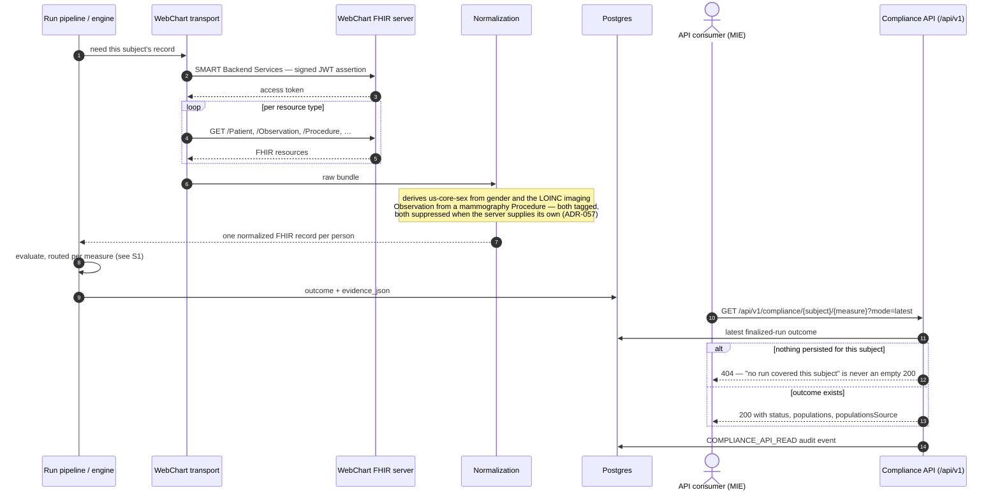
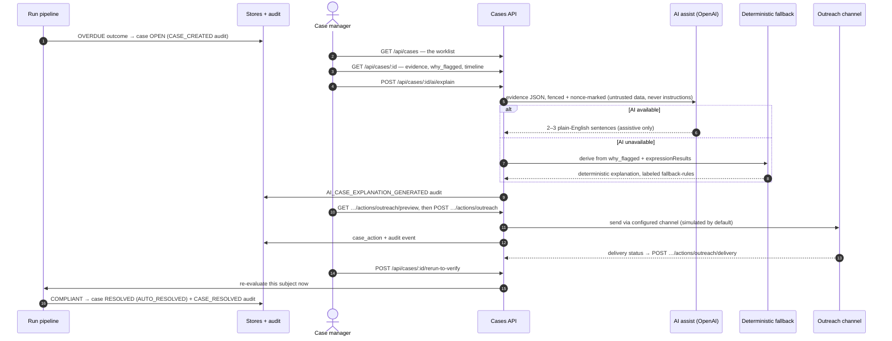
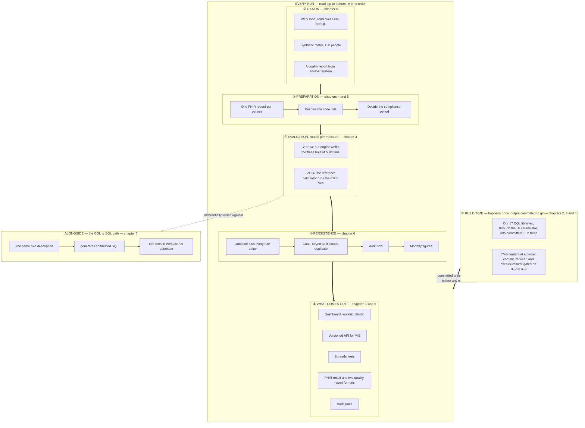

# Guide Scenarios Chapter + Chronological One-Pager + Numbers Audit + Feature Proposals — Implementation Plan

> **For agentic workers:** REQUIRED SUB-SKILL: Use superpowers:subagent-driven-development (recommended) or superpowers:executing-plans to implement this plan task-by-task. Steps use checkbox (`- [ ]`) syntax for tracking.

**Goal:** Answer the 2026-08-11 owner feedback on the documentation: add a sequence-diagram scenarios chapter to the guide, rebuild the one-page overview so it reads chronologically, verify every number, and write three product-feature proposals for review.

**Architecture:** Two PRs. PR 1 (`feat/guide-scenarios`, branch exists with the spec commit) is docs/guide work only: new `docs/guide/10-scenarios.md` with six mermaid `sequenceDiagram`s, a rebuilt README one-pager, a chronology sweep of the other 20 diagrams, and a numbers audit. PR 2 (`feat/feature-proposals`) adds `docs/PROPOSALS_2026-08.md` plus four GitHub issues (three proposals + one live-demo follow-up). No application code changes in either PR.

**Tech Stack:** Markdown + mermaid (`sequenceDiagram`, `flowchart`). No new dependencies (hard rule). Verification is rendering + grep/count commands against the tree.

**Spec:** `docs/archive/superpowers/specs/2026-08-12-guide-scenarios-and-feature-proposals-design.md`

---

## Ground truth gathered from the tree (2026-08-12, verify at HEAD if re-running later)

- Measure registry: **14** measures (`grep -cE 'id: "' backend-ts/src/engine/cql/measure-registry.ts` → 14).
- Committed ELM: **18** files in `backend-ts/src/engine/cql/elm/` = 17 measure libraries + `FHIRHelpers-4.0.1`.
- Routed official measures: `WORKWELL_OFFICIAL_MEASURES="cms122,cms125"` in `.github/workflows/deploy-twh-mieweb.yml` and `reconcile-twh-mieweb.yml` → **2 of 14** official, **12 of 14** authored.
- MADiE gate: **410/410** across 8 vendored measures (55+66+36+19+55+47+64+68).
- Runs surface (docblock, `backend-ts/src/routes/runs.ts:8-28`): `GET/POST /api/runs`, `POST /api/runs/claim`, `GET /api/runs/:id`, `/logs`, `/outcomes`, `/measure-report`, `/qrda1`, `/qrda`, `POST /api/runs/:id/evaluate`, `POST /api/runs/:id/import`, `POST /api/runs/:id/finalize`.
- Cases surface (`backend-ts/src/routes/cases.ts:7-14`): `GET /api/cases`, `GET /api/cases/:id`, `POST .../assign`, `.../escalate`, `GET .../actions/outreach/preview`, `POST .../actions/outreach`, `POST .../actions/outreach/delivery`, `POST .../rerun-to-verify`.
- Measures surface (`backend-ts/src/routes/measures.ts:4-14`): `POST /api/measures`, `GET /api/measures/:id`, `.../activation-readiness`, `POST .../approve`, `.../status`, `.../deprecate`, `GET .../elm`, `POST .../evaluate`, `POST /api/measures/compile`.
- AI surface (`backend-ts/src/routes/ai.ts` docblock): `POST /api/measures/:id/ai/draft-spec`, `.../ai/draft-cql`, `.../ai/generate-test-fixtures`, `POST /api/cases/:id/ai/explain`, `POST /api/runs/:id/ai/insight`.
- Compliance API (`backend-ts/src/routes/compliance-api.ts`): `GET /api/v1/compliance/{subjectId}/{measureId}?start=&end=&mode=latest|preview`; 404 on nothing-persisted; `populationsSource`; `COMPLIANCE_API_READ` audit; preview returns **501** on a WebChart-configured stack (ADR-061).
- MCP transport (`backend-ts/src/routes/mcp.ts`): `GET /sse` → `event: endpoint` with `/mcp/message?sessionId=…`; `POST /mcp/message` returns 202, responses pushed over SSE; methods initialize / tools/list / tools/call; **13 tools** in `backend-ts/src/mcp/tools.ts` (check_compliance, explain_outcome, explain_rule, get_case, get_employee, get_measure_traceability, get_measure_version, get_run_summary, list_cases, list_data_quality_gaps, list_measures, list_noncompliant, list_runs); role gating via `McpAuth` in dispatch.
- WebChart ingress modules (`backend-ts/src/engine/ingress/webchart/`): `smart-backend-auth.ts`, `webchart-client.ts`, `normalize.ts` (ADR-057 derivations), `live-directory.ts`.
- Scheduler: `backend-ts/src/admin/scheduler.ts`, gated on `WORKWELL_SCHEDULER_ENABLED`.
- Run pipeline: `backend-ts/src/run/run-pipeline.ts` (`executeManualRun`, `ASYNC_SCOPES`, `finishOrFail`); router `backend-ts/src/wiring/executor-router.ts` (`routedEngineForEnv`); case upsert `backend-ts/src/case/case-logic.ts` (`planCaseUpsert`, dispositions, `CASE_*` audit events except UNCHANGED).

**Mermaid validation for every diagram step:** open the file in the VS Code markdown preview (mermaid renders natively) or paste the block into https://mermaid.live — a syntax error renders as an error banner instead of a diagram. Do this for every diagram before committing it. Do NOT add any mermaid CLI/tooling to the repo.

---

# PR 1 — branch `feat/guide-scenarios`

### Task 1: Chapter 10 skeleton + S1 (a run, scheduled or manual)

**Files:**
- Create: `docs/guide/10-scenarios.md`

- [ ] **Step 1: Confirm you are on the branch**

Run: `git branch --show-current`
Expected: `feat/guide-scenarios`

- [ ] **Step 2: Create the chapter with intro + S1**

Create `docs/guide/10-scenarios.md` with exactly this structure (prose may be polished, structure and diagram content must survive):

````markdown
# 10. Scenarios — the flows in time order

The other chapters explain structure: what each part is. This chapter explains **sequence**: who
calls what, in which order, when a real person uses the system. Each scenario is one sequence
diagram plus a short narrative, and links to the chapters that own the mechanisms it touches.
The selection rule: a flow earns a diagram here when the *order of handoffs* is the content.
Admin configuration screens (programs, scheduler settings, email provider) are deliberately
absent — they are reads and writes with an audit row, and [chapter 6](06-data-and-databases.md)
already covers them structurally.

## S1 — A run, scheduled or manual

The core flow everything else references. Two triggers, one pipeline: the nightly scheduler
(demo/production sets `WORKWELL_SCHEDULER_ENABLED`) and an operator pressing Run in the Studio
land in the same run pipeline; from there the path to a persisted outcome is identical.
Mechanisms: [chapter 4](04-engine-and-routing.md) (engine + router),
[chapter 6](06-data-and-databases.md) (what gets persisted).

```mermaid
sequenceDiagram
  autonumber
  actor Op as Operator (Studio)
  participant Sch as Scheduler (nightly)
  participant API as Worker API (/api/runs)
  participant Pipe as Run pipeline
  participant Rt as Per-measure router
  participant Eng as Authored engine
  participant Off as Official executor
  participant DB as Postgres (runs, outcomes, cases, audit_events)
  Op->>API: POST /api/runs (scope: programs / site / measure)
  Note over Sch,Pipe: or: nightly tick — same pipeline from here on
  API->>Pipe: execute (async scopes are queued and claimed)
  Pipe->>DB: run row RUNNING + audit
  Pipe->>Pipe: resolve roster + compliance period per measure
  loop each measure in scope
    Pipe->>Rt: which engine runs this measure?
    alt routed official (cms122, cms125 on demo/production)
      Rt->>Off: evaluate the batch against the CMS artifact
      Off-->>Pipe: population results + evidence
    else authored (the other 12)
      Rt->>Eng: walk the committed ELM tree per subject
      Eng-->>Pipe: Outcome Status + every rule value
    end
    Pipe->>DB: outcome + evidence_json per subject
    Pipe->>DB: case upsert → CREATED / UPDATED / REOPENED / RESOLVED / EXCLUDED / UNCHANGED
    Pipe->>DB: CASE_* audit event (every disposition except UNCHANGED)
  end
  Pipe->>DB: close strictly-older-cycle cases, then RUN_COMPLETED audit
  Op->>API: GET /api/runs/:id — summary, distribution, pass rate
```

Three things the diagram encodes on purpose. **Routing is per measure** — the router decides
inside the loop, not once per run. **Every state change writes an audit row** — the `DB`
lane accumulates them. And **an idempotent re-confirm is silent**: the `UNCHANGED` disposition
writes no case event, so a nightly run records one `RUN_COMPLETED`, not hundreds of noise
events. One honesty note: for asynchronous scopes the run *message* (e.g. the zero-in-IPP
warning) exists only on the synchronous response; the run list does not carry it — the log
timeline does.
````

- [ ] **Step 3: Validate the diagram renders**

VS Code markdown preview or mermaid.live. Expected: renders with 8 participants, one loop, one alt.

- [ ] **Step 4: Commit**

```bash
git add docs/guide/10-scenarios.md
git commit -m "docs(guide): scenarios chapter skeleton + S1 run sequence diagram"
```

### Task 2: S2 — WebChart end-to-end

**Files:**
- Modify: `docs/guide/10-scenarios.md` (append)

- [ ] **Step 1: Append the S2 section**

````markdown
## S2 — WebChart end-to-end: from a live EHR to a compliance answer

The measures — the ELM trees and the CMS artifacts alike — running against a real WebChart
environment, and the answer being read back over the versioned API. This is the documented shape
of the already-built live path (ADR-028 transport, ADR-057 normalization, ADR-061 API).
Mechanisms: [chapter 5](05-fhir.md) (FHIR + the shim), [chapter 6](06-data-and-databases.md)
(ingress), [chapter 4](04-engine-and-routing.md) (evaluation).



The response's `populationsSource` field says whether the population booleans were measured by
the official executor or inferred from status — the one fact a consumer cannot reconstruct from
the numbers. `mode=preview` deliberately returns **501 on a WebChart-configured stack**: the
preview composes a synthetic bundle, and reporting demo playback as an evaluation of a live
tenant would be a lie (ADR-061).
````

- [ ] **Step 2: Validate rendering** (as Task 1 Step 3)

- [ ] **Step 3: Commit**

```bash
git add docs/guide/10-scenarios.md
git commit -m "docs(guide): S2 WebChart end-to-end sequence diagram"
```

### Task 3: S3 — Case/operator workflow

**Files:**
- Modify: `docs/guide/10-scenarios.md` (append)

- [ ] **Step 1: Append the S3 section**

````markdown
## S3 — A flagged person, worked by an operator

From an overdue outcome to a resolved case, with the AI lane shown honestly: assistive text with
a deterministic fallback, never a decision. Mechanisms: [chapter 1](01-big-picture.md) (cases,
worklist), [chapter 6](06-data-and-databases.md) (the idempotent upsert),
`docs/AI_GUARDRAILS.md` (the non-negotiable rule).



Two invariants worth reading off the lanes. Every mutating arrow into `API` produces a matching
arrow into `DB` — no state change without an audit row. And the `AI` lane never touches `DB`
except to log that it spoke: compliance state is authored by the engine alone, and a human
closure (`closed_by` set) is never reopened by a later run.
````

- [ ] **Step 2: Validate rendering**

- [ ] **Step 3: Commit**

```bash
git add docs/guide/10-scenarios.md
git commit -m "docs(guide): S3 case/operator workflow sequence diagram"
```

### Task 4: S4 — Authoring a measure

**Files:**
- Modify: `docs/guide/10-scenarios.md` (append)

- [ ] **Step 1: Append the S4 section**

````markdown
## S4 — Authoring a measure, from draft to active

The Studio authoring loop — including the fact the whole guide keeps repeating: compilation
happens at authoring/build time, never while somebody is being evaluated. Mechanisms:
[chapter 2](02-cql-and-authoring.md) (CQL + authoring), [chapter 3](03-compiler-and-elm.md)
(translator + ELM).

```mermaid
sequenceDiagram
  autonumber
  actor Au as Author
  participant M as Measures API
  participant AI as AI draft (assistive)
  participant T as Translator (CQL→ELM)
  participant Eng as Engine
  participant Cat as Measure catalog
  Au->>M: POST /api/measures — a Draft
  opt draft from policy text
    Au->>M: POST /api/measures/:id/ai/draft-spec
    M->>AI: policy text (no compliance determinations allowed)
    AI-->>Au: draft spec JSON — review banner, human edits before save
  end
  Au->>M: edit CQL, then POST /api/measures/compile
  M->>T: compile (UCUM-validated quantities)
  T-->>Au: ELM — or diagnostics, which are the authoring gate
  Au->>M: save CQL + test fixtures, validate
  M->>Eng: run fixtures against the compiled ELM
  Eng-->>M: fixture outcomes (all five statuses exercised)
  Au->>M: GET /api/measures/:id/activation-readiness
  Au->>M: POST /api/measures/:id/approve — a human decision, always
  Cat-->>Au: measure Active — the next run picks it up
  Note over T,Eng: The 17 committed libraries compile at BUILD time<br/>(pnpm compile-measures); CI refuses a tree where the committed<br/>ELM is not what the CQL produces. Nothing compiles during a run.
```

The AI lane is the same shape as S3: it can draft a spec or CQL, it cannot approve, activate, or
decide anything — activation is a gated human action with an audit row.
````

- [ ] **Step 2: Validate rendering**

- [ ] **Step 3: Commit**

```bash
git add docs/guide/10-scenarios.md
git commit -m "docs(guide): S4 authoring sequence diagram"
```

### Task 5: S5 — The standards loop

**Files:**
- Modify: `docs/guide/10-scenarios.md` (append)

- [ ] **Step 1: Append the S5 section**

````markdown
## S5 — The standards loop: import, evaluate, export

Another system's QRDA Category I documents in; our calculation; standard documents out. This is
the interoperability bridge (locked decision 4) — kept at 0 findings against the HL7 base
ruler, not a certification path. Mechanisms: [chapter 5](05-fhir.md) (the standards documents),
[chapter 4](04-engine-and-routing.md) (evaluation).

```mermaid
sequenceDiagram
  autonumber
  actor Ext as External system
  participant R as Runs API
  participant Id as Identity grouping
  participant Imp as QRDA I importer
  participant Eng as Engine (unchanged)
  participant DB as Stores
  Ext->>R: POST /api/runs → a run to import into
  Ext->>R: POST /api/runs/:id/import {measureId, qrda1: [documents]}
  R->>Id: group documents into people (identifier-only)
  Note over Id: identity is cross-document — a per-document import<br/>over-reports the population; demographic conflicts are<br/>reported, never silently resolved
  Id-->>R: one person per group
  loop per person
    R->>Imp: parse + translate the QDM entries
    Imp-->>Eng: a FHIR bundle (mapped to what the artifact's ELM retrieves)
    Eng-->>DB: outcome + qrda1Import evidence
  end
  Ext->>R: POST /api/runs/:id/finalize
  alt any outcome lacks qrda1Import evidence
    R-->>Ext: 409 — a population run is finalized by its own pipeline, not from outside
  else all outcomes are import-driven
    R-->>Ext: 200 — run COMPLETED, exportable
  end
  Ext->>R: GET …/measure-report | …/qrda1 | …/qrda
  R-->>Ext: FHIR MeasureReport / QRDA I / QRDA III
```

The finalize gate is the interesting arrow: it refuses to mark a run COMPLETED unless every
outcome came from an imported document, because finalizing a partially-imported population run
from outside would make a partial roster exportable as a finished result.
````

- [ ] **Step 2: Validate rendering**

- [ ] **Step 3: Commit**

```bash
git add docs/guide/10-scenarios.md
git commit -m "docs(guide): S5 standards loop sequence diagram"
```

### Task 6: S6 — An MCP consumer

**Files:**
- Modify: `docs/guide/10-scenarios.md` (append)

- [ ] **Step 1: Verify the tool count at HEAD**

Run: `grep -cE 'name: "' backend-ts/src/mcp/tools.ts`
Expected: 13 (if different, use the actual number in the prose below).

- [ ] **Step 2: Append the S6 section**

````markdown
## S6 — An AI client over MCP, read-only

Claude Desktop (or any MCP client) talking to the worker's own MCP server. Everything is a read;
the interesting ordering is the SSE handshake and the role gate. Mechanisms: `docs/MCP.md` (the
security boundary), [chapter 1](01-big-picture.md) (where MCP sits).

```mermaid
sequenceDiagram
  autonumber
  actor C as MCP client (Claude Desktop)
  participant T as MCP transport
  participant D as Dispatch + role gate
  participant DB as Stores (read-only)
  C->>T: GET /sse — open the event stream
  T-->>C: event: endpoint → /mcp/message?sessionId=…
  C->>T: POST initialize (202; result arrives over SSE)
  T-->>C: initialize result
  C->>T: tools/list
  T-->>C: 13 read-only tools
  C->>T: tools/call — e.g. list_noncompliant
  T->>D: dispatch with auth context (actor, role)
  alt role gate refuses (e.g. check_compliance needs CM/ADMIN)
    D-->>C: refusal, no data
  else allowed
    D->>DB: read
    D->>DB: tool-call audit event
    D-->>C: result, pushed over the SSE stream
  end
```

No MCP tool mutates anything: the server exposes reads plus explain-shaped tools, every call is
audited, and role gating happens at dispatch — the transport authenticates, the dispatcher
authorizes.
````

- [ ] **Step 3: Validate rendering**

- [ ] **Step 4: Commit**

```bash
git add docs/guide/10-scenarios.md
git commit -m "docs(guide): S6 MCP consumer sequence diagram"
```

### Task 7: Rebuild the README one-pager + wire chapter 10 in

**Files:**
- Modify: `docs/guide/README.md`
- Modify: `docs/guide/01-big-picture.md`, `docs/guide/02-cql-and-authoring.md`, `docs/guide/03-compiler-and-elm.md`, `docs/guide/04-engine-and-routing.md`, `docs/guide/05-fhir.md`, `docs/guide/06-data-and-databases.md` (one-line pointers)

- [ ] **Step 1: Replace the one-pager mermaid block in `docs/guide/README.md` (lines 36–78)**

Replace the whole ```mermaid block with:

````markdown

````

NOTE: `D1`'s wording changed from "read over SQL and turned into FHIR" only if the audit in
Task 9 says so — otherwise keep the original wording "WebChart, read over SQL and turned into
FHIR". Do not silently reword nodes; only the structure (numbered stages, ONCE above EVERYRUN,
strict vertical spine) is this task's job.

- [ ] **Step 2: Update the prose under the diagram**

Replace the "Read it as a spine…" paragraph with one explaining the new shape:

```markdown
Read it top to bottom: stage ① happens once and its outputs are committed to git; everything
under "EVERY RUN" happens, in that order, each time anybody is evaluated. The lane at the bottom
is the SQL executor, dotted rather than solid because it is real and checked against the engine
but deliberately not connected to the application; whether it becomes solid is one of the two
open decisions in [chapter 9](09-state-and-roadmap.md). For the same flows drawn as *sequences* —
who calls what, in what order — see [chapter 10](10-scenarios.md).
```

- [ ] **Step 3: Add chapter 10 to the README table**

Add a row to the "You want to know" table:

```markdown
| The flows in time order — run, WebChart end-to-end, cases, authoring, standards loop, MCP | [10. Scenarios](10-scenarios.md) |
```

- [ ] **Step 4: Add one-line pointers in the owning chapters**

In each listed chapter, after its first flowchart (or at the end of its intro section), add one
sentence pointing at the scenario that animates it:

- `01-big-picture.md`: "The case and worklist flow is drawn as a sequence in [chapter 10, S3](10-scenarios.md)."
- `02-cql-and-authoring.md`: "The authoring loop is drawn as a sequence in [chapter 10, S4](10-scenarios.md)."
- `03-compiler-and-elm.md`: "Where compilation sits in the authoring flow: [chapter 10, S4](10-scenarios.md)."
- `04-engine-and-routing.md`: "A full run, trigger to audit row, is drawn as a sequence in [chapter 10, S1](10-scenarios.md)."
- `05-fhir.md`: "The standards loop end to end: [chapter 10, S5](10-scenarios.md); the live WebChart path: [chapter 10, S2](10-scenarios.md)."
- `06-data-and-databases.md`: "The ingress-to-persistence order is drawn as a sequence in [chapter 10, S1 and S2](10-scenarios.md)."

- [ ] **Step 5: Validate rendering of the new one-pager** (nested subgraphs + the labeled edge are the risky parts — confirm ONCE renders above EVERYRUN and the spine is vertical)

- [ ] **Step 6: Commit**

```bash
git add docs/guide/README.md docs/guide/01-big-picture.md docs/guide/02-cql-and-authoring.md docs/guide/03-compiler-and-elm.md docs/guide/04-engine-and-routing.md docs/guide/05-fhir.md docs/guide/06-data-and-databases.md
git commit -m "docs(guide): chronological one-pager + chapter 10 cross-links"
```

### Task 8: Chronology sweep of the remaining diagrams

**Files:**
- Possibly modify: any of `docs/guide/01…09` (only where a diagram is genuinely time-confused)

- [ ] **Step 1: Review each of the 20 non-README diagrams against one question**

For each ```mermaid block in chapters 1–9: *does the visual layout imply an order of events that
contradicts the actual order in time?* (The README's fault: two stages side by side at the top
when one strictly precedes the other.) Structure-only diagrams (module maps, data models,
boundary diagrams) are NOT time-ordered and must be left alone.

- [ ] **Step 2: Fix only confirmed offenders**

Typical fix: `flowchart LR` → `flowchart TB` with a re-ordered spine, or adding an explicit
"happens first / happens per run" split as in the README rebuild. Keep node wording untouched.
Record in the commit message which diagrams changed and why; if NONE are time-confused, make no
commit and note that in the PR description.

- [ ] **Step 3: Validate + commit (only if changes were made)**

```bash
git add docs/guide/
git commit -m "docs(guide): fix time-order in <chapter> diagram(s)"
```

### Task 9: Numbers audit

**Files:**
- Possibly modify: any `docs/guide/*.md`

- [ ] **Step 1: Extract every numeric claim**

Run: `grep -nE '[0-9]+ (of|/) [0-9]+|[0-9]+%|[0-9]{2,}' docs/guide/*.md` and list each claim.

- [ ] **Step 2: Verify the headline claims against the tree**

| Claim | Verify with | Expected (2026-08-12) |
|---|---|---|
| "17 CQL files/libraries" | `ls backend-ts/src/engine/cql/elm/*.elm.json \| wc -l` | 18 files = 17 measure libraries + FHIRHelpers — the claim counts libraries, check phrasing matches |
| "12 of 14" / "2 of 14" | `grep -cE 'id: "' backend-ts/src/engine/cql/measure-registry.ts` and `grep WORKWELL_OFFICIAL_MEASURES .github/workflows/deploy-twh-mieweb.yml` | 14 total; `cms122,cms125` routed |
| "410 of 410" | `docs/STANDARDS_CONFORMANCE.md` per-measure table | 55+66+36+19+55+47+64+68 = 410 |
| "150 people" | `node --import tsx -e "import {EMPLOYEES} from './backend-ts/src/engine/synthetic/employee-catalog.ts'; console.log(EMPLOYEES.length)"` (run from `backend-ts/`, adjust path) | roster size claimed |
| Test counts in ch. 9 | are they DATED? If dated, leave; if undated, run `cd backend-ts && pnpm test` once and date the figure |  |
| Every % in ch. 9 | each must carry its measurement date per the guide's own rule | |

- [ ] **Step 3: Fix what is wrong; date what is volatile**

Correction rule: a number wrong *at its stated date* gets corrected; an undated volatile number
gets moved to or dated in chapter 9. Do not "refresh" correctly-dated historical figures.

- [ ] **Step 4: Commit**

```bash
git add docs/guide/
git commit -m "docs(guide): numbers audit — corrections + dating"
```

### Task 10: JOURNAL entry + PR

**Files:**
- Modify: `docs/JOURNAL.md` (new entry on top)

- [ ] **Step 1: Add the JOURNAL entry**

Dated 2026-08-12 (or the actual date of execution), covering: chapter 10 with six sequence
diagrams and the selection criterion (order-of-handoffs, admin CRUD excluded), the chronological
one-pager rebuild, the sweep result, and the numbers-audit outcome (list any corrected numbers
explicitly). Follow the JOURNAL's existing voice: what changed, what was measured, what was NOT
done.

- [ ] **Step 2: Push and open the PR**

```bash
git push -u origin feat/guide-scenarios
gh pr create --title "docs(guide): scenarios chapter, chronological one-pager, numbers audit" --body "<summary per JOURNAL entry; note diagram-render validation was manual (mermaid has no CI gate); list audited numbers>

🤖 Generated with [Claude Code](https://claude.com/claude-code)"
```

- [ ] **Step 3: Code-review the whole diff before merge**

Per standing practice: run the superpowers:code-reviewer agent on the full PR diff AND fetch
Codex's line comments via `gh api repos/{owner}/{repo}/pulls/<n>/comments` (invisible to
`gh pr view`). Reply on each thread. Docs PRs get the same treatment — the reviewer checks
diagram claims against the code facts in this plan's "Ground truth" section.

---

# PR 2 — branch `feat/feature-proposals`

### Task 11: The proposals document

**Files:**
- Create: `docs/PROPOSALS_2026-08.md`

- [ ] **Step 1: Branch from main after PR 1 merges**

```bash
git checkout main && git pull && git checkout -b feat/feature-proposals
```

- [ ] **Step 2: Write `docs/PROPOSALS_2026-08.md`**

Header states: these are proposals for owner/MIE review, none is approved or scheduled, and any
schema change stays owner-owned. Then one page per proposal, each with the same four headings —
**What it is / How it maps onto what exists / What would have to be built / Open questions**.
Content requirements per proposal (write full prose from these):

**P1 — Encounter-close quality check.** What: when a clinician closes an encounter in WebChart,
surface that patient's open measure gaps at that moment. Maps onto: the compliance API
(`GET /api/v1/compliance/{subject}/{measure}`, ADR-061) already answers per-subject-per-measure;
the WebChart seam (ADR-028) identifies the patient. Would need: a WebChart-side hook or embedded
view at encounter close; a multi-measure ("all gaps for this subject") variant of the compliance
API; a decision on preview semantics for a live tenant (today `mode=preview` is 501 on a
WebChart stack, deliberately — a real point-of-care check needs a live evaluation path, which is
a new, explicitly-designed capability, not a flag flip). Open: integration surface (WebChart UI
vs WorkWell view vs API-only), latency budget, measure set (routed official only vs all
applicable), and who acts on the answer.

**P2 — "Not seen in a while," with quality.** What: given a measure (or all measures), list
patients whose last encounter is older than N days alongside their current compliance status.
Maps onto: the worklist + case read models; encounters already flow through the shim/transport;
outcomes carry evaluation dates. Would need: an encounter-recency signal persisted or queried at
read time; a new read model / API filter; a definition of "seen" (any encounter? qualifying
encounter per the measure's own IPP?). Open: N's default, whether this is a Studio view or an
API contract for MIE, and whether recency is per measure or global.

**P3 — Next-action date estimate.** What: for any patient and measure, the date their next
procedure/action is due — the thing an operator schedules against. Maps onto: compliance windows
are already measure config; `next_action` exists on cases today; `evidence_json.why_flagged`
already carries `last_exam_date` + `compliance_window_days`. Would need: a derived
next-due-date exposed per outcome (last satisfying event + window), surfaced in the worklist
and/or compliance API. Explicitly deterministic — computed from the same evidence the engine
persisted, never an AI prediction (AI_GUARDRAILS: AI never decides compliance). Open: surfacing
(case field vs API field vs both), semantics when data is missing (MISSING_DATA has no last
event to project from), and whether "any quality" means the full catalog or the routed set.

- [ ] **Step 3: Commit**

```bash
git add docs/PROPOSALS_2026-08.md
git commit -m "docs: three feature proposals for owner review (encounter-close check, recency view, next-due estimate)"
```

### Task 12: GitHub issues + JOURNAL + PR

- [ ] **Step 1: File four issues**

```bash
gh issue create --title "Proposal: encounter-close quality check" --body "One-page proposal in docs/PROPOSALS_2026-08.md (P1). Not scheduled; awaiting owner/MIE review of integration surface, latency budget, and measure set."
gh issue create --title "Proposal: 'not seen in a while' view with quality status" --body "One-page proposal in docs/PROPOSALS_2026-08.md (P2). Not scheduled; awaiting owner review of the 'seen' definition and surfacing."
gh issue create --title "Proposal: deterministic next-action date per patient/measure" --body "One-page proposal in docs/PROPOSALS_2026-08.md (P3). Deterministic from persisted evidence; never AI. Awaiting owner review of surfacing and missing-data semantics."
gh issue create --title "Follow-up: live WebChart demonstration run" --body "Run measures end-to-end against the live WebChart environment and capture output for review — the live counterpart of guide chapter 10, S2. Named follow-up from the 2026-08-12 docs effort so it does not silently evaporate."
```

- [ ] **Step 2: JOURNAL entry**

Add to the same day's entry (or a new one): proposals doc + issue numbers, and the explicit
statement that nothing was built.

- [ ] **Step 3: Push, PR, review**

```bash
git push -u origin feat/feature-proposals
gh pr create --title "docs: feature proposals for owner review" --body "Adds docs/PROPOSALS_2026-08.md (P1–P3) + files tracking issues. No code. No commitments — every proposal is explicitly awaiting owner review.

🤖 Generated with [Claude Code](https://claude.com/claude-code)"
```

Then the same code-review pass as Task 10 Step 3.

---

## Self-review notes (done at plan time)

- **Spec coverage:** six diagrams (Tasks 1–6) ✓; one-pager rebuild + cross-links (Task 7) ✓;
  sweep (Task 8) ✓; numbers audit (Task 9) ✓; JOURNAL/DoD (Task 10) ✓; proposals doc (Task 11) ✓;
  issues incl. live-demo follow-up (Task 12) ✓; out-of-scope list respected (no code, no S7, no
  admin diagrams, no live runs) ✓.
- **Facts:** all route paths, module names, tool names and counts in the diagrams were read from
  the tree on 2026-08-12 (see "Ground truth"); the executor re-verifies the two live counts
  (MCP tools, measure registry) inline where the diagram states them.
- **Known judgment calls left to the executor:** S1 deliberately simplifies the queued/claim
  path to one note (the docblock's QUEUED/claim mechanics live in chapter 4, not the diagram);
  Task 8 may legitimately conclude "no changes."
