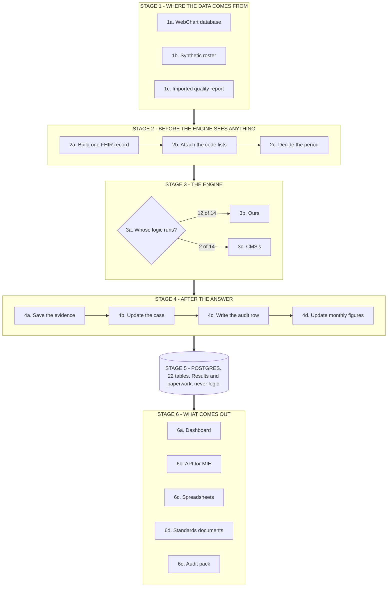

# 1. The big picture

> Part of the [WorkWell guide](README.md). Next: [CQL and authoring](02-cql-and-authoring.md)

**WorkWell is a measure engine and an authoring studio, not an EHR.** It takes clinical data in
FHIR shape, runs quality and surveillance measure logic over it, and emits results plus the
standard reporting artifacts. WebChart is the data source and the eventual consumer: WorkWell is
the thing that turns "here is a population" into "here is who is non-compliant, and here is the
per-rule evidence for why." It runs both our own occupational measures and CMS's published ones —
the published ones unmodified, on the reference calculator, gated by their authors' own test cases.

## The six stages, in a paragraph each

**Stage 1 — data in.** Three ways during normal operation: WebChart's database read over SQL and
served as FHIR, a deterministic 150-person synthetic roster carrying real clinical codes, and
imported patient-level quality documents from another system. A fourth path, the live WebChart FHIR
tenant, sits behind the same seam as the first. [Chapter 6](06-data-and-databases.md).

**Stage 2 — preparation.** Whatever the source, the engine only ever sees one shape: a FHIR bundle
per person holding the patient, their program enrollment, any documented exemption, and the
clinical events the measure reads. Code lists are resolved (a measure never says "a mammogram"; it
says "any code in this list of 92"), and the evaluation is assigned to the measure's own compliance
cycle rather than today's date — the one decision that makes nightly reruns update a case instead
of duplicating it. [Chapters 5](05-fhir.md) and [4](04-engine-and-routing.md).

**Stage 3 — the engine, routed per measure.** Twelve of our fourteen runnable measures execute our
own compiled CQL on MITRE's reference JavaScript engine, about 68 ms per person. Two run CMS's
published artifact, unmodified, on the reference measure calculator. Both paths return the same
shape, so nothing downstream knows which answered. [Chapters 3](03-compiler-and-elm.md) and
[4](04-engine-and-routing.md).

**Stage 4 — after the answer.** The verdict is saved together with the value of every rule the
measure evaluated — the working, not just the conclusion. The person's case is opened, updated or
closed under a key that cannot duplicate. Every real state change writes an append-only audit row.
Monthly numerator/denominator figures roll up at the end. [Chapter 6](06-data-and-databases.md).

**Stage 5 — Postgres.** Twenty-two tables of results and paperwork. No measure logic lives in the
database and no compliance decision is ever made by a query. Three things are deliberately absent:
the patient bundles we evaluated, any executable form of the measures, and the licensed code lists.

**Stage 6 — what comes out.** Five kinds of output, nine artifacts in total. The dashboard and
worklist for daily use. A versioned compliance API for MIE's own code — one person, one measure,
one answer, with a 404 rather than an empty success when no run covers the question
([`docs/COMPLIANCE_API.md`](../COMPLIANCE_API.md) is the contract). Spreadsheets for the
compliance officer. The standards documents — a FHIR MeasureReport and both QRDA formats, all
validating clean against their official rulers ([chapter 5](05-fhir.md)). And an audit pack that
puts a run, its outcomes, cases, audit rows and uploaded documents into one artifact a surveyor
can hold.

## What is borrowed, and from whom

Almost none of the hard parts are ours. The measure logic and the plumbing are; the language, the
compiler, the execution engine and the graders come from the organisations that define this field.
That is deliberate: when a number comes out of this system, somebody else can check it.

| What | Who makes it | Why it is credible | What we use it for |
|---|---|---|---|
| CQL | HL7 | The standard language for clinical quality logic. CMS writes its measures in it. | Every measure we author; every measure CMS publishes |
| ELM | HL7 | The compiled form of CQL — source-to-bytecode relationship | What actually executes; compiled once, committed |
| `@cqframework/cql` | CQFramework (HL7's reference implementation) | It *is* the reference translator. If it disagrees with us, we are wrong. | CQL to ELM, in its JavaScript build — no JVM anywhere |
| `cql-execution` + `cql-exec-fhir` | MITRE | The reference JS engine for ELM, plus the FHIR data adapter | Our engine's core: one compiled measure against one patient bundle |
| `fqm-execution` | Project Tacoma (MITRE) | The reference implementation for calculating a whole published FHIR measure | Runs CMS's artifacts unmodified |
| `dqm-content-qicore-2025` | CQFramework | The published home of CMS's FHIR measures, with test cases | Where we vendor a CMS measure from, at a pinned commit |
| MADiE test cases | CMS measure authors | The expected answers the measure's own authors publish | Our gate: 410 of 410 across 8 measures; nothing routes without it |
| VSAC | National Library of Medicine | The national authority for clinical code lists | Completing code lists upstream ships capped |
| Cypress | MITRE, open source | The official ONC certification test harness | Validated both QRDA document types to zero findings |
| HAPI FHIR / `cqf-fhir-cr` | Smile CDR + CQFramework (Java) | An independent engine sharing no code with ours | Cross-executed our artifacts as a second opinion: 255 of 278 |
| FHIR R4, QI-Core, US Core | HL7 | The data format and clinical profiles CMS measures target | The shape of everything the engine reads |
| QRDA I / III | HL7 | The document formats for quality reporting | What we export for interoperability |

The point of the table: a claim like "this employee is overdue" traces to a published measure, run
on a reference engine, against a code list from the NLM, graded by test cases the measure's own
authors wrote. That traceability is the product. The code is the cheap part.

## Where this sits in the wider world

NCQA — the organisation that runs HEDIS — describes the digital quality ecosystem in three layers,
and each maps cleanly onto something in this repo:

| NCQA's layer | Who they name | Where WorkWell sits |
|---|---|---|
| Applications and content | Their own digital content services | The Studio, the worklist, the cases, the audit pack — most of what is on screen |
| Infrastructure and enablement | Execution engines from Smile, MITRE and Firely | We compose MITRE's stack rather than compete with it, and have cross-executed our artifacts through Smile's Java engine as an independent check |
| Data | US Core, CARIN, Da Vinci profiles | The WebChart facade, the live tenant, and the QI-Core profiles stamped on every record |

Their definition of a CQL engine — one that can run the ELM rendering of *any* CQL written to the
spec — is exactly the property the published package asserts and tests
([chapter 8](08-packages.md)). Where we genuinely do not fit their picture: we run no HEDIS
measures (licensed specifications; the standing rule is our own spec text and cases only), and
occupational measures have no home in their ecosystem at all — which is precisely the gap the
authoring work in [chapter 2](02-cql-and-authoring.md) exists to fill.

How the project got to this shape — the direction changes, with dates — is the first half of
[chapter 9](09-state-and-roadmap.md).
