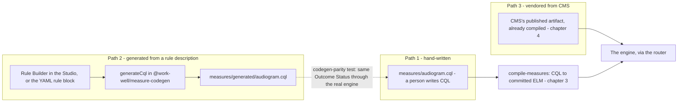
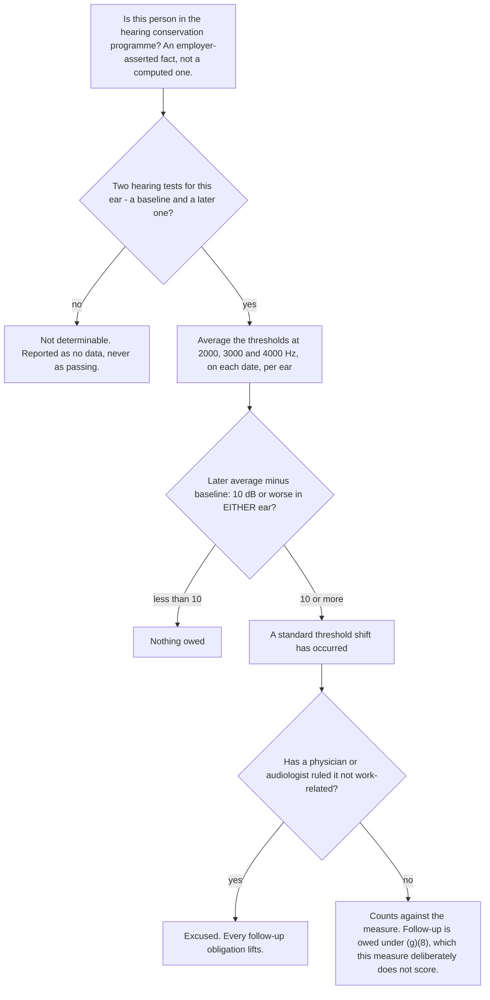

# 2. CQL, and the three ways a measure gets written

> Part of the [WorkWell guide](README.md). Previous: [The big picture](01-big-picture.md) ·
> Next: [The compiler and ELM](03-compiler-and-elm.md)

CQL — Clinical Quality Language — is HL7's language for writing clinical logic that a machine can
execute and a clinician can read. CMS writes its quality measures in it. So do we, for the
occupational measures nobody else publishes. This chapter reads a real measure line by line, then
covers the three ways a measure enters this system. The authoring loop is drawn as a sequence in
[chapter 10, S4](10-scenarios.md).

## Reading a measure

This is `backend-ts/measures/audiogram.cql`, the annual hearing-test measure, abridged:

```cql
library AnnualAudiogramCompleted version '1.0.0'
using FHIR version '4.0.1'
include FHIRHelpers version '4.0.1' called FHIRHelpers

valueset "Audiogram Procedures": 'urn:workwell:vs:audiogram-procedures'

parameter "Measurement Period" Interval<DateTime>
context Patient

define "In Hearing Conservation Program":
  exists([Condition] C
    where exists(C.code.coding x
      where x.system = 'urn:workwell:vs:hearing-enrollment'
        and x.code = 'hearing-enrollment'))

define "Most Recent Audiogram Date":
  Last(
    [Procedure] P
      where exists(P.code.coding C
        where C.system = 'urn:workwell:vs:audiogram-procedures'
          and C.code = 'audiogram-procedure')
      sort by (performed as FHIR.dateTime)
  ).performed as FHIR.dateTime

define "Days Since Last Audiogram":
  difference in days between
    Coalesce("Most Recent Audiogram Date", @1900-01-01T00:00:00.0)
    and Now()

define "Overdue":
  "In Hearing Conservation Program"
    and not "Has Active Waiver"
    and "Days Since Last Audiogram" > 365

define "Outcome Status":
  if "Excluded" then 'EXCLUDED'
  else if "Missing Data" then 'MISSING_DATA'
  else if "Overdue" then 'OVERDUE'
  else if "Due Soon" then 'DUE_SOON'
  else if "Compliant" then 'COMPLIANT'
  else 'MISSING_DATA'
```

The parts worth naming:

- **`using FHIR version '4.0.1'`** declares the data model. Every retrieve in the file is
  type-checked against FHIR's actual structure ([chapter 5](05-fhir.md) defines the FHIR terms).
- **`[Condition]` and `[Procedure]`** are retrieves — "fetch every resource of this type". The
  `where` clauses filter by coding. This is the one operation that makes CQL a clinical language
  rather than a general one.
- **`define` introduces a named rule.** Each is independently evaluated and independently
  readable. `"Overdue"` reads almost as the sentence a policy manual would use, which is the
  design goal of the language.
- **Rules reference rules.** `"Overdue"` builds on three others. The engine returns a value for
  every one of them, which is why a case screen can show the working and not just the verdict.
- **`"Outcome Status"` is the verdict**, one of five strings. The engine treats anything else as
  missing data. The five buckets are WorkWell's workflow vocabulary; the official CMS measures
  return population membership instead, and [chapter 4](04-engine-and-routing.md) covers the
  translation between the two.
- **The language has real semantics underneath the readable surface**: three-valued logic (a
  missing value is neither true nor false), interval arithmetic, and terminology membership. That
  is what makes "just translate CQL to SQL" a language-implementation project rather than a
  transformation — the argument in [chapter 7](07-sql-and-the-bridge.md).

## The three ways a measure gets written



**Path 1: hand-written CQL.** Seventeen files in `backend-ts/measures/`, one per measure. This is
the path for anything with real clinical judgment in it — the OSHA measure below is the worked
example. The hand-written file is always the build source.

**Path 2: generated from a rule description.** Most surveillance measures share one shape — "has
this test happened recently enough" — and that shape is fully described by a few parameters. Each
measure's YAML file carries them:

```yaml
# measures/audiogram.yaml
id: audiogram
policyRef: OSHA 29 CFR 1910.95
bindings:
  enrollment: { code: hearing-enrollment,  valueSet: "urn:workwell:vs:hearing-enrollment" }
  waiver:     { code: audiogram-waiver,    valueSet: "urn:workwell:vs:audiogram-waiver" }
  event:      { code: audiogram-procedure, valueSet: "urn:workwell:vs:audiogram-procedures", type: procedure }
rule:
  type: windowed-recency
  windowDays: 365
  dueSoonDays: 30
```

`pnpm gen-cql` (`scripts/gen-cql.mjs`) reads every YAML with a `rule:` block, calls `generateCql`
from `@work-well/measure-codegen` — the published, zero-dependency package
([chapter 8](08-packages.md)) — and writes canonical CQL to `measures/generated/`. Two rule shapes
exist: `windowed-recency` (a window, a due-soon threshold, an optional grace period) and
`series-completion` (required doses, minimum intervals, and alternatives — hepatitis B accepts
either two Heplisav doses or a traditional three-dose series).

The part that keeps this honest: **the generated file is not what runs.** The hand-written `.cql`
remains the build source; the generated output is the *parity artifact*. `codegen-parity.test.ts`
compiles both and proves they produce the same `Outcome Status` through the real engine. So the
rule description is demonstrably equivalent to the hand-written measure rather than assumed to be —
and the same rule description also generates the SQL in [chapter 7](07-sql-and-the-bridge.md),
which is the whole bridge argument in one sentence.

In the Studio, the **Rule Builder tab** edits these parameters against a live generated-CQL
preview, so an author can work declaratively and still see exactly what the parameters mean in the
language of record.

**Path 3: vendored from CMS.** For the eight official measures we do not author anything — we take
CMS's published, already-compiled artifact and run it unmodified.
[Chapter 4](04-engine-and-routing.md) covers the twelve vendoring steps and the gates.

## Authoring from a regulation: the OSHA worked example

CMS publishes clinical measures. Nobody publishes occupational ones — there is no official CQL for
hearing conservation, respirator surveillance, or hazardous-waste medical monitoring. Writing them
is the part of this project no competitor gets by downloading CMS artifacts, and it looks like
this. The measure is OSHA 29 CFR 1910.95: has a worker in a hearing conservation program suffered a
standard threshold shift?



Four details the boxes cannot hold. The program trigger is an eight-hour noise exposure at 85 dBA —
an industrial-hygiene measurement that will never appear in a clinical feed, so the measure takes
enrollment as asserted rather than pretending to compute it. The three frequencies are the three
the regulation names; the audiogram also tests 500, 1000 and 6000 Hz, and averaging the tested set
instead of the named three is a documented way to get this wrong, so the six LOINC codes (three per
ear) are listed one by one rather than pulled from a list that could silently gain a member. The
two ears are judged independently, and one is enough. And an average is only computed when all
three frequencies are present on both dates, so a partial test comes out not-determinable rather
than quietly passing.

Three authoring decisions in it that would need defending in review:

1. **It answers one obligation and refuses six others.** The regulation also requires a baseline
   audiogram within six months of first exposure, an annual test, written notification within 21
   days, hearing-protector fitting, a referral path, and training and recordkeeping. Rolling those
   into one hearing-conservation score would hide partial failure — refit everybody, notify nobody,
   still look good. Each unscored obligation is listed in the measure's own documentation
   (`docs/measures/OSHA_1910_95_STS.md`) with its paragraph and the reason it is out.
2. **Two of them are not merely unimplemented; they are not computable.** The 21-day notification
   clock starts at the *determination* that a shift occurred, not at the test that revealed it,
   and no clinical record says when a determination was made. The referral obligation has no
   regulatory deadline at all. A measure claiming to score either would be inventing a due date.
3. **It is compiled, tested, and deliberately not in the nightly run.** The synthetic roster
   generator describes measures as a recency window; it cannot produce what this one reads — two
   dated hearing tests carrying six threshold readings each. Wiring it in anyway would report
   no-data for the whole workforce and look integrated while proving nothing. It is verified
   through the same entry point an outside integrator would use (ADR-065).

One limitation is written into the measure's own header rather than left to be discovered: the
LOINC codes identify frequency and ear but not whether the test was air- or bone-conduction, and
the regulation requires air. A site recording both in one visit could mask or manufacture a shift.
Fixing that needs context the data model does not currently carry, so it is a stated limitation,
not a solved problem.

## Where to see it in the app

| What | Where |
|---|---|
| A measure's CQL | Measures → pick a measure → the CQL tab (`/studio/{id}`) |
| The rule parameters and generated-CQL preview | `/studio/{id}` → Rule Builder tab |
| Live compilation with diagnostics | `/studio/elm` — paste or edit CQL, the tree rebuilds ([chapter 3](03-compiler-and-elm.md)) |
| Value sets and code governance | `/studio/{id}` → Value Sets tab |
| Policy-to-define traceability | `/studio/{id}` → Traceability tab |

## Reproduce it yourself

```bash
cd backend-ts
pnpm gen-cql        # regenerate measures/generated/ from the YAML rule blocks

# generated ≡ hand-written, through the engine — 8 tests, ~25s
node --import tsx --test src/measure/codegen-parity.test.ts
```

Run the parity test by file path, not with `pnpm test --test-name-pattern`. `pnpm` inserts its own
`--` before forwarded arguments, so Node stops parsing options and the filter is dropped in
silence — you get the whole suite and no error telling you the filter did nothing.
