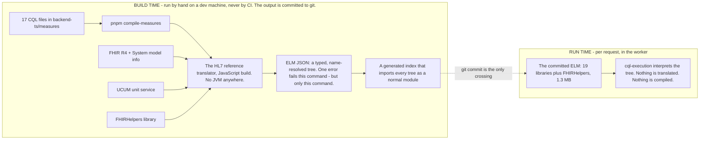
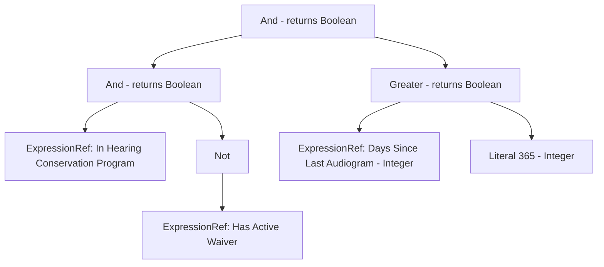

# 3. The compiler and ELM

> Part of the [WorkWell guide](README.md). Previous: [CQL and authoring](02-cql-and-authoring.md) ·
> Next: [The engine and the router](04-engine-and-routing.md)

There are two clocks in this system. One runs on a developer machine, where CQL text is compiled
into ELM and the result is committed to git by hand. The other runs in the server when a request
arrives, where nothing is translated and nothing is compiled — an interpreter walks a tree that is
already sitting in the repository. Every confusing question about "where does the compiling happen"
dissolves once the two clocks are kept apart, so this chapter starts there.

Note the first clock precisely: **a person runs it, not CI.** No workflow invokes
`compile-measures`, so the committed ELM is only as current as the last time somebody regenerated
it. That is a real gap and it is named in [chapter 9](09-state-and-roadmap.md).



## What each build step is doing

**The 17 CQL files** live in `backend-ts/measures/`, one per measure, plain text, readable by a
clinician who has seen the language before. They express things like: has this person had a hearing
test in the last year, and is there a documented reason to excuse them. [Chapter 2](02-cql-and-authoring.md)
covers how they get written.

**The translator is HL7's own.** `@cqframework/cql` 4.0.0-beta.1 is the reference implementation of
the CQL-to-ELM compiler. Historically it only ran on the JVM; there is now a JavaScript build of the
same compiler, which is why this project contains no Java. Using the reference compiler instead of
writing a parser means our reading of the language cannot quietly drift from everyone else's.

**Three inputs it will not start without:**

1. *A machine-readable description of FHIR itself.* The compiler has to know what a Patient is and
   what fields an Observation has before it can type-check a rule that reads them. We register the
   official model-info XML for FHIR R4 and for the System types.
2. *FHIRHelpers.* A standard library, published by HL7, that converts FHIR's own oddities into plain
   values. Every measure written against FHIR includes it, including all of CMS's.
3. *A unit service.* If a rule mentions a quantity like 10 dB or 9 percent, the compiler asks the
   unit service whether the unit is real. The default service throws on any unit at all — the
   `LibraryManager` takes it as its fourth positional argument, and without one, any CQL containing
   a quantity literal fails to compile. We only discovered this because the ELM Explorer could not
   compile unit-bearing CQL, which had been true and invisible for months, because none of our
   committed measures happened to use a unit (ADR-064, issue #397). One validator in
   `backend-ts/src/measure/ucum.ts` now serves the build, the runtime compile route and the
   conformance harness.

**The output is committed.** `pnpm compile-measures` writes one `.elm.json` per library into
`backend-ts/src/engine/cql/elm/` — 19 libraries (a few measures keep two versions) plus FHIRHelpers,
1.3 MB in total — and regenerates `index.ts`, a static import index. That index is why the running
server never reads a file from disk to load a measure: the ELM is bundled into the JavaScript, the
worker stays portable to environments with no filesystem, and a measure cannot go missing at runtime
because of a deployment mistake. A compiled measure changes in a pull request diff like any other
code.

A single syntax or type error fails `compile-measures`, so a measure that does not compile cannot
be compiled into the tree. And since #410 (2026-08-12), stale ELM cannot merge either: the backend
CI job recompiles every measure and fails on any difference from what is committed — covering the
`.elm.json` files, the generated `index.ts`, and the bundled translator resources
(`cql-resources.json`), including a *new* output file, which a plain `git diff` would ignore as
untracked. So if you edit a `.cql` file and forget to regenerate, CI tells you, instead of staying
green while the measure that would deploy is the one you last compiled rather than the one you last
edited. The check is sound because the compiler's output is byte-identical run to run (ADR-064,
re-measured when the gate landed).

## What the tree actually is

The ELM Explorer screen labels its right-hand panel an AST, and it is worth being concrete about
what that means, because this tree sits at the centre of the whole system.

When the compiler reads a line of CQL it does not keep the text. It builds a tree. Each node is one
operation, and its children are the things the operation works on. A comparison has two children. A
function call has one child per argument. That structure is an abstract syntax tree, and ELM is that
tree written out as JSON, with a resolved type stamped on every node.

Here is a real one. The audiogram measure defines when somebody is overdue:

```cql
define "Overdue":
  "In Hearing Conservation Program"
    and not "Has Active Waiver"
    and "Days Since Last Audiogram" > 365
```

The compiler turns that into this tree (taken from the committed
`AnnualAudiogramCompleted-1.0.0.elm.json`, position markers omitted):



Evaluating the rule means walking that tree from the bottom up: resolve the three referenced rules,
negate one, compare the day count to 365, and the value at the root is true or false. No English is
interpreted anywhere in that, which is the entire reason quality measures are written in a language
with a compiler rather than in prose.

Three things follow from this that carry through the rest of the guide:

- **Running a measure is walking a tree.** When [chapter 4](04-engine-and-routing.md) says the
  engine is handed a compiled tree and returns answers, this is the tree. The engine is a tree
  walker with a data adapter bolted on, which is why it is small enough to publish as a package
  with two dependencies ([chapter 8](08-packages.md)).
- **Every named rule is a root of its own.** A measure is not one tree. It is a few dozen, one per
  `define`. That is why the evidence we save is a value per rule rather than a single verdict: the
  engine genuinely computed all of them, so throwing away everything but the verdict would discard
  work already done.
- **The compiler leaves position markers on each node.** Every node records which characters of the
  original CQL it came from. That is what lets the ELM Explorer highlight the source when you click
  a node. It is also exactly what we strip out of CMS's measure files to shrink them from 16 MB to
  2.4 MB — so for the routed CMS measures we cannot offer that view, and we lose per-rule values as
  well. That trade is why we store population membership rather than a rule trace for CMS measures
  ([chapter 4](04-engine-and-routing.md)).

## The nodes, by name

Counting the distinct node types in one of our compiled measures gives 26. The common ones:

| Node | What it is | Example in the audiogram measure |
|---|---|---|
| `Retrieve` | Fetch every resource of a given type, optionally filtered by a code list. The domain-specific instruction — see below. | `[Procedure]` |
| `Query` | Iterate a source with `where`, `sort`, `return` clauses | `[Procedure] P where … sort by …` |
| `ExpressionRef` | Use another named rule's value | `"Days Since Last Audiogram"` |
| `FunctionRef` | Call a function, usually from FHIRHelpers | implicit conversions like `ToDateTime` |
| `Property` | Read a field off a value | `.performed` |
| `Literal` | A constant, with its type | `365` |
| `And` / `Or` / `Not` | Three-valued boolean logic (null is neither true nor false) | the `Overdue` definition above |
| `Greater` / `Less` / `Equal` | Comparisons | `> 365` |
| `Exists` | Is this list non-empty | `exists([Condition] …)` |
| `Last` / `First` | Take one element from a sorted list | most recent audiogram |
| `If` | Conditional, kept structured — never flattened to jumps | the `Outcome Status` ladder |
| `Interval` | A range with open/closed bounds | the Measurement Period |
| `As` / `NamedTypeSpecifier` | Type assertion and type names | `performed as FHIR.dateTime` |

And two raw excerpts, because the JSON is less exotic than it sounds. A `Retrieve` for procedures:

```json
{
  "type": "Retrieve",
  "dataType": "{http://hl7.org/fhir}Procedure",
  "templateId": "http://hl7.org/fhir/StructureDefinition/Procedure",
  "codeFilter": [],
  "dateFilter": []
}
```

Each node also carries `localId` (a stable id) and `locator` (line and column in the source CQL) —
the position markers described above — plus a resolved result type. The full logical specification
is HL7's, at [cql.hl7.org](https://cql.hl7.org/); nothing in our tree is a local invention.

## Said properly: this is a compiler pipeline, and ELM is the intermediate representation

Everything above is the standard compiler shape, and naming it that way makes the design decisions
stop looking arbitrary.

| Compiler concept | Here |
|---|---|
| Source language | CQL. What a measure author writes and what CMS publishes. |
| Frontend | HL7's reference translator. Parses, type-checks, resolves every name and value-set reference. |
| Intermediate representation | **ELM.** The name is literally Expression Logical Model. |
| Backend | An execution engine. MITRE's in JavaScript, which is ours. Others exist in Java and .NET. |
| Target | Not machine code — a patient's record, through a data adapter. The adapter is the closest thing to a target ABI. |
| Debug metadata | The position markers on every node, which power the Explorer's click-to-highlight. |
| Distribution format | ELM again, base64-encoded inside a FHIR Library resource. The same trick as shipping bytecode instead of source. |

**The many-to-many argument.** Without an intermediate representation, every measure authoring tool
would need its own compiler for every execution environment, and the number of pieces to build and
keep correct is the product of the two. With one, authoring targets the representation and each
engine consumes it, and the count is the sum. Nobody would build a shared measure ecosystem the
first way.

We use that property directly, and bluntly: **we do not compile CMS's CQL. We take their
already-compiled representation and throw their source away.** A CMS bundle carries the logic in
three forms; our vendoring step keeps only the ELM and drops the CQL text
([chapter 4](04-engine-and-routing.md)). An earlier attempt went the other way — re-running the
frontend over their source — and it was intractable under the pinned translator (ADR-024). Taking
the representation instead is the whole point of the representation existing.

**What kind of intermediate representation.** The answer constrains what can be done with it. The
26 node types include `If`, `Query`, `And`, `Or`, `Exists`, `Property` and `Retrieve`. What is
absent is more informative: no basic blocks, no labels, no branches, no assignments, no phi nodes.

- Control flow is not flattened. An `If` stays an `If`, nested inside another `If`. That is
  deliberate on HL7's part and it is a regulatory requirement rather than an oversight: somebody has
  to be able to trace a computed result back to a published measure definition and see that they
  correspond. Flattening into blocks and jumps would destroy the correspondence.
- It sits high on the abstraction ladder — well above three-address code, not in single-assignment
  form at all. A type-annotated, name-resolved expression tree, with neither virtual registers nor
  an evaluation stack.
- It has one domain-specific instruction with no general-purpose equivalent. `Retrieve` means: go
  and fetch every resource of this type whose code appears in this value set. That single node is
  what makes this a clinical representation rather than a general one, and it is the node every
  data adapter has to implement.

**Where the analogy breaks**, which is worth knowing before leaning on it:

1. Our backend is an interpreter, not a code generator. No instruction selection, no register
   allocation — the engine walks the tree. That is where the ~68 ms per person per measure goes,
   and why the cost is paid per evaluation rather than once at build.
2. There is no optimiser at all, and here that is a feature. No constant folding, no dead-code
   elimination, no common-subexpression sharing. Every named rule is evaluated even when nothing
   downstream asks for it. A compiler would call that waste; for us it is the evidence trail. The
   reason a case screen can say which rule decided somebody's status is that nothing was
   eliminated. An optimiser would delete exactly the thing we sell.
3. The many-to-many axis is data models, not hardware. The second dimension is the shape of the
   clinical data underneath — FHIR through one adapter, the older QDM model through another. That
   is why [chapter 5](05-fhir.md) has to talk about two published versions of every CMS measure.

## Where to see it in the app

The **ELM Explorer** (`/studio/elm`, linked from the Studio landing page) shows the compiled ELM
beside the CQL it came from, for any runnable measure. Click a tree node and the CQL span it came
from highlights — that is the position metadata doing its job. Edit the CQL and the tree rebuilds
live: `POST /api/measures/compile` runs the translator at runtime, the one deliberate exception to
the two-clocks rule. That is authoring, not evaluation; nobody's compliance depends on it, and a
compile error there is diagnostics for the author rather than a failure of anything.

## Reproduce it yourself

```bash
cd backend-ts
pnpm compile-measures     # recompiles all 17 CQL files; output is byte-stable
git diff src/engine/cql/elm/   # should be empty if nothing changed
```
