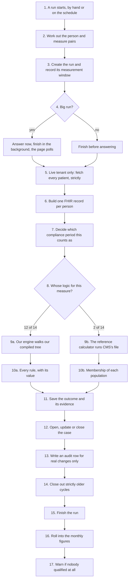
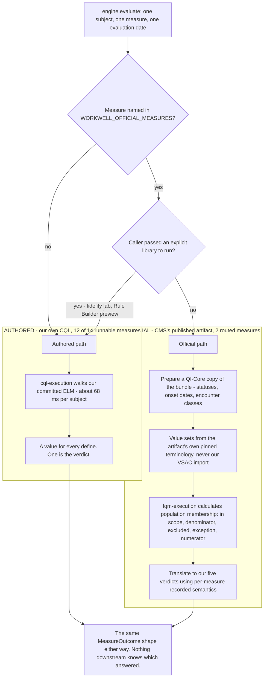
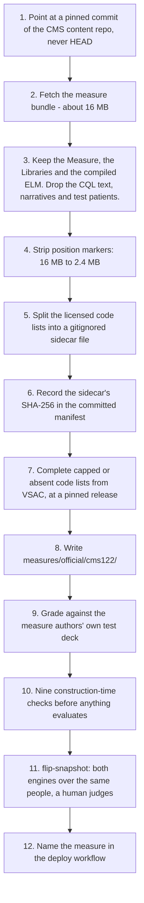

# 4. The engine and the router

> Part of the [WorkWell guide](README.md). Previous: [The compiler and ELM](03-compiler-and-elm.md) ·
> Next: [FHIR](05-fhir.md)

"Run the CQL" hides about twenty mechanical steps, and "get the CQL for a CMS measure" hides twelve
more. This chapter walks both, then explains the router that lets one run use two different engines,
and the three numbers that shaped it: 68, 171, and 11. A full run, trigger to audit row, is drawn as
a sequence in [chapter 10, S1](10-scenarios.md).

## One run, start to finish



Steps 9 and 10 are the whole of what "run CQL" means. Notice what is not in them: no compiling, no
reading files from disk, no database query. The engine is handed a record and a compiled tree and
gives back answers.

1. **A run starts.** Somebody presses the button or the overnight scheduler fires. Four scopes: one
   measure across everybody, everything for one person, everything for one site, or everything for
   everybody — the last is 14 measures across 150 people on the demo stack.
2. **The scope becomes a flat list of person-and-measure pairs.** For a site run, the seeded
   distribution is still computed over the whole population and filtered down, so a person's result
   is identical whichever scope evaluated them. Without that, the same person could land in a
   different bucket depending on how the run was started, and their case would flip back and forth.
3. **The run row is written immediately**, marked running, with its first log line. The measurement
   window is recorded here rather than inferred later, so a rerun tomorrow reuses the same window
   and updates the same cases.
4. **Answer now or later.** A full run takes about a minute — too long to hold a request open — so
   wide scopes return a running status and finish in the background while the page polls. One
   consequence worth knowing: the warning in step 17 is returned on the synchronous answer only,
   so for background runs it lives in the log timeline, not the run list. Fixing that needs a new
   `runs` column, and schema changes are owner-owned.
5. **Live tenant only: fetch the population, strictly.** Every patient is pulled from the WebChart
   FHIR server before evaluation starts, and a later-page failure fails the whole run. That is the
   opposite of how the read-only tools behave, deliberately: this fetch replaces the authoritative
   list of who exists, so a truncated page would silently erase everybody on the missing pages.
6. **Build one FHIR bundle per person** — the patient, their program enrollment, any documented
   exemption, and the clinical events this measure reads, stamped with the QI-Core profiles CMS
   logic checks for. Built fresh, used once, discarded ([chapter 6](06-data-and-databases.md) covers
   why bundles are never persisted).
7. **Decide which compliance period this counts as.** The measure's own cycle, not today's date. An
   annual audiogram run on the fourteenth of March counts as the current annual cycle. This single
   decision is why the nightly job updates one case per person per cycle instead of opening a new
   case every night — the Java-era backend did not do this and needed a migration to clean up about
   five thousand duplicates.
8. **Route by measure** — the next section.
9. **Evaluate.** The authored path loads the compiled tree, builds the measurement window as a
   closed interval, resolves the code lists into a lookup, and hands all of it plus the bundle to
   `cql-execution`, pinning "now" to the evaluation date so that re-running last month's date gives
   last month's answer. The official path is described below.
10. **Read the answer.** Our engine returns a value for every named rule; one rule is the verdict
    (`Outcome Status`, forced to `MISSING_DATA` if it is anything but the five known values), and
    one says whether the person was in the measure's population at all — which is how "not
    applicable" is told apart from "applicable but no record". CMS's calculator returns population
    booleans instead; see below.
11. **Save the outcome** — one row per person per measure per run, verdict plus all the working. A
    person whose evaluation threw is saved as `MISSING_DATA` with the error text attached, never
    skipped, so a failure is visible instead of quietly shrinking the denominator.
12. **Upsert the case**, keyed on person, measure and period so a repeat run can never duplicate.
    State-aware in three ways that took real work: an operator's in-progress status is preserved, a
    case a human closed is never reopened by a machine (one the system closed can be), and a
    compliant result on an already-closed case does nothing rather than moving its closure date.
13. **Audit only real changes.** A re-confirmation that changed nothing writes nothing — otherwise
    a nightly run would write a couple of thousand rows a night saying nothing happened, and the
    useful entries would be unfindable. Everything else writes an append-only `audit_events` row.
14. **Close out older cycles.** Open cases from a strictly older cycle, for people this run
    evaluated, are resolved as rolled over. Strictly older, not merely different: a backdated rerun
    has an earlier cycle, and a looser check would let it close today's live case.
15. **Finish the run** — completed, or partly failed if anybody errored. One person's failure never
    stops a run.
16. **Roll into the monthly figures**, after the run is already finished and structurally unable to
    fail it. A reporting rollup must never invalidate a completed evaluation.
17. **Warn if nobody qualified** — only for CMS-routed measures, and only a warning. For an all-male
    cohort, a breast cancer screening measure finding nobody in its population is the correct
    answer, and failing the run would replace everybody's evidence with an error. The warning names
    both possible causes — a genuinely ineligible group, or data missing a structural element the
    measure reads — and leaves a human to tell them apart (ADR-043).

## The router

`WORKWELL_OFFICIAL_MEASURES` is a comma-separated allowlist in the deployment configuration, never
`all`. When it is unset — which is every environment except demo/production — the router returns the
authored engine by identity: no wrapper, no dispatch, nothing to reason about, and a test asserts
the identity. When a measure is named in it, nine checks have to pass before the router will even
construct itself.



Three details in that diagram carry most of the weight:

- **The preparation step is measured, not theoretical.** Run without it, the official artifact reads
  an unprepared synthetic roster as entirely outside the measure population — IPP zero across the
  board. The copy gets QI-Core-expected statuses, onset dates moved into the past, and encounter
  classes filled in; the authored engine still sees the original.
- **The terminology is the artifact's own.** The value-set cache is built from the code lists
  vendored beside the measure at its pinned commit, never from our own VSAC import. That is what
  makes the MADiE gate evidence about this exact path.
- **The translation to verdicts is per-measure and recorded, because there is no safe default.**
  On the diabetes measure the numerator counts *failure* — HbA1c above 9 percent — so its
  translation inverts. Guess one way and every failure reports as compliant; guess the other and
  every success reports as overdue. The raw population booleans are stored too, and the standards
  exports read those in preference to our verdict, because five workflow buckets cannot express a
  denominator exception ([chapter 5](05-fhir.md)).

### The batching numbers

`fqm-execution` re-parses the artifact's 2.4 MB ELM on every call. Measured on the real artifacts:

| | Per subject |
|---|---|
| Official, one call per person | 171 ms |
| Official, whole roster in one pass | 11–16 ms |
| Authored engine | ~68 ms either way |

So unbatched, the official path is about 2.5 times slower than our own engine; batched, it is
faster. That inverted the assumption the roadmap had been carrying, and it is why the run pipeline
has a measure-major pre-pass: the whole roster goes through a routed measure in one call. The
subjects argument is a factory rather than an array, because an eager caller would build bundles
for all 14 measures and throw 13 sets away.

### The identity that keeps the cache honest

The engine object itself reports what logic it runs: `logicVersionFor(measureId)` returns
`official-fqm:<version>:<artifactSha>:<terminologySha>` for a routed measure and nothing for an
authored one. The incremental evaluation cache (`eval_state`, off by default) includes that string
in its fingerprint. Without it, flipping a measure to the official artifact would leave the cache
copying forward outcomes the *authored* engine computed — and a re-vendor would not invalidate them
either. The terminology digest is in there because re-fetching code lists at a different upstream
ref can move value-set membership, and therefore outcomes, with the measure bytes unchanged.

It hangs off the engine object rather than being passed alongside it because the alternative — one
more optional flag threaded through every caller — is the exact shape of bug that review caught
twice elsewhere. Here the logic identity and the thing that computes the outcome are the same
object, so they cannot disagree.

## Getting a CMS measure into the tree

CMS's FHIR measures are published in `cqframework/dqm-content-qicore-2025`, with test cases. One
command vendors one:

```bash
cd backend-ts
pnpm vendor:official --measure CMS122FHIRDiabetesAssessGT9Pct --catalog-id cms122 \
  --strip-elm-annotations --complete-terminology
```



The steps that need a sentence more than the diagram gives them:

- **Step 4 has a real cost.** The calculator resolves per-statement values by the position ids we
  strip, so with them gone we get population membership back but not a statement trace. That is the
  trade behind storing `populationResults` for CMS measures ([chapter 3](03-compiler-and-elm.md)
  explains the marker mechanism).
- **Step 5 exists because the repository is public.** Each measure carries dozens of code lists
  holding thousands of licensed AMA CPT and SNOMED codes. They go into a file that is deliberately
  not committed and is fetched at build time instead; the checksum in step 6 means the codes are
  pinned even though they are not stored, so a public repo still holds a reproducible measure. A
  regenerated sidecar either hashes identically or fails loudly at load.
- **Step 7 exists because upstream ships incomplete lists.** The content repo caps every published
  expansion at 1,000 entries (full ones need an NLM licence). One list both routed measures use is
  1,000 of 1,997 codes, and it feeds an exclusion — a short exclusion list silently scores people
  who should have been excused. Those lists are re-expanded from VSAC at vendor time, pinned to the
  release the content repo itself names. If the credential is missing, nothing is written and
  routing stays refused: a differently-incomplete list is the one outcome worse than staying
  capped.
- **Step 9 is the gate.** Every measure ships with test patients and the answers its authors
  expect. All of them run: **410 of 410 exact, across all 8 vendored measures** (CMS122 55,
  CMS125 66, CMS2 36, CMS68 19, CMS951 55, CMS138 47, CMS130 64, CMS165 68). No measure is allowed
  near a real person before this passes.
- **Step 12 is a reviewed change, not an operator action.** The measure is named in the deploy
  workflow file rather than set on the container, because the deploy deletes and recreates the
  container and would wipe a hand-set value. Switching a measure on therefore has a diff, and
  reverting it is a one-line edit.

### The nine construction-time checks

| # | Check | What goes wrong without it |
|---|---|---|
| 1 | Covered by the MADiE gate | A measure with no external validation gets routed. |
| 2 | Artifact vendored, catalog id matches | A mismatch runs a different measure than requested. |
| 3 | Numerator semantics recorded | No safe default exists — the diabetes inversion above. |
| 4 | Scoring is `proportion` | A cohort measure has no numerator; left alone this produced a "successful" run in which every subject was `MISSING_DATA`. |
| 5 | `populationBasis` is `boolean` | CMS68 counts encounters: one patient with four visits is four denominator units. We map one answer per person, so routing it would report a wrong denominator — and all 19 of its test cases have one visit each, so a green gate provably cannot catch this. |
| 6 | Terminology sidecar present, hash matches | 26 value sets silently expand empty. |
| 7 | No retrieved code list is capped | Half a list is not an empty list, so check 9 cannot see it. |
| 8 | No declared code list is absent from the bundle | The CMS138 story below. |
| 9 | Every retrieved code list expands non-empty | The one that would otherwise be invisible: the calculator treats an unloadable list as empty, an empty list matches nothing, and the measure reports every person as out of population — indistinguishable downstream from a genuinely ineligible group. |

The worker also runs these at boot, because everything is lazy: a typo would otherwise boot clean,
log that official measures are on, keep the health endpoint green, and 500 every evaluating route.

### Vendored, gated and routed are three different things

| State | Count | Detail |
|---|---|---|
| Vendored — artifact in the tree | 8 of 8 | Each with complete code lists and nothing truncated |
| MADiE-gated — authors' own deck passes | 8 of 8 | 410 of 410 |
| Routed — evaluating real people | 2 | cms122 and cms125, demo/production stack only |

The other six pass their decks but stay unrouted because they have no authored counterpart to
compare against, and that comparison — `pnpm flip-snapshot`, step 11 — is what every flip so far
was judged on.

> **The eighth measure is the one worth retelling.** CMS138 (tobacco screening) would not run at
> all: all 47 of its test cases errored, and the original note said its code lists "would not
> expand" — a symptom, pointing at the wrong system. What was actually wrong: the measure's logic
> declares 32 code lists and the published bundle ships 31. One was simply absent, so there was
> nothing to expand. Our own tooling could not see that either, and that is the part a reviewer
> should notice: the vendor step counted the code lists a bundle *contains*, so a list that was
> never shipped produced no entry, no warning and no truncation flag — the measure read as complete
> while being unrunnable. The step now diffs what the logic asks for against what the bundle
> carries, the missing list is sourced from VSAC at build time, and all 47 cases pass (ADR-053).

## Where to see it in the app

- `/runs` — the run list, each run's log timeline, and the export downloads.
- `/cases/{id}` — one person's per-define evidence, the derived `why_flagged` block, and a raw
  evidence JSON toggle. This is "why is this person flagged", traced to the define that decided it.
- The routing state is configuration: `WORKWELL_OFFICIAL_MEASURES` in `deploy-twh-mieweb.yml`.

## Reproduce it yourself

```bash
cd backend-ts
pnpm test:official-cases        # the MADiE gate: 410/410 (needs the terminology sidecar)
pnpm flip-snapshot --measure cms125   # both engines over the same bundles, per-subject diff
```
