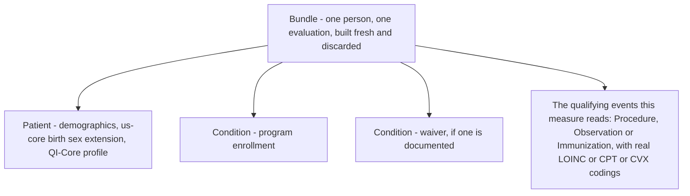
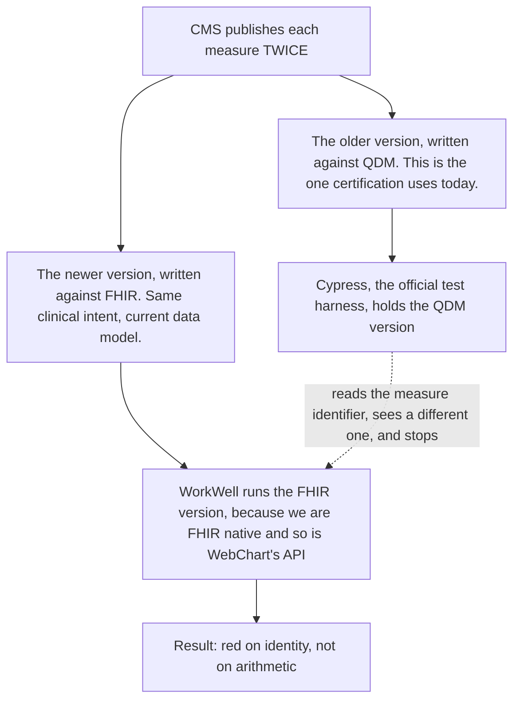
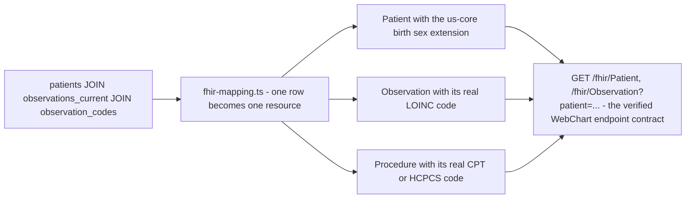
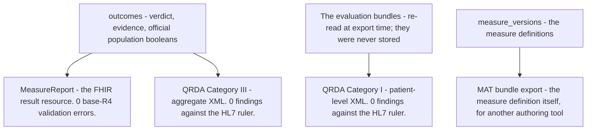

# 5. FHIR: the shape of everything the engine reads and reports

> Part of the [WorkWell guide](README.md). Previous: [The engine and the router](04-engine-and-routing.md) ·
> Next: [Data and databases](06-data-and-databases.md)

The engine never reads a database row, a CSV, or an HL7 v2 message. Everything it evaluates arrives
as FHIR, and most of what it reports leaves as FHIR. This chapter defines the handful of FHIR terms
the rest of the guide leans on, shows how WebChart rows become FHIR, and covers the standard
reporting documents that come out the other end. The standards loop end to end:
[chapter 10, S5](10-scenarios.md); the live WebChart path: [chapter 10, S2](10-scenarios.md).

## FHIR in five terms

FHIR (Fast Healthcare Interoperability Resources) is HL7's standard for exchanging health data as
JSON over HTTP. Five of its ideas do all the work in this system:

**A resource** is one typed JSON record: a `Patient`, an `Observation` (a measurement or test
result), a `Procedure`, a `Condition` (a diagnosis or documented state), an `Immunization`, an
`Encounter` (a visit). Each has a defined set of fields.

**A bundle** is a list of resources shipped as one JSON document. WorkWell builds one bundle per
person per evaluation: the `Patient`, a `Condition` recording their program enrollment, an optional
`Condition` recording a waiver, and the clinical events the measure reads.

**A coding** says what a clinical entry *is*, using a code from a named system: LOINC for
observations and lab tests, CPT and HCPCS for procedures, SNOMED for clinical concepts, CVX for
vaccines. A measure never says "a mammogram" — it says "any code in this list of 92 codes". Those
lists are value sets, and resolving them is half of what [chapter 4](04-engine-and-routing.md)'s
machinery does.

**A profile** is a ruleset layered on a resource type, saying which fields must be present and how
they are used. They stack: FHIR R4 is the base; US Core is the US national layer; QI-Core is the
quality-measurement layer on top of that, and it is what CMS measures are written against. Every
bundle we build stamps its resources with QI-Core profile URLs, because official measure logic
checks for them — an unstamped resource can be silently invisible to a retrieve.

**An extension** is a named extra field a profile adds. The example that cost us a measurement
pass: CMS's breast cancer screening measure does not read `Patient.gender`. It reads the US Core
*birth sex* extension and compares the coded value against SNOMED `248152002`. With the extension
absent, all 56 WebChart test patients fell out of the measure population, and the run looked
exactly like a legitimately ineligible cohort. Nothing errored. That is what "profile-sensitive"
means in practice, and why the mapping work below is load-bearing rather than cosmetic.

### One bundle, anatomically

## CMS publishes every measure twice

The single most confusing fact in this ecosystem, and the root of a red grading result that had
nothing to do with arithmetic:

The two versions carry different identifiers and different internal population names, so a grader
built for one cannot read output from the other. Our computed numbers matched the harness's own
expected results exactly — 150 of 150 and 64 of 64 patients agreeing on every population — and the
submission still came back red, because the harness stopped at the identifier before looking at any
number. Relabelling our results with the QDM version's identity would mean claiming to have run
logic we did not run, so we do not do it (ADR-046, ADR-058). What follows from that is the standing
decision that WebChart keeps carrying certification and WorkWell does not chase it
([chapter 9](09-state-and-roadmap.md)).

## How WebChart rows become FHIR

The shim's mapping (`wcdb-fhir-shim/src/fhir-mapping.ts`) mostly writes itself — a LOINC-coded lab
row becomes an `Observation` with that LOINC code. Two mappings do more work than they look:

- **The birth sex extension**, described above. Both places that map `patients.sex` into FHIR emit
  it, carrying the SNOMED concept — an extension carrying a bare `"F"` is indistinguishable from
  one that is absent, which is a lesson that cost a full measurement pass to learn.
- **Mammography is dual-stamped.** Our authored measure retrieves a `Procedure` with a CPT or
  HCPCS code; CMS's official measure retrieves an `Observation` from a 92-entry LOINC list, and on top of
  that requires `category` set to imaging. Each single representation fails in the opposite
  direction — Procedure only, and the official measure reports a screened woman as overdue;
  Observation only, and ours does. So one screening-mammogram row emits both, derived strictly from
  the same real row. This is normalization, not fabrication: an explicit code allowlist, never a
  category sweep, and non-inflating because both measures ask "does one exist", not "how many".

The **live tenant path** applies the same two derivations in `normalizeWebChartBundle` — the birth
sex extension derived from `gender` through a two-value allowlist, the LOINC imaging observation
derived from a mammography procedure — both tagged as derived, and both suppressed when the server
supplies the real thing itself (ADR-057). Reading a server's own recorded "female" as not-female
would also be an inference, and a worse one.

## FHIR and the standards documents on the way out

**MeasureReport** (`GET /api/runs/:id/measure-report`) is FHIR's standard result resource — what a
quality-reporting receiver expects. It reads the official population booleans in preference to our
five-bucket verdict, because the workflow vocabulary cannot express a denominator exception and it
inverts for a measure whose numerator counts failures. It validates at zero base-R4 errors; the gap
to the stricter DEQM reporting profile is exactly three findings per report, so we deliberately do
not claim that profile yet.

**QRDA Category I and III** are HL7's XML document formats for quality reporting — patient-level
and aggregate. Both export types validate at zero findings against the HL7 base rulers (XSD and
Schematron), measured by 22 submissions to a local instance of Cypress, the official ONC test
harness. Category I is also an *input*: the import path in
[chapter 6](06-data-and-databases.md) is what closed the loop against a third party's archive.
A structural note worth knowing: a QRDA document is only meaningful for data coded in real
terminologies, which is why the authored catalog's synthetic `urn:workwell:*` measures are not
QRDA-representable by design.

**The MAT export** (`GET /api/measures/:id/versions/:vid/export/mat`) packages a measure
*definition* — not results — as a FHIR bundle, the authoring interchange format.

The CSVs, the audit packet and the versioned compliance API also read from these same tables; they
are product outputs rather than FHIR, and [chapter 1](01-big-picture.md) covers them.

## Where to see FHIR, honestly

- **In:** the shim's endpoints are real FHIR searchsets — `curl localhost:8085/fhir/Patient?_count=5`.
- **Stamped:** every built bundle carries QI-Core profile URLs.
- **Out:** the MeasureReport download and the MAT export are FHIR resources; the QRDA documents are
  the XML cousins.
- **Referenced:** each outcome's `evidence_json.evaluatedResource` records the patient, measure and
  period context.
- **But there is no screen that shows the evaluation bundle itself.** Bundles are transient by
  design, so the thing a developer most wants when debugging "why did this retrieve match nothing"
  is the one thing the UI cannot show. A "show the bundle" panel is a small build and it is on the
  open list in [chapter 9](09-state-and-roadmap.md).
