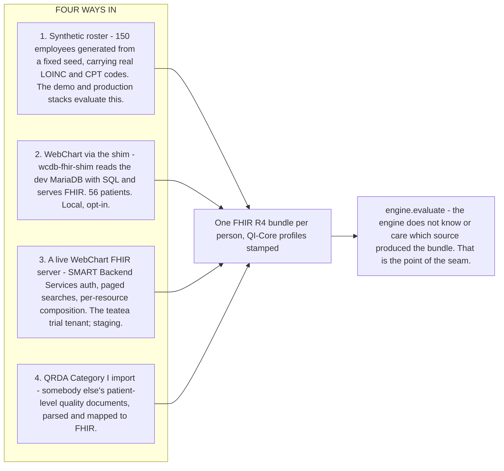
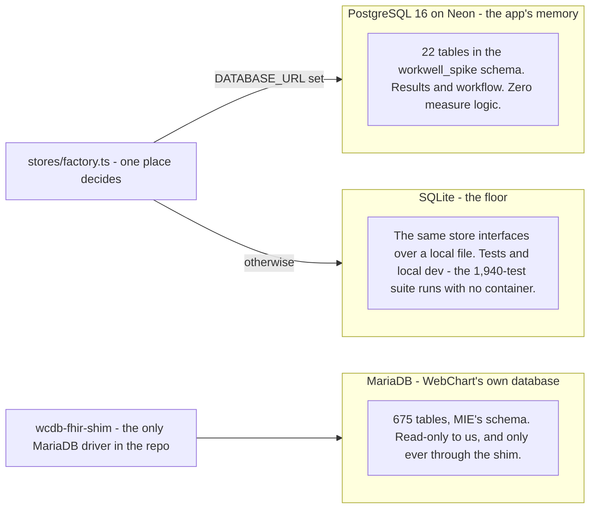
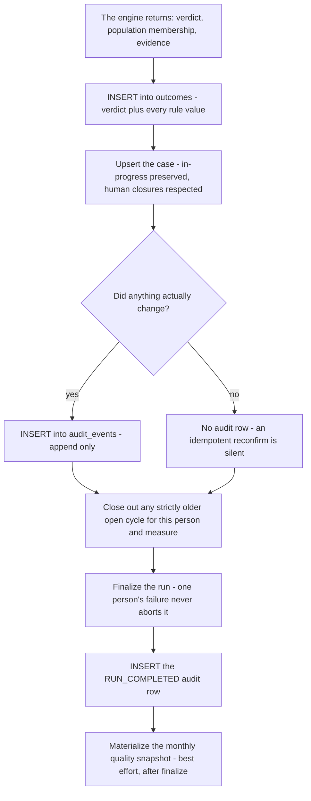

# 6. Data in, and the three databases

> Part of the [WorkWell guide](README.md). Previous: [FHIR](05-fhir.md) ·
> Next: [SQL, all three places](07-sql-and-the-bridge.md)

Two questions get answered here. Where does patient data come from before the engine sees it — there
are four ways in — and what is stored where afterwards, across the three databases this system
touches. The ingress-to-persistence order is drawn as a sequence in
[chapter 10, S1 and S2](10-scenarios.md).

## The four ways data enters the engine

**1. The synthetic roster.** 150 employees generated in memory from a fixed seed, so the same run
produces the same people every time. Their records carry genuine LOINC and CPT codes rather than
invented ones, which matters because the published CMS measures look for specific codes and would
match nothing against made-up data. Each person's bundle holds the patient, their program
enrollment, any documented waiver, and the qualifying event for the measure at hand.

**2. WebChart through the shim.** `wcdb-fhir-shim` reads the seeded WebChart development database
(`ghcr.io/mieweb/dev-wcdb`) over SQL and serves FHIR — [chapter 7](07-sql-and-the-bridge.md) has
the mechanics, [chapter 5](05-fhir.md) the mapping. The app consumes it through the same
`WORKWELL_WEBCHART_BASE_URL` seam as a real tenant, with zero app-side branching.

**3. A live WebChart FHIR server.** Auth is SMART Backend Services — a signed JWT assertion, no
static API key — with paged `Patient` searches and per-resource `?patient=` composition, because
the real server exposes no `$everything` operation. The `teatea` trial tenant is registered and
live. The server quirks found there (400s on `_count`, 403s on a bare `/Patient`, no `$export`,
blood-pressure panels with `status=unknown`) are exactly the class of thing only a real server
teaches you.

**4. QRDA Category I import.** `POST /api/runs/:id/import` accepts a batch of patient-level quality
documents — a batch, because resolving which documents describe the same person is inherently
cross-document. A hand-rolled CDA parser (Node has no DOM parser, and the project rule is no new
dependencies) maps six QDM datatypes to what the measure logic actually retrieves, and the
unchanged engine evaluates the result. This is the path that proved the engine is not marking its
own homework: a third party's archive of 214 generated patients went through it, and the computed
populations matched that third party's own published expected answers for every one of 150 of 150
and 64 of 64 subjects on the two measures tested.

**Why WebChart, and why through one seam.** WebChart is where the real occupational-health data
is, it is the ONC-certified system MIE already ships, and it is the consumer for anything WorkWell
computes. The integration is one seam with three interchangeable things behind it — a HAPI
simulator, our own shim over the MariaDB, and a real tenant — so proving the contract against the
cheap one proves it for the expensive one.

**Measured on real WebChart data:** official CMS125 admits 4 of 56 subjects to its initial
population and agrees with the authored engine on all 56. Official CMS122 admits 0 of 56 — the
seed has no Conditions, and that measure's population requires a diabetes diagnosis the roster
must never fabricate. That is a data gap, not a divergence, and the flip-snapshot tool reports it
as inconclusive rather than as a failure.

## The three databases

**Postgres is the ceiling, SQLite is the floor, and one factory decides.** Route and service code
sees shared store interfaces — `RunStore`, `OutcomeStore`, `CaseStore` and eleven more — never a
concrete driver. `backend-ts/src/stores/factory.ts` is the single place that picks a backend: a
`DATABASE_URL` pointing at Postgres selects the `Pg*` implementations over one pooled connection
scoped to the `workwell_spike` schema; otherwise the `Sqlite*` implementations run over the local
database binding. The schema self-creates on first touch in both backends
(`stores/postgres/schema-pg.ts` and `stores/sqlite/schema.ts` — the one part of the tree whose
changes are owner-only). The arrangement means the full test suite runs with no database container,
while a store contract test proves the two backends agree; the production cutover to Neon was one
environment variable.

**MariaDB is WebChart's, and the app never touches it.** The only MariaDB driver in the repository
lives in `wcdb-fhir-shim` (ADR-034). Everything the app learns from WebChart arrives as FHIR over
HTTP.

## What is in Postgres, table by table

| Table | Holds | Written when |
|---|---|---|
| `runs` | Run header: scope, trigger, status, measurement period | run start and finish |
| `run_logs` | Per-run timeline (info, warnings, errors) | throughout a run |
| `outcomes` | One row per person, measure and run: verdict plus `evidence_json` | after each evaluation |
| `cases` | The workflow layer, keyed so it cannot duplicate | the upsert after each outcome |
| `case_actions` | Operator actions: outreach, assign, escalate, rerun | route handlers |
| `audit_events` | The append-only ledger. Every state change, no exceptions | everywhere state changes |
| `measures` | The authoring catalog (63 measures, 14 runnable) | the Studio |
| `measure_versions` | Per-version spec JSON, CQL text, compile status, test fixtures | the Studio |
| `value_sets` | Terminology: OID, canonical URL, codes, expansion hash | value-set import / VSAC |
| `measure_value_set_links` | Which measure uses which value set | the Studio |
| `terminology_mappings` | Local code to standard code crosswalk | admin |
| `waivers` | Exemptions the CQL reads to return `EXCLUDED` | admin |
| `segments`, `segment_measures`, `segment_overrides` | Applicability groups — they gate case creation, never compliance | admin |
| `quality_snapshots` | Monthly numerator/denominator per measure and scope | end of each run |
| `eval_state` | Incremental-evaluation fingerprints (off by default) | when enabled |
| `person_links` | Cross-system identity: confirmed and broken links | identity review |
| `outreach_templates` | Campaign message templates | admin |
| `scheduled_appointments` | Follow-up scheduling on a case | case actions |
| `evidence_attachments` | Operator-uploaded documents on a case | case detail |
| `audit_packet_exports` | A record that an audit packet was produced | auditor routes |

### The three things deliberately not in Postgres

1. **The FHIR bundles.** Every evaluation bundle is transient — built, evaluated, dropped. Nothing
   here quietly becomes a second medical record. The honest consequence: the QRDA Category I export
   re-reads bundles at export time rather than reconstructing them from a persisted outcome, and
   there is no screen that shows the bundle a past evaluation used
   ([chapter 9](09-state-and-roadmap.md) lists that as an open gap).
2. **Any executable form of the measures.** No CQL or ELM stored as SQL, no logic in the database.
3. **The official artifacts' code lists.** Licensed content — gitignored, fetched at build, pinned
   by checksum ([chapter 4](04-engine-and-routing.md)).

### The contract that makes reruns safe

`UNIQUE(employee_id, measure_version_id, evaluation_period)` on `cases`, combined with persisting
the measure's compliance *cycle* rather than today's date. Run the same scope twice and you get an
upsert, not a second case. Run it nightly for a year and you get one case per person per cycle,
with the prior cycle closed as rolled over. The Java-era backend lacked this and needed a cleanup
migration for roughly five thousand duplicate cases; the contract now makes them impossible.

## What happens to one answer

Details of the case-upsert rules and the empty-population warning are in
[chapter 4](04-engine-and-routing.md), steps 11 through 17.

## Where to see it in the app

- `/compliance` — the roster grid: every person crossed with every active measure, live WebChart
  subjects included.
- `/runs` — run history with each run's log timeline.
- The audit ledger exports from `/api/audit-events/export?format=csv`.
- FHIR on the wire from the shim: `curl localhost:8085/fhir/Patient?_count=5`.
