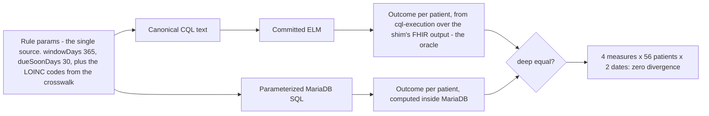

# 7. SQL, all three places it lives

> Part of the [WorkWell guide](README.md). Previous: [Data and databases](06-data-and-databases.md) ·
> Next: [The npm packages](08-packages.md)

SQL appears in three completely separate places in this system, and conflating them is what makes
the story confusing. One is bookkeeping. One is how WebChart's rows become something the engine can
read. One is the CQL→SQL bridge: measure logic running as a query inside WebChart's own database,
checked against the CQL engine.

```mermaid
flowchart TB
  subgraph S1["ONE - SQL as the app's own memory. PostgreSQL 16, hosted on Neon."]
    direction LR
    A1["A person is evaluated"] --> A2["Save the outcome: verdict plus every rule value"]
    A2 --> A3["Open or update the case - never a duplicate"]
    A3 --> A4["Write the audit row - append only"]
  end
  subgraph S2["TWO - SQL as how we read WebChart. The only MariaDB driver in the repo."]
    direction LR
    B1["WebChart MariaDB - 675 tables"] --> B2["Hand-written joins: patients, observations, codes"]
    B2 --> B3["Rows become FHIR resources with real LOINC and CPT codes"]
    B3 --> B4["Served over the same endpoints a real WebChart tenant serves"]
  end
  subgraph S3["THREE - SQL as a second way to run a measure. The CQL to SQL bridge."]
    direction LR
    C1["One rule description"] --> C2["generates CQL for the engine"]
    C1 --> C3["generates SQL for MariaDB"]
    C2 --> C4["A verdict per patient - the reference answer"]
    C3 --> C5["A verdict per patient - computed inside MariaDB"]
    C4 --> C6["Compared: 4 measures, 56 people, 2 dates. Identical."]
    C5 --> C6
  end
```



## One: Postgres holds what happened, never how it was decided

Twenty-two tables — runs, outcomes, cases, the audit log, the measure catalog, code lists, waivers,
monthly rollups. Every row is a record of a result or of somebody doing something. No measure logic
lives there, and no compliance decision is ever made by a query.
[Chapter 6](06-data-and-databases.md) lists every table.

## Two: SQL is how WebChart rows become FHIR

`wcdb-fhir-shim/` is a small standalone service and the one place in the repository allowed to hold
a MariaDB driver (`mysql2`, approved by ADR-034 for that package alone — `backend-ts` is
deliberately driver-free). It reads the WebChart database directly, joins `patients` to
`observations_current` to `observation_codes`, and turns each row into a FHIR resource carrying
real LOINC, CPT and HCPCS codes. Then it serves those resources over exactly the endpoints a real
WebChart tenant serves, so the app talks to it through one configuration value and cannot tell the
difference. [Chapter 5](05-fhir.md) covers the mapping itself, including the two fields that turned
out to be load-bearing for CMS measure execution.

## Three: the CQL→SQL bridge

The original ask, in compiler terms from [chapter 3](03-compiler-and-elm.md), was: **add a SQL
backend to the ELM representation.** Read the CQL, emit the SQL. That is a completely reasonable
thing to want, and it is the obvious move once you see that ELM exists. Here is why we did not do
it that way, and what we did instead.

A backend is cheap when the representation has already been lowered close to the target. ELM has
not been. It sits near the top of the ladder: structured control flow, three-valued logic where a
missing value is neither true nor false, interval arithmetic with genuine uncertainty about
boundaries, and value-set membership as a primitive. Writing a backend from there to SQL means
implementing all of those semantics again, in SQL. That is not a backend — it is a second
implementation of the language, and two implementations of the same measure semantics means two
answers to the same question with no way to say which is right.

A compiler team handles this with a chain of representations, lowering step by step, each one
closer to the target. For CQL that chain does not exist. There is one representation and it is the
high-level one. The only serious public attempt at an ELM-to-SQL backend targets an analytics
warehouse rather than a transactional database, and is partial.

So the backend was added one tier *higher*, where the language is small enough to have a second
backend safely. A windowed-recency rule description has no three-valued logic, no intervals and no
terminology semantics — it is a handful of numbers and a code list:

```yaml
rule:
  type: windowed-recency
  windowDays: 365
  dueSoonDays: 30
```

From that one description we generate CQL for the engine (`@work-well/measure-codegen`,
[chapter 2](02-cql-and-authoring.md)) and SQL for the database
(`backend-ts/src/engine/cql/codegen/generate-sql.ts`, pure string templating, no driver). There is
only ever one definition of the rule, and the two outputs are checkable against each other.



And because both paths exist, the engine is the reference implementation for the query, and the two
are differentially tested. That is exactly how a compiler team validates a new backend: run both,
diff the results, investigate every disagreement. Four measures, fifty-six patients, two evaluation
dates, no disagreement (`wcdb-fhir-shim` parity suite, ADR-025: a measure that has never passed
parity is never served by SQL).

### What the generated SQL looks like

Abridged from the committed `wcdb-fhir-shim/sql/hypertension.sql` (regenerate with
`cd backend-ts && pnpm generate:sql`):

```sql
SELECT
  p.pat_id,
  CONCAT('wc-', p.pat_id) AS subject_id,
  last_ev.dt AS last_event_date,
  CASE
    WHEN last_ev.dt IS NULL                            THEN 'MISSING_DATA'
    WHEN DATEDIFF(params.eval_date, last_ev.dt) > 365  THEN 'OVERDUE'
    WHEN DATEDIFF(params.eval_date, last_ev.dt) > 335  THEN 'DUE_SOON'
    ELSE 'COMPLIANT'
  END AS outcome_status
FROM (SELECT CAST(? AS DATE) AS eval_date) params
CROSS JOIN patients p
LEFT JOIN (
  SELECT o.pat_id, MAX(DATE(COALESCE(o.obs_result_dt, o.obs_ts))) AS dt
  FROM observations_current o
  JOIN observation_codes oc ON oc.obs_code = o.obs_code
  WHERE oc.loinc_num IN ('85354-9','8480-6')
    AND COALESCE(o.obs_result_dt, o.obs_ts) IS NOT NULL
    AND DATE(COALESCE(o.obs_result_dt, o.obs_ts)) >= DATE('0001-01-01')
  GROUP BY o.pat_id
) last_ev ON last_ev.pat_id = p.pat_id
WHERE p.is_patient = 1
ORDER BY p.pat_id;
```

Three properties worth pointing at:

- **No SQL is assembled while a request is in flight.** The generated files are committed, reviewed
  like any other code, freshness-tested in CI, and loaded by the shim at startup, split on
  `-- @statement` markers. Runtime values — the evaluation date, a patient id — are bound `?`
  parameters. The LOINC codes are code-controlled measure parameters, shape-validated against
  `/^[0-9]{1,7}-[0-9]$/` before being inlined as quoted literals.
- **The date guard excludes only MariaDB's zero-date.** A genuine record from 1890 flows through
  and comes out overdue, because that is what the engine does with it. An earlier version filtered
  more aggressively and would have disagreed with the engine on exactly those rows; review caught
  it.
- **Enrollment and waiver gates are deliberately absent from the SQL.** On the live WCDB path every
  subject is roster-enrolled on the WorkWell side, and the WebChart seed carries no waiver
  Conditions — putting those gates in the SQL would encode a fact about the database that is not
  true.

### Scope, stated exactly

Four measures: `hypertension`, `diabetes_hba1c`, `obesity_bmi`, `cholesterol_ldl` — all
windowed-recency. The vaccine measures cannot be done this way against WCDB because the database
has no immunization table, so there is nothing to reach parity against. They are excluded rather
than attempted, because an unverifiable query would violate the one rule that makes the bridge
trustworthy.

### What it is not

The generated SQL is not wired into the app's executor seam. CQL remains the sole authority for
`Outcome Status` in the product (ADR-008); the SQL serves the shim's own compliance endpoints
(`GET /compliance/{patient}/{measure}` and `GET /compliance/{measure}/cohort`) and the parity
harness. Promoting it to a production executor is a decision, not a wiring task — it is one of the
two open decisions in [chapter 9](09-state-and-roadmap.md). The parity suite also self-skips in CI
unless a live shim URL is configured, so it is a proven result, not a standing gate.

> **A naming trap in the Studio.** The measure Studio's CQL tab has a SQL preview panel that
> templates illustrative SQL from the measure spec, in the browser. It is not the parity-proven
> `generate-sql.ts` output. Two different things wear the same name in the same product; until the
> panel is either pointed at the real artifacts or relabelled, the committed files in
> `wcdb-fhir-shim/sql/` are the real thing.

## Where to see it on the wire

```bash
# FHIR out of WebChart SQL (role two)
curl localhost:8085/fhir/Patient?_count=5

# a verdict computed inside MariaDB (role three)
curl localhost:8085/compliance/hypertension/cohort
```

## Reproduce it yourself

```bash
cd backend-ts
pnpm generate:sql          # regenerate the committed .sql artifacts; diff should be empty
# with the wcdb compose profile up:
#   the shim's parity suite evaluates both paths and deep-compares per patient
```
