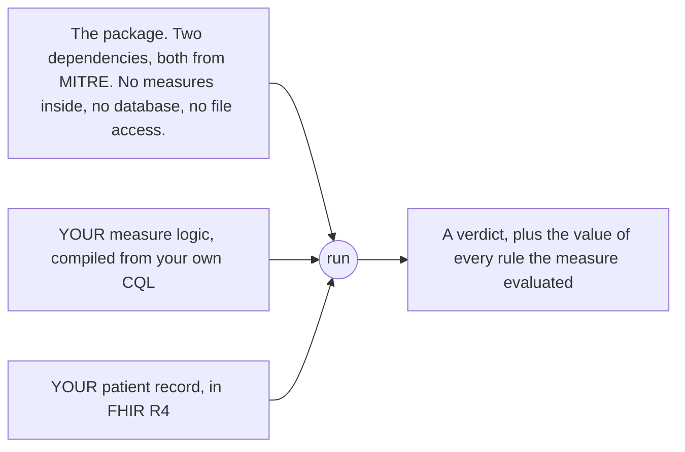

# 8. The npm packages

> Part of the [WorkWell guide](README.md). Previous: [SQL, all three places](07-sql-and-the-bridge.md) ·
> Next: [State and roadmap](09-state-and-roadmap.md)

Two packages went to the public npm registry on 2026-08-07, each with a signed provenance record
from the build, so anyone can verify which commit and which workflow produced the file they
downloaded.

| Package | Version | Depends on | Answers |
|---|---|---|---|
| `@work-well/measure-engine` | 0.1.0 | `cql-execution`, `cql-exec-fhir` | Is this person compliant with this measure, and what did each rule decide |
| `@work-well/measure-codegen` | 0.1.0 | nothing at all | What CQL expresses this described rule |



## The design decision that made the engine publishable

**Measure content is injected, never shipped** (ADR-059). The catalog, the compiled ELM libraries
and the offline code-list fallbacks all stay application-side, wired in exactly one place —
`createWorkwellEngine()` — which every former direct construction site now calls. The package knows
nothing about audiograms, and a consumer test asserts exactly that: `audiogram` is unknown to it.

Content is *required*, and the requirement is a compile error rather than a convention, because an
engine constructed with an empty catalog reports no-data for an entire workforce — which is
indistinguishable from a workforce that genuinely does not qualify, the same failure shape
[chapter 4](04-engine-and-routing.md)'s empty-population warning exists to keep visible.

Injection is also what unblocked the extraction at all. The blocker on record for two weeks was
nine test files that reached from the engine core into the app: moving the code would either strand
them or give the package a dev-dependency pointing back at the application. Under injection the
problem dissolved instead of being paid — every one of those tests configures content, so every one
belongs app-side by the same rule that keeps the content out.

## What deliberately does not ship

- **`@work-well/official-executor`** — the sole home of `fqm-execution`, which drags in a large
  dependency tree (axios, handlebars, moment, lodash). The package boundary is the quarantine.
  Publishing it would advertise, under the `@work-well` name, exactly the dependency the engine's
  two-line manifest exists to exclude.
- **`@work-well/example-consumer`** — a test, not a sample: one dependency, its own CQL, ELM and
  bundle, asserting the engine works with content the repo never gave it.
- **The measure content itself** — see above.

## How we know the packages work outside this repository

`pnpm verify:publish` runs in CI on every pull request. It packs real tarballs, installs them into
a temporary directory with a plain `npm install` and no knowledge of this repo, runs the engine
there on real measure content, and type-checks a TypeScript consumer against the packed type
definitions. After publication, the same exercise was repeated installing from npm into an empty
directory — which is what turns "works outside the app" into "works outside the repo".

## Positioning

`fqm-execution` (Project Tacoma, MITRE) takes a whole published FHIR measure bundle and calculates
it end to end, producing a MeasureReport. `@work-well/measure-engine` sits one layer down: compiled
ELM plus a patient bundle in, per-rule values out. No Measure resource, no bundle unpacking, no
MeasureReport. Both sit on the same `cql-execution` core.

The strongest evidence for that framing is a choice made against our own package: official CMS
measures run on `fqm-execution` in our production, not on our engine. We compose it; we do not
compete with it. No performance or conformance comparison against it has been run, so none is
claimed.

The full library contract — semver policy, what a version promises, the scope-name history — is in
[`docs/PACKAGES.md`](../PACKAGES.md), which is the document an integrator should read first.

## Reproduce it yourself

```bash
cd backend-ts
pnpm verify:publish     # pack, install into a clean dir, run a measure there, typecheck a consumer
```
