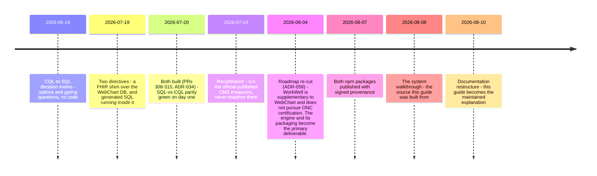
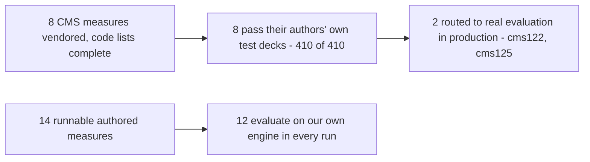

# 9. Where things stand, and what comes next

> Part of the [WorkWell guide](README.md). Previous: [The npm packages](08-packages.md)

This chapter owns the volatile facts. Every number here carries the date it was measured and the
command that reproduces it, so the other chapters can stay stable while this one moves.

## How the project got to its current shape



Two things about that sequence are easy to misread and worth stating plainly. The CQL→SQL work was
never cancelled — it was built, proven, and then not carried forward when the 07-24 recalibration
moved priority to the official CMS measures, and that narrowing went unannounced for three weeks.
And the decision not to pursue ONC certification is not a retreat from standards: both QRDA formats
validate clean, the numbers matched the certification harness's own expected results subject for
subject, and the red grade traced to measure identity (QDM vs FHIR lineage,
[chapter 5](05-fhir.md)), not arithmetic. WebChart already carries certification; WorkWell
supplements it.

## The measure funnel



The six gated-but-unrouted measures are not blocked by quality — they have no authored counterpart
to diff against, and that comparison is what every flip so far was judged on
([chapter 4](04-engine-and-routing.md)).

## The numbers, dated

| Claim | Number | Reproduce / evidence |
|---|---|---|
| Test suite | 1,940 total · 1,925 pass · 0 fail · 15 skip (2026-08-08, 279 s) | `cd backend-ts && pnpm test`. The 15 skips need the gitignored terminology sidecar or a local Postgres, and self-skip rather than passing vacuously. |
| CMS measures vs their own test decks | 410 of 410, 8 measures | `pnpm test:official-cases`, after the two-step setup below |
| CQL language conformance | 1,622 pass of 1,835 cases (2026-08-05) | `pnpm cql-tests:fetch` then `pnpm cql-tests`, against `cqframework/cql-tests`. Failures cluster in the shared translator and engine, not our measures; five of the sixteen files are perfect, and they are the constructs our measures use. |
| SQL vs the CQL engine | zero divergence — 4 measures × 56 patients × 2 dates (2026-07-20) | the shim parity suite, [chapter 7](07-sql-and-the-bridge.md) |
| QRDA Category I vs the HL7 ruler | 0 findings, XSD and Schematron (2026-08-02) | Cypress 7.5.1, 22 submissions |
| QRDA Category III vs the HL7 ruler | 0 findings (2026-08-02) | same |
| MeasureReport vs base FHIR R4 | 0 errors; the DEQM profile gap is exactly 3 findings per report | `measure-report.test.ts` |
| Independent Java engine running our artifacts | 255 of 278 (2026-08-04) | 14 of the 23 exceptions trace to one conjunct whose required field the test cases omit |
| Subject-level agreement vs Cypress's expected results | 64 of 64 and 150 of 150, every population (2026-08-03) | reproduced against a second independently generated archive |
| Routed in production | 2 measures | `WORKWELL_OFFICIAL_MEASURES` in `deploy-twh-mieweb.yml` |

### Two of those commands need a corpus the repository does not carry

`pnpm test` and the rest work in a fresh clone. The two conformance rows do not, and they fail
loudly rather than reporting a smaller number — which is the intended behaviour, not a rough edge.
Both corpora are third-party content fetched at a pinned commit and deliberately gitignored, so a
clone stays small and upstream content is never silently re-vendored.

```bash
cd backend-ts

# CMS measures vs their own test decks — fetch the pinned content, then vendor the terminology
pwsh -NoProfile -File scripts/fetch-official-cases.ps1   # ~34 MB, into the gitignored .official-content/
pnpm vendor:official --measure CMS122FHIRDiabetesAssessGT9Pct --catalog-id cms122 --strip-elm-annotations
# …repeat for the other seven; ci.yml's `official-cases` job is the authoritative list
pnpm test:official-cases

# CQL language conformance — refuses to report at all until the full corpus is present
pnpm cql-tests:fetch    # without this, `pnpm cql-tests` exits 2 and tells you to run it
pnpm cql-tests
```

**The full 410 of 410 needs a VSAC credential.** Two measures (CMS122 and CMS125) depend on a value
set upstream ships capped at 1,000 codes; completing it means re-expanding from VSAC, which needs
`WORKWELL_VSAC_API_KEY_VENDOR` and the `--complete-terminology` flag. Without the key those two
measures vendor with the capped expansion — CI does exactly this on fork pull requests and says so
rather than reporting a pass it did not earn. The other six are byte-identical either way.

## Open gaps, named

- **Nothing in CI checks that the committed ELM matches the CQL it came from.** The backend job
  installs, typechecks and tests; no workflow runs `compile-measures`. Edit a `.cql` file, forget to
  regenerate, and CI stays green while the deployed measure runs the previously compiled logic —
  a stale-input failure that is silent, which is the class this project keeps getting bitten by
  (ADR-040 closed the same shape for the evaluation cache). The fix is cheap and nobody has done it:
  recompile in CI and fail on a non-empty diff, which is sound because the compiler's output is
  byte-identical run to run (ADR-064). Found by review on the documentation PR that first wrote the
  guarantee down as though it existed.
- **No screen shows the FHIR bundle an evaluation used.** Bundles are transient by design
  ([chapter 6](06-data-and-databases.md)), so the thing a developer most wants when debugging a
  retrieve is the one thing the UI cannot show. Small build, high value.
- **The empty-population warning does not reach the run list.** For background runs — which is
  every wide-scope run — it lives in the log timeline, because `runs` has no message column and
  schema changes are owner-owned.
- **Demographic supplemental data (race, ethnicity, sex, payer) is absent across the QRDA chain.**
  Deferred deliberately: today it moves no external number.
- **Four CLI entry points still use `node:` builtins** — the last unmoved piece of the package
  extraction.
- **Undiagnosed measure discrepancies:** two Procedure-only cases in CMS125, seven numerator flips
  in CMS2, and CMS130/CMS165 never swept.
- **The Studio's SQL preview panel shows illustrative SQL**, not the parity-proven generated
  artifacts ([chapter 7](07-sql-and-the-bridge.md)). Either point it at the real files or relabel
  it.
- **Auth is deliberately minimal.** Hardcoded accounts with a real JWT refresh-token flow; no SSO,
  no user directory. `docs/PRODUCTION_READINESS_2026-07.md` carries the full production gap list.

## What comes next

The approved plan is `docs/ROADMAP_2026-08-04.md`; the owner-locked decisions constraining it are
in `docs/LOCKED_DECISIONS.md` §4. In order:

1. **More occupational content (M-E).** The first regulation-authored measure — OSHA hearing STS,
   [chapter 2](02-cql-and-authoring.md) — merged as ADR-065. The differentiator is the measures
   nobody publishes; official eCQMs prove the engine, occupational content is what no competitor
   obtains by downloading CMS artifacts.
2. **US Quality Core verification (M-D).** Run Inferno's US Quality Core test kit against the
   shim's FHIR output — the direction CMS's own content is heading.
3. **Retire the authored cms122/125 subsets to the fidelity lab** (issue #377) now that the
   official artifacts are routed.
4. **Owner steps:** migrate npm publishing from the 2FA-bypass token to Trusted Publishing, and
   close the certification question below.

## The two decisions this document exists to surface

**Is the CQL→SQL executor a product path or a finished proof?** It sits at four measures,
parity-green since 2026-07-20, not wired into the app, with the parity suite self-skipping in CI.
Product path means widening the measure set and making the parity gate live; finished proof means
saying so and keeping it as evidence. The ambiguity is exactly how it fell off the architecture
diagram once already.

**Is certifying WorkWell's own engine a business goal?** Everything currently rests on no: WebChart
carries ONC certification and WorkWell supplements it. That single answer is what makes it right to
refuse to relabel FHIR-executed results with the older data model's identity, and right not to
build a second engine for a data model on its way out. If the answer changes, both of those reopen
and the roadmap changes shape. One nuance found while reading the wider ecosystem: NCQA runs its
own digital-measures validation programme, distinct from ONC certification, and much closer to what
this engine already does — that track has never been decided either way.
