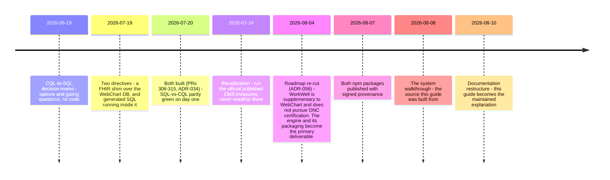
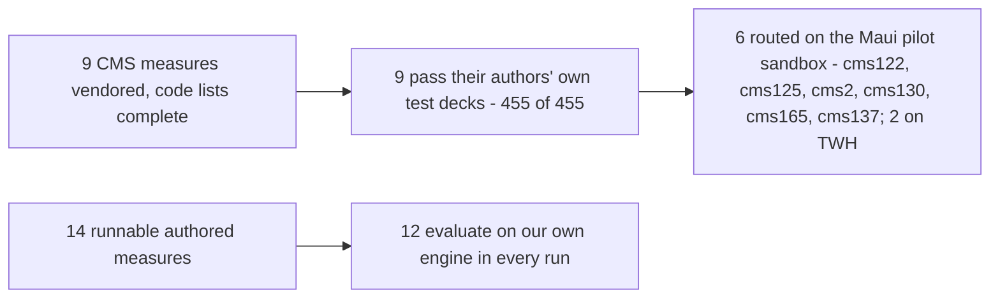

# 9. Where things stand, and what comes next

> Part of the [WorkWell guide](README.md). Previous: [The npm packages](08-packages.md)

This chapter owns the volatile facts. Every number here carries the date it was measured and the
command that reproduces it, so the other chapters can stay stable while this one moves.

## How the project got to its current shape



Two things about that sequence are easy to misread and worth stating plainly. The CQL→SQL work was
never cancelled — it was built, proven, and then not carried forward when the 07-24 recalibration
moved priority to the official CMS measures, and that narrowing went unannounced for three weeks.
And the decision not to pursue ONC certification is not a retreat from standards: both QRDA formats
validate clean, the numbers matched the certification harness's own expected results subject for
subject, and the red grade traced to measure identity (QDM vs FHIR lineage,
[chapter 5](05-fhir.md)), not arithmetic. WebChart already carries certification; WorkWell
supplements it.

## The measure funnel



The three gated-but-unrouted measures (cms68, cms951, cms138) are not blocked by quality — cms68's
`populationBasis` is `Encounter` and our model answers once per person (construction check 5), and
none of the three is in the pilot's set. The six the pilot routes were judged by `pnpm flip-gate`
rather than a two-engine diff, because an official-only measure has no authored BEFORE
([chapter 4](04-engine-and-routing.md)).

## The numbers, dated

| Claim | Number | Reproduce / evidence |
|---|---|---|
| Test suite | 2,807 total · 2,783 pass · 1 fail · 23 skip (2026-09-20, measured on `main`'s backend) — the one failure is the standing local `corpus-membership` stale-sparse-checkout, not a product defect. CI shards it three ways since #575 (14.3m → 6.8m). | `cd backend-ts && pnpm test`. The **23** skips need the gitignored terminology sidecar or a local Postgres, and self-skip rather than passing vacuously — the count was 15 when this row was written on 2026-08-08 and this cell said so in one column while reporting 23 in the other. Both halves are the same run now. |
| CMS measures vs their own test decks | 455 of 455, 9 measures (2026-09-06, CMS137's 45 added by #529) | `pnpm test:official-cases`, after the two-step setup below |
| CQL language conformance | 1,612 pass of 1,823 cases (2026-08-05; corrected 2026-08-26 — the harness had graded 12 commented-out tests, `docs/evidence/CQL_RUNNER_HARNESS_DIFF_2026-08-26.md`) | `pnpm cql-tests:fetch` then `pnpm cql-tests`, against `cqframework/cql-tests`. Failures cluster in the shared translator and engine, not our measures; five of the sixteen files are perfect, and they are the constructs our measures use. |
| SQL vs the CQL engine | zero divergence — 4 measures × 56 patients × 2 dates (2026-07-20) | the shim parity suite, [chapter 7](07-sql-and-the-bridge.md) |
| QRDA Category I vs the HL7 ruler | 0 findings, XSD and Schematron (2026-08-02) | Cypress 7.5.1, 22 submissions |
| QRDA Category III vs the HL7 ruler | 0 findings (2026-08-02) | same |
| MeasureReport vs base FHIR R4 | 0 errors; the DEQM profile gap is exactly 3 findings per report | `measure-report.test.ts` |
| Independent Java engine running our artifacts | 362 of 387 across eight measures (255 of 278 on 2026-08-04; CMS137 44 of 45 on both rates on 2026-09-06; CMS130 63 of 64 on 2026-09-07) | 22 of the 25 exceptions trace to one helper reading a medication order's period — 8 proven by single-variable mutation, 14 consistent-with by inventory. CMS137's one is a millisecond-versus-second precision difference at the period's first instant, isolated by two mutations. CMS165 was swept the same day and is deliberately NOT in this total: 56 of its 68 patients fall out of the initial population on the Java side, which needs diagnosing before it says anything about either engine |
| Subject-level agreement vs Cypress's expected results | 64 of 64 and 150 of 150, every population (2026-08-03) | reproduced against a second independently generated archive |
| Routed in production | 6 on the Maui pilot sandbox, 2 on TWH (2026-09-08, ADR-078) | `WORKWELL_OFFICIAL_MEASURES` in `deploy-maui-mieweb.yml` (cms122, cms125, cms2, cms130, cms165, cms137) and in `deploy-twh-mieweb.yml` (cms122, cms125) |
| Pilot page loads, BEFORE the 2026-09-10 read-path change (live Maui, 20,000 patients, ~1M retained outcome rows, warm second pass) | programs overview 6.3 s · site list 5.8 s (every page pays it) · order proposals 11.4 s for 10.7 MB · hierarchy rollup 8.7 s for 4.6 MB · roster page 2.8 s · cases page 0.5 s | `curl -w '%{time_total}'` against `maui-api-ts.os.mieweb.org` as the sandbox admin; the AFTER numbers are measured on the first deploy and recorded in `docs/JOURNAL.md` (2026-09-10), never predicted here |
| Pilot page loads, AFTER the 2026-09-10 read-path change (same stack, same method, warm second pass) | programs overview 1.0–1.1 s · site list 0.7–1.3 s · order proposals 2.6 s for 65 KB (100-row page) · roster 1.4 s warm · trend 1.0 s · top-drivers 0.4–0.5 s · whole programs page 3.6 s warm | Measured post-deploy on 2026-09-10 and recorded in `docs/JOURNAL.md`. `risk-outlook` was untouched — see the row below, where it has since been measured again and is worse. The 3.6 s whole-page figure is what the same-day `?include=detail` change (13 requests → 1) then targets; its AFTER number is measured on the next deploy, never predicted here |
| Pilot reads that have NOT been fixed, measured 2026-09-13 (live Maui, 20,000 patients; cold = first call after idle, warm = second) | ~~case CSV export **504 at 60.2 s, cold and warm**~~ (FIXED, and MEASURED on the sandbox 2026-09-15: **7.7 s cold, 6.5 s warm** — see the row below) · `risk-outlook` **504 cold, 8.2 s warm** · `top-drivers` 34.9 s cold, 0.57 s warm · programs overview 7.1 s cold, 3.6 s warm · `/api/runs` 32.5 s cold, 2.2 s warm · `/api/cases?limit=1` 1.0–1.1 s · `/api/worklist/patients` 0.8–0.9 s | `curl -w '%{time_total}'` against `maui-api-ts.os.mieweb.org`, recorded in the 2026-09-13 `docs/JOURNAL.md` entry. The export did not merely run slow: it held the whole connection pool, so while it ran every database-backed endpoint queued behind it (`/api/panels` 0.3 s idle → three consecutive 45 s timeouts, while `/api/version`, which touches no database, stayed at 0.2 s). That half is fixed and re-measured (row below). `programRiskOutlook` is the one read model never moved onto the latest-run winners of #547, and it is why the Maui e2e suite's one flake is the cms125 measure page rendering no heading in 20 s; it is PR B2's subject |
| Case CSV export, the fix (code 2026-09-13, measured on the sandbox 2026-09-15 after the deploy) | **The export: 504 at 60.2 s → 200 in 7.7 s cold, 6.5 s warm**, 32,558 rows / 10,654,867 bytes. **The pool probe: `/api/panels` 45 s timeout x3 with ONE export in flight → 0.26–0.68 s with THREE** (idle 0.25–0.64 s), `/api/version` 0.19–0.46 s, `/api/worklist/patients` 0.86–2.49 s; an export under that contention 17.4 s. `exports/runs?format=csv` (made serial in the same PR) 3.45–3.61 s, so its follow-up aggregate is not needed. Bench that picked the chunk size: `EXPLAIN (ANALYZE, BUFFERS)` on `postgres:16`, 460,000 `case_actions` rows, a 40,000-case export, rolled back: 5,000 ids/statement 32.8 ms x 8 = 417 ms · 10,000 (shipped) 35.8 ms x 4 = 214 ms · 20,000 52.0 ms x 2 = 136 ms. Smaller chunks are strictly worse (30 x 500 = 1,335 ms vs 49 ms for one statement of 15,000) | `curl -w '%{time_total}'` as the sandbox admin, recorded in the 2026-09-15 `docs/JOURNAL.md` entry. **The export returns EVERY case, not the open ones**: 32,558 (15,309 OPEN, 15,676 RESOLVED, 1,573 EXCLUDED), so the old per-case form was ~32,600 statements and the batched form is FOUR — the "~15,300 / two" figures in the 2026-09-13 notes came from the open-case count and are corrected. **Speed only**: no sandbox case has ever had an outreach action, so the column is empty in all 32,558 rows and the batched answer's CORRECTNESS rests on the store contract test that compares it with the per-case form. **Measure outside the nightly window**: the SCHEDULED run (2026-09-15 12:09:53Z → 13:39:49Z, 120,000 pairs) degrades everything, including endpoints that touch no database — the same export took 60.5–83.2 s and 504'd half the time, login 39.7 s, `/api/version` up to 22.0 s |
| Measure page read path, the fix (code 2026-09-15, measured on the sandbox after the deploy) | `programRiskOutlook` moves off the measure's whole retained history onto the winning run, memoized under the winners' `runKey` with `today`/`horizonDays` applied per request; the repeat-non-complier streak retired (ADR-081); the page paints per panel instead of gating on all four reads | **`risk-outlook`: 504 cold / 8.2 s warm → 3.43 s cold / 0.60 s warm** (cms125; cms122 1.68 s / 0.55 s). **A different horizon is served warm without a re-read** — `horizonDays=30` answers in 0.58 s off the entry warmed at 90, which is the memo-key design measured rather than argued. The measure page's four reads, warm: `/api/programs` 2.9 s, `/trend` 2.0 s, `/top-drivers` 0.47 s, `/risk-outlook` 0.53 s, page HTML 0.93 s — and none of them holds the heading any more. **The Maui read-only e2e project is 29/29 with no retries**, the first fully green run against the sandbox (27/2 before #560, 28 passed + 1 flaky before this); the flake was `/programs/cms125` rendering no heading in 20 s and it now passes in 16.6 s. Measured 2026-09-15 ~19:30Z, outside the nightly recompute window and on a WARM worker — see the note below, which cost two misleading runs to learn |
| Open-case badge and the DB pool, the fix (code 2026-09-19, #561/#562, ADR-084; sandbox AFTER pending the deploy) | The badge (`/api/cases?status=open&outreach=none&limit=1`) loaded every ACTIVE case — 15,309 on the pilot — to return one number. Pushed into SQL as one statement returning the page plus `COUNT(*) OVER ()`. **Benchmarked at pilot scale (15,600 cases) against a real PostgreSQL 16 over the same link both ways: 789 ms median (581–979) → 90 ms (90–136); a real 50-row page 92 ms.** Both loaders agreed on 15,600. Alongside it the pool stops running on driver defaults and the 30 s `statement_timeout` becomes an owner-run role default, because Neon's proxy silently drops the startup parameter on BOTH endpoints (measured) | Local A/B, both paths in one process against one database, so the delta is the query shape rather than the network. **The sandbox numbers are measured after the deploy and recorded in `docs/JOURNAL.md`, never predicted here** — as for every row above. Not fixed by this: `/api/worklist/patients` keeps the uncapped pipeline (it groups every row) and is recorded as measured debt; the staff-closed list keeps it too, because its outcome filter reads what CQL says today per row and its header counts describe the whole list |
| Programs dashboard read path, BEFORE the 2026-09-21 fix (live Maui, 20,000 patients, six routed measures; measured 17:59-18:20Z, outside the nightly window) | `/api/programs/overview` **503 `statement_timeout` at 30 s cold**, 3.2-3.7 s warm - `?include=detail&granularity=month` **59.8 s with every downstream memo already warm** - `/api/programs/sites` 17.2 s cold, 2.5 s warm - `/trend` 3.0-4.8 s per measure warm - `/top-drivers` 0.42-0.72 s - `/api/cases?status=open&limit=25` 0.50 s - `/api/exports/outcomes?runId=` 120,000 rows / 27.8 MB in 40.9 s | `curl -w '%{time_total}'` against `maui-api-ts.os.mieweb.org` as the sandbox admin. The detail figure is the finding, not the total: warm, the only work left in it is thirteen winners walks at 2.5-4 s each, and `programSites` warm (2.5 s, five strings) is that walk with nothing else attached. **The AFTER numbers are measured on the deploy and recorded in `docs/JOURNAL.md`, never predicted here** |
| Programs dashboard read path, the fix (code 2026-09-21, ADR-087; **measured after the deploy**) | The winners probe is memoized under the candidate run list (the cheap `runs` statement IS the key), `aggregateOfficialRun` becomes ONE unordered statement instead of a one-row probe plus ten `LIMIT/OFFSET` pages each re-sorting 20,000 evidence rows, and the read models are warmed at BOOT as well as after each run | **AFTER, measured 2026-09-21 20:35-20:37Z on a cold container, warm second pass:** `/api/programs/overview` **0.74-0.89 s** (was 503 cold / 3.2-3.7 s warm) - `?include=detail&granularity=month` **1.57-2.58 s** (was 59.8 s) - `/api/programs/sites` **0.28 s** (was 17.2 s cold / 2.5 s warm) - `/trend` **0.28 s** per measure (was 3.0-4.8 s) - `/top-drivers` 0.27-0.30 s. **No 503 anywhere, including the first request on a cold container.** Browser-verified: the page renders 120,000 evaluations, 61.9% compliance, 15,298 open cases and six measure cards. **Still true and named rather than implied:** the FIRST request after a deploy is ~47 s if a caller beats the boot warm (a 200, not a 503); `outcomes (run_id, measure_id)` does not exist and is owner DDL - the largest single win left; and the overview still derives its status buckets from 120,000 rows in JavaScript where a `GROUP BY` would return 90, deferred because the site/tenant/profile predicates have no SQL form |
| Pilot compliance rates, corrected 2026-09-10 (ADR-079) | CMS2 60.9→68.7% · CMS130 19.5→43.3% · CMS165 20.5→62.4% · CMS125 18.0→72.1% · CMS122 7.4→72.4% (inverse) · CMS137 0.4→13.5% | Not a data change: out-of-population patients were in the rate's denominator. `missingData` equalled `total − initialPopulation` exactly for all six measures, so the whole Missing Data column was out-of-population |

### A sandbox number is only a number if you record the conditions

Two windows make every timing in the table above meaningless, and both were learned by throwing away
measurements on 2026-09-15:

- **The nightly recompute.** The SCHEDULED `ALL_PROGRAMS` run has been starting ~12:05–12:10 UTC and
  finishing ~13:30–13:40 UTC — 90 minutes over 120,000 subject-measure pairs. Inside it the case
  export takes 60–83 s instead of 6.5 s, `POST /api/auth/login` takes 39.7 s instead of 0.6 s, and
  even `/api/version`, which touches no database, takes up to 22 s. **Ask `GET /api/runs` first** and
  confirm nothing is RUNNING/QUEUED.
- **The first minutes after a deploy.** Every `RunKeyedMemo` is empty on a restarted worker:
  `/api/programs` measured **22.6 s cold against 2.9 s warm**. The warm pass
  (`program/warm-read-models.ts`) runs after a RUN completes, not after a restart, so a fresh deploy
  has no warm caches at all. This is also enough to fail e2e global setup, whose sign-in navigation
  allows 30 s: two runs on 2026-09-15 reported failures — `/measures` missing its MIPS crosswalk, and
  a setup timeout — that a warm re-run resolved to 29/29 with no retries. **Warm the page you are
  about to measure, and say which pass the number came from.**

### Two of those commands need a corpus the repository does not carry

`pnpm test` and the rest work in a fresh clone. The two conformance rows do not, and they fail
loudly rather than reporting a smaller number — which is the intended behaviour, not a rough edge.
Both corpora are third-party content fetched at a pinned commit and deliberately gitignored, so a
clone stays small and upstream content is never silently re-vendored.

```bash
cd backend-ts

# CMS measures vs their own test decks — fetch the pinned content, then vendor the terminology
pwsh -NoProfile -File scripts/fetch-official-cases.ps1   # ~34 MB, into the gitignored .official-content/
pnpm vendor:official --measure CMS122FHIRDiabetesAssessGT9Pct --catalog-id cms122 --strip-elm-annotations
# …repeat for the other seven; ci.yml's `official-cases` job is the authoritative list
pnpm test:official-cases

# CQL language conformance — refuses to report at all until the full corpus is present
pnpm cql-tests:fetch    # without this, `pnpm cql-tests` exits 2 and tells you to run it
pnpm cql-tests
```

**The full 455 of 455 needs a VSAC credential.** Two measures (CMS122 and CMS125) depend on a value
set upstream ships capped at 1,000 codes; completing it means re-expanding from VSAC, which needs
`WORKWELL_VSAC_API_KEY_VENDOR` and the `--complete-terminology` flag. Without the key those two
measures vendor with the capped expansion — CI does exactly this on fork pull requests and says so
rather than reporting a pass it did not earn. The other six are byte-identical either way.

## Open gaps, named

- ~~**Nothing in CI checks that the committed ELM matches the CQL it came from.**~~ **CLOSED
  2026-08-12 (#410):** the backend CI job now recompiles and fails on any difference — see
  [chapter 3](03-compiler-and-elm.md). Kept here because the gap was found by review on the
  documentation PR that first wrote the guarantee down as though it existed, and that provenance
  is the lesson.
- **No screen shows the FHIR bundle an evaluation used.** Bundles are transient by design
  ([chapter 6](06-data-and-databases.md)), so the thing a developer most wants when debugging a
  retrieve is the one thing the UI cannot show. Small build, high value.
- **The empty-population warning does not reach the run list.** For background runs — which is
  every wide-scope run — it lives in the log timeline, because `runs` has no message column and
  schema changes are owner-owned.
- **Demographic supplemental data (race, ethnicity, sex, payer) is absent across the QRDA chain.**
  Deferred deliberately: today it moves no external number.
- **Four CLI entry points still use `node:` builtins** — the last unmoved piece of the package
  extraction.
- **Measure discrepancies, mostly diagnosed now:** two Procedure-only cases in CMS125 remain open, CMS130 and CMS165 were swept on 2026-09-07 from that
  credentialed workflow: CMS130 agrees on 63/64, and CMS165's 11/68 is recorded as an open question
  rather than a result, because 56 of 68 patients fall out of the initial population on the Java side
  (issue #532). CMS2's seven numerator
  flips are **no longer undiagnosed** (2026-09-07): the second engine takes a medication order's start
  from `dosageInstruction.timing.repeat.boundsPeriod` and not from `authoredOn`, proven by mutation on
  all seven. It is the same helper CMS122's and CMS125's disagreements were isolated to
  (`docs/evidence/CROSS_ENGINE_2026-09-07_CMS2.md`).
- **The Studio's SQL preview panel shows illustrative SQL**, not the parity-proven generated
  artifacts ([chapter 7](07-sql-and-the-bridge.md)). Either point it at the real files or relabel
  it.
- **Auth is deliberately minimal.** Hardcoded accounts with a real JWT refresh-token flow; no SSO,
  no user directory. `docs/PRODUCTION_READINESS_2026-07.md` carries the full production gap list.

## What comes next

The approved plan is `docs/ROADMAP_2026-08-30.md` (**the Maui pilot** — ADR-070, 2026-08-30); the
owner-locked decisions constraining it are in `docs/LOCKED_DECISIONS.md` §4 and §4A. The prior plan's
§4 verification set (`docs/ROADMAP_2026-08-04.md`) remains the bar. In order:

1. **The Maui pilot (M-M).** A patient-driven sandbox deployment for a primary-care group entering
   an MSSP ACO (PY2027). Cheap-first: MM-0 (second deployment, "patient" terminology as config,
   clickable status-chip drill-downs, primary-care synthetic roster, MIPS↔CMS crosswalk in the UI —
   **all landed by 2026-09-01** — the crosswalk last, in #505 — and the Maui sandbox is live)
   → MM-1 (official-only measure onboarding for CMS2/CMS130/CMS165 — gated ≠ routable ≠ runnable —
   per-measure gated flips, the PY2027 re-vendor, and CMS137 only if measure 305 survives the CY2027
   final rule; **U1–U3 built by 2026-09-06**: the runnable rule and calendar period (ADR-072), the
   20,000-patient data-first corpus whose clinical facts follow the year each run scores (ADR-075),
   and CMS137 vendored, gated 45/45 and read as two rates with its strata carried into the
   MeasureReport and QRDA III (ADR-074) — all six measures are runnable once routed, and the flips
   themselves stay the gated workflow edits of MM-1c) → MM-2 (provider-panel work lists and
   assignment — **PR 1 merged 2026-09-12**: a patient-first work list, panel filters by provider and
   primary insurance, set-based bulk assign; **PR 2 the same week**: `panel_assignments`, the durable
   provider→staff mapping the practice already works by, applied to the cases a run OPENS and
   backfilled onto the ones it owns, with `cases.assignment_source` recording who chose so a panel
   edit never overrules a person (ADR-080), merged 2026-09-12; PR 3 is the ACO's attributed-list
   import and report, **#557 — MERGED 2026-09-16 as #574, ADR-082**; what remains open is not the build but four ACO-supplied inputs that decide its DEFAULTS, ROADMAP §7.5)
   → MM-3 (cards that resolve: order
   proposals + exception documentation, inside ADR-067's refusals) → MM-4 (encounter-time
   integration). Roadmap §7 tabulates the external dependencies.
2. **More occupational content (M-E) — deferred behind M-M, not cancelled.** The first
   regulation-authored measure — OSHA hearing STS, [chapter 2](02-cql-and-authoring.md) — merged as
   ADR-065; the differentiator claim (locked decision 6) stands long-term.
3. **US Quality Core verification (M-D) — likewise deferred behind M-M.** Run Inferno's US Quality
   Core test kit against the shim's FHIR output — the direction CMS's own content is heading.
4. **Retire the authored cms122/125 subsets to the fidelity lab** (issue #377) now that the
   official artifacts are routed.
5. **Owner steps:** migrate npm publishing from the 2FA-bypass token to Trusted Publishing, and
   close the certification question below.

## The two decisions this document exists to surface

**Is the CQL→SQL executor a product path or a finished proof?** It sits at four measures,
parity-green since 2026-07-20, not wired into the app, with the parity suite self-skipping in CI.
Product path means widening the measure set and making the parity gate live; finished proof means
saying so and keeping it as evidence. The ambiguity is exactly how it fell off the architecture
diagram once already.

**Is certifying WorkWell's own engine a business goal?** Everything currently rests on no: WebChart
carries ONC certification and WorkWell supplements it. That single answer is what makes it right to
refuse to relabel FHIR-executed results with the older data model's identity, and right not to
build a second engine for a data model on its way out. If the answer changes, both of those reopen
and the roadmap changes shape. One nuance found while reading the wider ecosystem: NCQA runs its
own digital-measures validation programme, distinct from ONC certification, and much closer to what
this engine already does — that track has never been decided either way.
