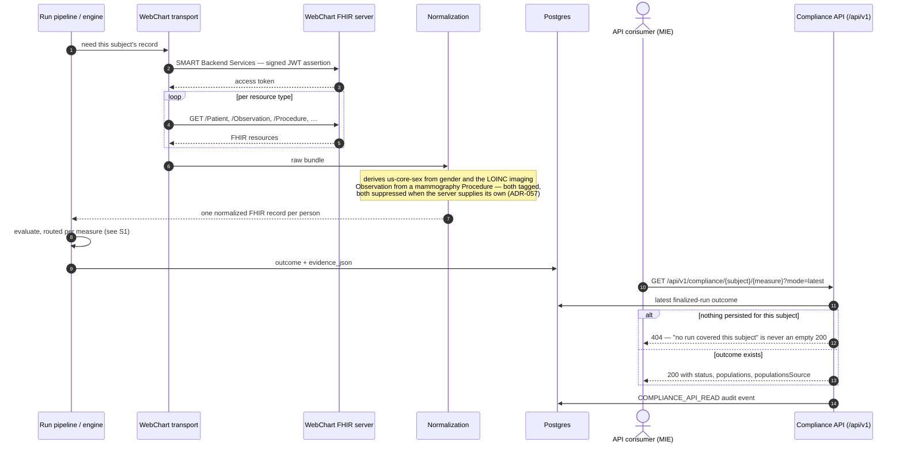

# 10. Scenarios — the flows in time order

The other chapters explain structure: what each part is. This chapter explains **sequence**: who
calls what, in which order, when a real person uses the system. Each scenario is one sequence
diagram plus a short narrative, and links to the chapters that own the mechanisms it touches.
The selection rule: a flow earns a diagram here when the *order of handoffs* is the content.
Admin configuration screens (programs, scheduler settings, email provider) are deliberately
absent — they are reads and writes with an audit row, and [chapter 6](06-data-and-databases.md)
already covers them structurally.

## S1 — A run, scheduled or manual

The core flow everything else references. Two triggers, one pipeline: the nightly scheduler
(demo/production sets `WORKWELL_SCHEDULER_ENABLED`) and an operator pressing Run in the Studio
land in the same run pipeline; from there the path to a persisted outcome is identical.
Mechanisms: [chapter 4](04-engine-and-routing.md) (engine + router),
[chapter 6](06-data-and-databases.md) (what gets persisted).

```mermaid
sequenceDiagram
  autonumber
  actor Op as Operator (Studio)
  participant Sch as Scheduler (nightly)
  participant API as Worker API (/api/runs)
  participant Pipe as Run pipeline
  participant Rt as Per-measure router
  participant Eng as Authored engine
  participant Off as Official executor
  participant DB as Postgres (runs, outcomes, cases, audit_events)
  Op->>API: POST /api/runs (scope: programs / site / measure)
  Note over Sch,Pipe: or: nightly tick — same pipeline from here on
  API->>Pipe: execute (async scopes are queued and claimed)
  Pipe->>DB: run row RUNNING + audit
  Pipe->>Pipe: resolve roster + compliance period per measure
  loop each measure in scope
    Pipe->>Rt: which engine runs this measure?
    alt routed official (cms122, cms125 on demo/production)
      Rt->>Off: evaluate the batch against the CMS artifact
      Off-->>Pipe: population results + evidence
    else authored (the other 12)
      Rt->>Eng: walk the committed ELM tree per subject
      Eng-->>Pipe: Outcome Status + every rule value
    end
    Pipe->>DB: outcome + evidence_json per subject
    Pipe->>DB: case upsert → CREATED / UPDATED / REOPENED / RESOLVED / EXCLUDED / UNCHANGED
    Pipe->>DB: CASE_* audit event (every disposition except UNCHANGED)
  end
  Pipe->>DB: close strictly-older-cycle cases, then RUN_COMPLETED audit
  Op->>API: GET /api/runs/:id — summary, distribution, pass rate
```

Three things the diagram encodes on purpose. **Routing is per measure** — the router decides
inside the loop, not once per run. **Every state change writes an audit row** — the `DB`
lane accumulates them. And **an idempotent re-confirm is silent**: the `UNCHANGED` disposition
writes no case event, so a nightly run records one `RUN_COMPLETED`, not hundreds of noise
events. One honesty note: for asynchronous scopes the run *message* (e.g. the zero-in-IPP
warning) exists only on the synchronous response; the run list does not carry it — the log
timeline does.

## S2 — WebChart end-to-end: from a live EHR to a compliance answer

The measures — the ELM trees and the CMS artifacts alike — running against a real WebChart
environment, and the answer being read back over the versioned API. This is the documented shape
of the already-built live path (ADR-028 transport, ADR-057 normalization, ADR-061 API).
Mechanisms: [chapter 5](05-fhir.md) (FHIR + the shim), [chapter 6](06-data-and-databases.md)
(ingress), [chapter 4](04-engine-and-routing.md) (evaluation).



The response's `populationsSource` field says whether the population booleans were measured by
the official executor or inferred from status — the one fact a consumer cannot reconstruct from
the numbers. `mode=preview` deliberately returns **501 on a WebChart-configured stack**: the
preview composes a synthetic bundle, and reporting demo playback as an evaluation of a live
tenant would be a lie (ADR-061).
