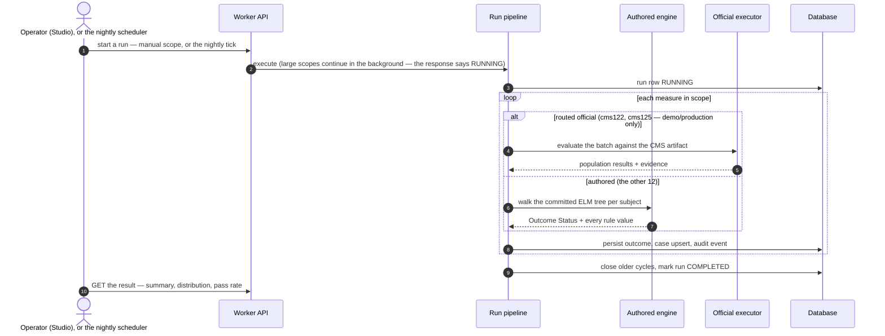
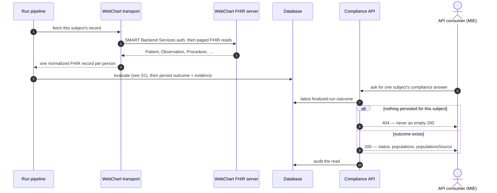
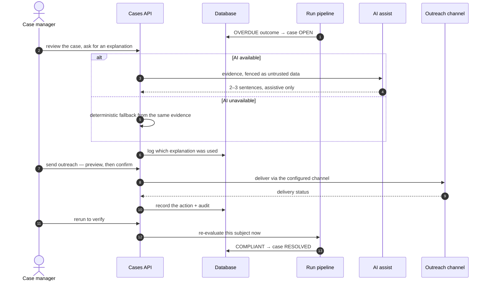
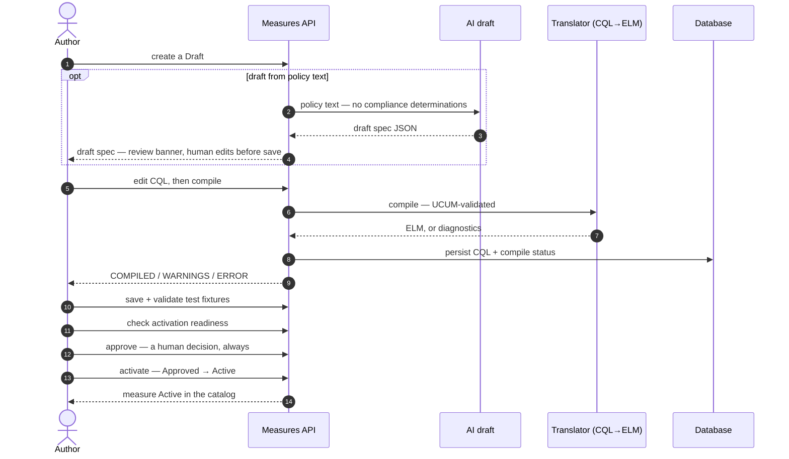
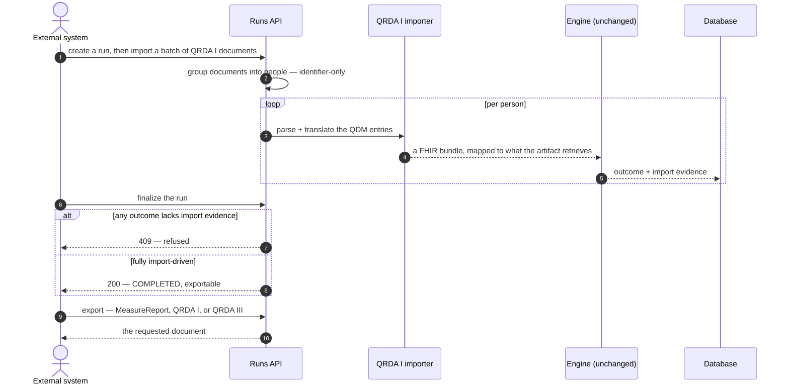
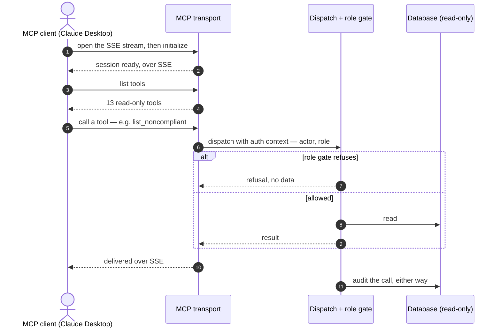
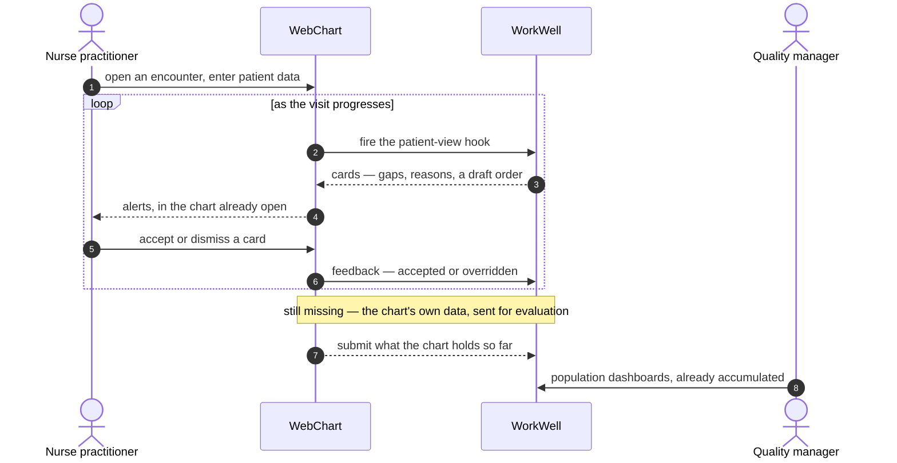

# 10. Scenarios — the flows in time order

The other chapters explain structure: what each part is. This chapter explains **sequence**: who
calls what, in which order, when a real person uses the system. Each scenario is one sequence
diagram plus a short narrative, and links to the chapters that own the mechanisms it touches.
The selection rule: a flow earns a diagram here when the *order of handoffs* is the content.
Admin configuration screens (programs, scheduler settings, email provider) are deliberately
absent — they are reads and writes with an audit row, with no temporal story a sequence diagram
would add.

**S1 through S6 document behaviour that ships today. [S7](#s7--quality-inside-the-encounter-target-state)
is the one exception** — it is the target architecture for the WebChart integration, not built,
and it says so at the top and again in a table of what exists today.

## Who's who across these diagrams

The same handful of components show up under different names depending on which scenario they're
in — defined once here instead of six times below.

- **Worker API / Cases API / Measures API / Runs API** — the same backend worker every time; the
  label just names which route group a scenario is hitting (`/api/runs`, `/api/cases`,
  `/api/measures`).
- **Run pipeline** — the code that turns a scope into evaluated outcomes: resolve the roster,
  route each measure, persist the result. [Chapter 4](04-engine-and-routing.md).
- **Authored engine / Official executor** — the two things that can answer "is this measure
  satisfied": our own compiled CQL, walked by `cql-execution`, or CMS's own published artifact run
  through a quarantined package. [Chapter 4](04-engine-and-routing.md).
- **Database** — Postgres in production, SQLite in tests, the same contract either way. Runs,
  outcomes, cases and audit events live here — never the measure logic itself.
  [Chapter 6](06-data-and-databases.md).
- **WebChart transport** — the code that authenticates to a real WebChart FHIR server and pages
  through its API to fetch one person's clinical record. [Chapter 5](05-fhir.md).
- **WebChart FHIR server** — the actual EHR: MIE's WebChart, exposing patient data as FHIR
  resources over the wire.
- **Compliance API** — the versioned, external-facing endpoint (`/api/v1/compliance/...`) that
  other MIE systems read a compliance answer from.
  [`docs/COMPLIANCE_API.md`](../COMPLIANCE_API.md).
- **AI assist** — OpenAI, called only for assistive text (draft specs, plain-English case
  explanations), never for a compliance decision. [`docs/AI_GUARDRAILS.md`](../AI_GUARDRAILS.md).
- **Outreach channel** — however a case's notification actually gets sent — email, SMS, and so
  on — simulated by default.
- **Translator** — the CQL→ELM compiler: HL7's own reference implementation.
  [Chapter 3](03-compiler-and-elm.md).
- **QRDA I importer** — the hand-rolled parser that turns another system's quality documents into
  the same FHIR shape the engine already reads. [Chapter 6](06-data-and-databases.md).
- **MCP transport / Dispatch + role gate** — the SSE-based protocol layer, and the code behind it
  that checks a caller's role before running a tool. [`docs/MCP.md`](../MCP.md).
- **Nurse practitioner / Quality manager** — the two clinical-side readers in
  [S7](#s7--quality-inside-the-encounter-target-state). The practitioner is mid-visit and needs
  one patient's answer now; the manager is looking across a population and never sees a patient.
  Different questions, so deliberately different surfaces.

One note on granularity: S1 through S6 draw WorkWell's *insides* (the pipeline, the engine, the
database as separate lanes) because that is where those flows happen. S7 draws WorkWell as a
single lane, because that scenario is about the boundary between two systems — the seam is the
subject, and the internals behind it are S1's.

## S1 — A run, scheduled or manual

The core flow everything else references. Two triggers, one pipeline: the nightly scheduler
(demo/production sets `WORKWELL_SCHEDULER_ENABLED`) and an operator pressing Run in the Studio
land in the same run pipeline; from there the path to a persisted outcome is identical.
Mechanisms: [chapter 4](04-engine-and-routing.md) (engine + router),
[chapter 6](06-data-and-databases.md) (what gets persisted).

What happens, in order:

1. **A run starts one of two ways that land in the same pipeline.** An operator presses Run in
   the Studio with a scope — one measure, one site, one person, or everything — or the nightly
   scheduler fires on its own (`WORKWELL_SCHEDULER_ENABLED`, demo/production only). From here the
   two are indistinguishable; nothing downstream knows or cares which one started the run.
2. **Large scopes don't hold the request open.** A full run takes about a minute, so the API
   answers `RUNNING` immediately and the pipeline keeps going in the background while the Studio
   polls for the result.
3. **The run row is written before anything is evaluated**, so a crash partway through still
   leaves a `RUNNING` row an operator can see, rather than no record at all.
4. **Routing happens per measure, inside the loop — not once for the whole run.** Twelve of the
   fourteen runnable measures walk our own committed ELM tree. Two (`cms122`, `cms125`, and only
   where an environment sets `WORKWELL_OFFICIAL_MEASURES`) run CMS's own published artifact
   through the quarantined official executor instead. Both branches return the same shape, so
   nothing downstream needs to know which one answered.
5. **"Persist" on the diagram is three writes folded into one arrow:** the outcome row (verdict
   plus the value of every rule), an idempotent case upsert (keyed so a rerun updates instead of
   duplicating — one of six dispositions, from `CREATED` to `UNCHANGED`), and an audit event for
   every disposition except `UNCHANGED` — a re-confirmation that changed nothing writes nothing,
   which is why a nightly run logs one `RUN_COMPLETED`, not a few thousand identical rows.
6. **Finalizing also closes stale cases.** Once every subject in scope has been evaluated, any
   case still open from a strictly older compliance cycle for someone this run touched is closed
   as rolled over, before the run itself is marked `COMPLETED`.
7. **Reading the result is a separate call**, independent of whether the run answered
   synchronously or is still finishing in the background: `GET /api/runs/:id` returns the
   evaluated count, the pass rate, and the per-outcome distribution.

One honesty note the diagram can't show: for asynchronous scopes, a run-level warning (for
example, nobody at all in a measure's initial population) exists only on the *synchronous*
response — the run list doesn't carry it, the log timeline does.

## S2 — WebChart end-to-end: from a live EHR to a compliance answer

The measures — the ELM trees and the CMS artifacts alike — running against a real WebChart
environment, and the answer being read back over the versioned API. This is the documented shape
of the already-built live path (ADR-028 transport, ADR-057 normalization, ADR-061 API).
Mechanisms: [chapter 5](05-fhir.md) (FHIR + the shim), [chapter 6](06-data-and-databases.md)
(ingress), [chapter 4](04-engine-and-routing.md) (evaluation).

What happens, in order:

1. **Fetching is per subject, and strict.** The pipeline asks the transport for one person's
   record; the transport authenticates with SMART Backend Services (a signed JWT assertion, no
   static API key) and pages through `/Patient`, `/Observation`, `/Procedure` and the rest,
   composed per resource because the real server exposes no `$everything` operation.
2. **Normalization means adapting the data's shape to what the measure logic expects — filling
   gaps, never inventing facts.** WebChart's raw FHIR doesn't natively carry two fields the
   official CMS logic reads: it emits `Patient.gender` but not the `us-core-sex` extension, and a
   screening mammogram as a `Procedure` rather than the `Observation` the CMS artifact's numerator
   specifically looks for. Both are derived from the real WebChart data, tagged as derived, and
   suppressed the moment the server supplies its own version (ADR-057) — the distinction that
   keeps this from becoming fabrication.
3. **Evaluation happens between fetching and persisting** — the same pipeline as S1, routed per
   measure, same engine split. Nothing about the data's origin changes how it gets evaluated.
4. **Reading the answer back is a second, independent call.** An API consumer like MIE's own code
   asks the versioned compliance API for one subject's answer to one measure. A 404 means "no run
   has covered this subject yet" — never an empty 200, because those two things must never be
   confusable.
5. **`populationsSource` says where the population booleans came from** — measured by the
   official CMS executor, or inferred from the outcome status — the one fact a consumer cannot
   reconstruct from the numbers alone.
6. **Every read is audited, too, not just every write** — a `COMPLIANCE_API_READ` event for each
   call.

Two things the diagram doesn't show. No deployed stack currently pairs this WebChart ingress with
official measure routing — staging, the WebChart-configured stack, leaves
`WORKWELL_OFFICIAL_MEASURES` unset — so this is the mechanism end to end, not a
currently-deployed pairing. And `mode=preview` deliberately returns **501 on a WebChart-configured
stack**: the preview composes a synthetic bundle, and reporting demo playback as an evaluation of
a live tenant would be a lie (ADR-061).

## S3 — A flagged person, worked by an operator

From an overdue outcome to a resolved case, with the AI lane shown honestly: assistive text with
a deterministic fallback, never a decision. Mechanisms: [chapter 1](01-big-picture.md) (cases,
worklist), [chapter 6](06-data-and-databases.md) (the idempotent upsert),
[docs/AI_GUARDRAILS.md](../AI_GUARDRAILS.md) (the non-negotiable rule).

What happens, in order:

1. **The case starts from a run, not from an operator.** An OVERDUE outcome opens a case
   automatically, with a `CASE_CREATED` audit event — a case manager never creates one by hand.
2. **Opening a case is a read that already carries an explanation.** The screen shows the same
   structured evidence a run persisted (`why_flagged`, `expressionResults`), and asking for a
   plain-English explanation is part of the same action, not a second navigation.
3. **The AI explanation is assistive, and fenced against its own input.** The evidence JSON is
   wrapped in per-request nonce'd markers, and the model is told explicitly to treat it as data,
   never instructions — the defense against a WebChart-sourced string one day containing
   something that reads like a command ([`docs/AI_GUARDRAILS.md`](../AI_GUARDRAILS.md)).
4. **Unavailable AI degrades to a deterministic explanation from the same evidence**, not a blank
   field. The fallback is rule-based, not a second model call, and is labeled `fallback-rules` so
   nobody mistakes it for the model's own words.
5. **Every explanation, sent or fallback, is logged** — which one fired is itself an audit fact,
   independent of what it said.
6. **Outreach is preview-then-confirm**, sent through whichever channel is configured (simulated
   by default), and both the action and its delivery status are recorded.
7. **Rerun-to-verify calls back into the exact same run pipeline as S1.** A COMPLIANT result
   auto-resolves the case (`AUTO_RESOLVED`) — the same idempotent upsert logic that opened the
   case decides whether it can close.

Two invariants worth reading off the lanes. Every mutating arrow into `API` produces a matching
arrow into `DB` — no state change without an audit row. And the `AI` lane never writes to `DB`
except to log that it spoke: compliance state is authored by the engine alone, and a human
closure (`closed_by` set) is never reopened by a later run.

## S4 — Authoring a measure, from draft to active

The Studio authoring loop — including the fact the whole guide keeps repeating: compilation
happens at authoring/build time, never while somebody is being evaluated. Mechanisms:
[chapter 2](02-cql-and-authoring.md) (CQL + authoring), [chapter 3](03-compiler-and-elm.md)
(translator + ELM).

What happens, in order:

1. **A measure starts life as a Draft**, optionally seeded from an AI-drafted spec generated from
   policy text — the model is explicitly told it must not make compliance determinations, and the
   draft carries a review banner until a human edits and saves it.
2. **Compilation happens here, at authoring time — never during a run.** The CQL→ELM translator
   runs synchronously on save, checking UCUM units along the way, and returns either compiled ELM
   or diagnostics. Those diagnostics *are* the authoring gate: a measure with a compile error
   cannot proceed.
3. **Fixture validation is structural only** — name, subject, a recognized expected-outcome value
   — not an engine run. Actually exercising the CQL happens later, at `pnpm compile-measures`
   build time, where the 17 measure libraries (plus `FHIRHelpers`) compile for real and CI
   refuses a committed tree that the current CQL no longer produces.
4. **Approval and activation are two separate, always-human steps** — an activation-readiness
   check, then an explicit approve, then an explicit status change from Approved to Active.
   Neither is inferable from a passing compile.
5. **"Active" governs the catalog, not the run pipeline.** Population runs enumerate the
   build-time measure registry; Studio compilation does not install ELM there. An authored
   measure only joins actual runs once its CQL lands in the repo and `compile-measures` commits
   its ELM — the CI gate in point 2.

The AI lane is the same shape as S3: it can draft a spec or CQL, it cannot approve, activate, or
decide anything — activation is a gated human action with an audit row.

## S5 — The standards loop: import, evaluate, export

Another system's QRDA Category I documents in; our calculation; standard documents out. This is
the interoperability bridge (locked decision 4) — kept at 0 findings against the HL7 base
ruler, not a certification path. Mechanisms: [chapter 5](05-fhir.md) (the standards documents),
[chapter 4](04-engine-and-routing.md) (evaluation).

What happens, in order:

1. **Import is a batch, not a document at a time**, because resolving which documents describe
   the same person is inherently cross-document — a per-document import would over-report the
   population by treating duplicates as distinct people.
2. **Grouping is identifier-only, deterministic, and conservative.** Demographic conflicts inside
   a group are reported, never silently resolved — merging two people who are not the same
   person is the one mistake this step refuses to risk.
3. **The engine underneath doesn't change.** The importer parses each document's QDM entries and
   translates them to whatever the target artifact's ELM actually retrieves — the same engine S1
   routes a run through, fed a differently-sourced bundle.
4. **Finalize is a gate, not a formality.** It refuses (`409`) to mark the run `COMPLETED` unless
   every single outcome came from an imported document — finalizing a partially-imported
   population run from outside would make a partial roster exportable as though it were a
   finished result.
5. **Export produces the same three standards documents S2's live path can produce** — a FHIR
   MeasureReport and both QRDA formats — the loop is symmetric: documents in, the identical
   engine runs, documents out.

## S6 — An AI client over MCP, read-only

Claude Desktop (or any MCP client) talking to the worker's own MCP server. Everything is a read;
the interesting ordering is the SSE handshake and the role gate.
Mechanisms: [docs/MCP.md](../MCP.md) (the security boundary and tool posture).

What happens, in order:

1. **The handshake is SSE-first, HTTP-second.** The client opens `GET /sse` and gets back the
   actual endpoint to POST to (`/mcp/message?sessionId=…`); `initialize` then returns `202`
   immediately, and its real result arrives asynchronously over the already-open stream — a
   two-channel handshake, not a single request/response.
2. **The tool list is fixed and small**: 13 read-only tools, discoverable before any are called.
3. **Authorization happens at dispatch, not at the transport.** The transport authenticates the
   connection; the dispatcher separately checks the caller's role against the specific tool
   requested (`check_compliance`, for instance, needs Case Manager or Admin) — two different
   questions, asked in two different places. Either way, the dispatcher's answer is relayed back
   through the transport, the same channel that opened the connection.
4. **Every call is audited regardless of outcome** — a refusal is logged just as a successful
   read is, so a denied attempt is as visible in the audit trail as an allowed one.

No MCP tool mutates anything: the server exposes reads plus explain-shaped tools, every call is
audited, and role gating happens at dispatch — the transport authenticates, the dispatcher
authorizes.

## S7 — Quality inside the encounter (target state)

> **This flow is not built, but its delivery half now is.** Every scenario above documents shipped
> behaviour. This one is the target architecture for the WebChart integration, and it has moved: since
> 2026-08-17 WorkWell serves a **CDS Hooks** service — the community standard for exactly this shape of
> alert — so a clinician's system can ask "what is outstanding for this patient?" and get structured
> findings back. What is still absent is the half that makes it *live*: WorkWell answers from the last
> completed run rather than from data supplied on the request, nothing in WebChart fires the hook today,
> and nothing writes back into the EHR. The table at the end of this section names each part. Mechanisms:
> [chapter 5](05-fhir.md) (FHIR), [chapter 4](04-engine-and-routing.md) (evaluation),
> [`docs/CDS_HOOKS.md`](../CDS_HOOKS.md) (the built contract),
> [`docs/COMPLIANCE_API.md`](../COMPLIANCE_API.md) (the per-measure one it complements).

The idea in one sentence: **quality stops being a report somebody visits and becomes an answer
that arrives while the clinician can still act on it.**

Solid arrows are built; the dashed one at the bottom is step 2, the piece that would make a card
reflect *this* visit rather than the last completed run.

What happens, in order:

1. **An encounter is an event, not a document.** The practitioner opens one and starts entering
   what the visit produces — a blood pressure, a medication, a history. Nothing waits for the
   visit to be finished and signed.
2. **WebChart pushes; WorkWell does not pull.** Each submission carries what the chart holds so
   far. This is the inversion that matters, and the reason is arithmetic: a physician sees around
   thirty patients a day, so pulling a month of encounters for a ten-physician practice means
   fetching, assembling and evaluating tens of thousands of records before anybody sees a single
   answer. Pushing as it happens spreads that same work across the day and turns the population
   view into a read of something already computed. **This is the part still missing.** CDS Hooks has
   a place for it — `prefetch`, where a client ships FHIR resources alongside the invocation — and
   WorkWell deliberately declares no prefetch template, because it does not evaluate data supplied
   on the request and advertising otherwise would make a client fetch and transmit for nothing.
3. **Findings come back in-band, during the visit.** *Built, over yesterday's evaluation.* The
   exchange is a CDS Hooks invocation: the client fires the `patient-view` hook with a patient id and
   gets back **cards** — a one-line summary, a plain-English reason, the run and date it was computed
   from, and a link into WorkWell. An alert after the encounter closes is a letter; an alert during it
   is a decision. The honest limit is freshness, not delivery: cards reflect the last completed run,
   so data entered five minutes ago is not yet in them.
4. **The practitioner never leaves WebChart.** *Built at the data level; not built as rendering.*
   Cards are structured for the client to draw in its own UI, which is what makes this an
   integration rather than an embedded panel — a panel is still somewhere you have to go and look.
   How WebChart would render them is WebChart's to decide, and nothing renders them today.
   Follow-up is a card **suggestion**: a `ServiceRequest` with `intent=proposal`, `status=draft`,
   which the clinician accepts or ignores. That is write-back **without WorkWell holding write
   credentials into a certified EHR** — the standard carries the proposal, the EHR performs the write.
5. **Weekly, the same exchange runs as a batch.** Same endpoint, same evaluation, wider window —
   it catches whatever the real-time path missed and gives both sides a natural reconciliation
   point.
6. **Follow-up becomes work, not a report.** Findings that need action land in WebChart as tasks
   and documents in somebody's queue. This is the piece furthest from today's build, because it is
   the only one that requires WorkWell to *write* into a certified EHR rather than read from it.
7. **Managers read WorkWell directly.** Population dashboards stay where they are; a quality
   manager is asking a different question than a practitioner mid-visit, and the two surfaces are
   different on purpose rather than by omission.
8. **Periodically, both sides reconcile what was sent against what was received.** Encounters
   WorkWell never got, and encounters it got that WebChart has no record of sending, are both
   findings — a sink that silently drops messages looks exactly like a quiet week. *Half built:* the
   CDS Hooks **feedback** endpoint records whether each card was accepted or overridden, so "did
   anyone act on this?" is now answerable from the audit ledger. Reconciling *encounters* still needs
   step 2.

### Why this is not just another quality dashboard

Dashboards that accumulate encounters and display measure results are a solved, crowded
problem — there are a great many of them, and building one more would be the least interesting
thing this engine could do. Three things here are not that: the finding arrives **inside the
workflow, mid-encounter**, while the clinician can still change what happens; the follow-up
becomes **real work in the EHR** rather than a list somebody is supposed to check; and the
answer is **traceable to a published measure** run on a reference engine, which
[chapter 1](01-big-picture.md) covers.

### What exists today

| Part of the flow | Status |
|---|---|
| The engine, the measures, the evidence per rule | **Built** — [ch. 3](03-compiler-and-elm.md), [ch. 4](04-engine-and-routing.md) |
| FHIR ingest from a live WebChart tenant | **Built, but pulling** — SMART Backend Services, read-only, on a schedule (S2) |
| A compliance answer per subject and measure | **Built** — versioned, read-only `GET` ([`COMPLIANCE_API.md`](../COMPLIANCE_API.md)) |
| Population dashboards for a quality manager | **Built** — the manager surface is the one part of this diagram that is real |
| **A standards-shaped way to deliver findings into a workflow** | **Built** — a CDS Hooks 2.0.1 service for the `patient-view` hook ([`CDS_HOOKS.md`](../CDS_HOOKS.md)); cards over the most recent **completed run** |
| **Follow-up offered as an order the clinician accepts** | **Built** — a card `suggestion` carrying a draft `ServiceRequest`, so nothing is written by WorkWell. Only for order codes with an APPROVED terminology mapping, which today excludes cms122/cms125 |
| **Did anyone act on the finding** | **Built** — the CDS Hooks feedback endpoint, audited |
| Evaluating data supplied on the request | Not built — this is step 2, and `prefetch` is where it would go. WorkWell declares none, because it evaluates none |
| WebChart pushing an encounter as it happens | Not built — and no public evidence either way that WebChart acts as a CDS Hooks client |
| Quality rendered inside WebChart's own UI | Not built — cards are structured for a client to draw; nothing draws them today |
| Tasks and documents written back into WebChart | Not built — a suggestion proposes an order; there is no task or document write path |
| Send/receive reconciliation of encounters | Not built — card feedback answers "was it acted on", not "did every encounter arrive" |

One connection worth drawing, because it turns an existing refusal into a feature. The compliance
API's `mode=preview` deliberately returns **501 on a WebChart-configured stack** (ADR-061): preview
composes a *synthetic* bundle, and reporting demo playback as an evaluation of a live tenant would
be a lie. A path where the caller submits a **real** bundle and gets findings back is exactly what
makes that answer honest — the caller supplies the data, so nothing is being simulated. The
501-shaped hole in today's API is the shape of step 2 above, and in CDS Hooks it has a name:
`prefetch`. Serving it is the same refusal in a different place — the service declares no prefetch
template *because* it evaluates none, rather than accepting resources and quietly ignoring them.

### Why CDS Hooks rather than an endpoint of our own

The earlier sketch of this scenario described a bespoke submit-a-bundle endpoint. Building one would
have meant asking MIE to write a client against a contract only WorkWell speaks. CDS Hooks is the
published standard for this exact shape — discovery plus one invocation per service, returning cards
— and it is a JSON contract over HTTPS, so serving it needed no new dependency and no JVM: two routes
on the worker that already existed. Its `suggestion` mechanism also solves the hardest part of step 6
for free, since a proposed order travels as data the EHR performs rather than as a write WorkWell
would need credentials for.

What the standard does **not** settle: whether WebChart acts as a CDS Hooks client, and how it would
authenticate. CDS Hooks defines its own signed-JWT profile which forbids symmetric algorithms, so
WorkWell's bearer token is not it — the gap is named in [`CDS_HOOKS.md`](../CDS_HOOKS.md) rather than
papered over, and it reduces to two things to ask for: an issuer and a JWKS URL.
