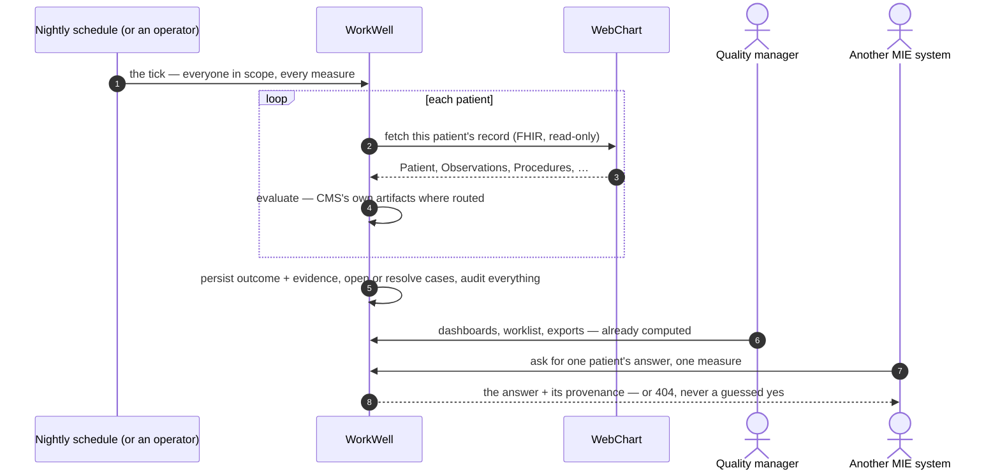
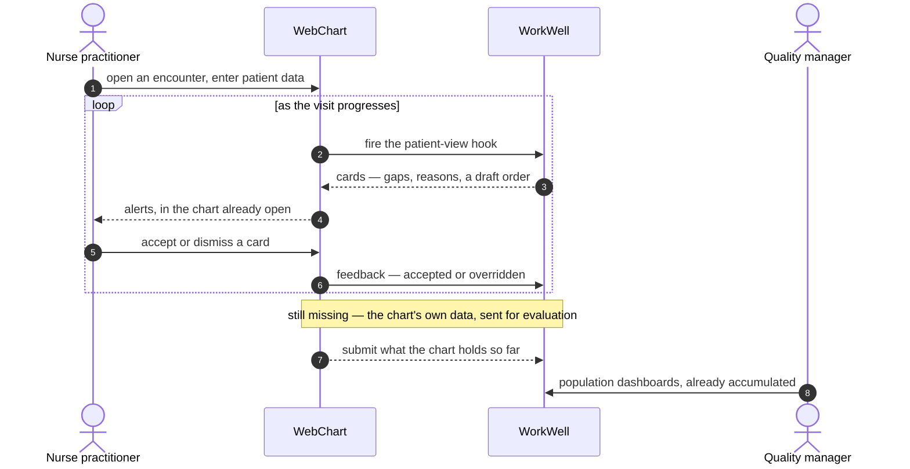

# 10. Scenarios — the two integration flows

The other chapters explain structure: what each part is. This chapter explains **sequence**: who
calls what, in which order. It carries the two scenarios that matter for an integration
conversation, and they differ on exactly one axis — **when quality is computed relative to when
care happens**:

1. **[The batch loop](#the-batch-loop--quality-on-a-schedule-built-today)** — on a schedule,
   across the whole population, after the fact. **This is built and running today.**
2. **[S7 — quality inside the encounter](#s7--quality-inside-the-encounter-target-state)** — per
   patient, during the visit, while the clinician can still act. **This is the target state**;
   its delivery half (CDS Hooks) is built, and the section says precisely which parts are not.

The two are complements, not alternatives. The batch loop is how population numbers, dashboards
and follow-up worklists get produced at all; the in-encounter loop is how a finding reaches the
one person who can still change it. A real deployment wants both: the batch as the floor and the
reconciliation point, the encounter hook as the moment of action.

> Earlier revisions of this chapter also walked five internal operator flows (runs, cases,
> authoring, the standards loop, MCP). They were removed on 2026-08-25 — the mechanisms they
> traced belong to [chapters 1–8](README.md), and this chapter now stays at the boundary between
> systems, which is where an integration conversation lives. The removed text is in git history.

## Who's who

- **WorkWell** — drawn as a single lane in both diagrams, because these scenarios are about the
  boundary between two systems. Behind the lane: the run pipeline, the two engines (our compiled
  CQL, and CMS's own published artifacts for the measures routed to them —
  [chapter 4](04-engine-and-routing.md)), and the database that holds runs, outcomes, cases and
  the audit trail ([chapter 6](06-data-and-databases.md)).
- **WebChart** — the EHR: MIE's WebChart, exposing patient data as FHIR resources, read via
  SMART Backend Services auth ([chapter 5](05-fhir.md)).
- **Quality manager** — looks across a population, never mid-visit. Reads WorkWell directly.
- **Nurse practitioner** — mid-visit, needs one patient's answer now. Should never have to leave
  the chart. Different question from the manager's, so deliberately a different surface.
- **Another MIE system** — anything that wants the answer machine-readably: the versioned
  [Compliance API](../COMPLIANCE_API.md) (`GET /api/v1/compliance/{subject}/{measure}`).

## The batch loop — quality on a schedule (built today)

The idea in one sentence: **on a schedule, WorkWell reads what the EHR holds, evaluates every
measure for every patient, and has the answers accumulated before anybody asks.**

What happens, in order:

1. **A schedule fires, or an operator presses Run — the pipeline is the same either way.** The
   scope can be everything, one site, one measure, or one person; the nightly tick evaluates the
   full population unprompted. Nothing downstream knows or cares which trigger started it.
2. **Fetching is per patient, read-only, and strict.** WorkWell authenticates to WebChart's FHIR
   API with SMART Backend Services (a signed assertion, no static key) and pages through the
   patient's resources. Where WebChart's raw FHIR doesn't carry a field the official CMS logic
   reads, the value is *derived from WebChart's own real data*, tagged as derived, and suppressed
   the moment the server supplies its own — adapting shape, never inventing facts (ADR-057).
3. **Evaluation is routed per measure.** Most measures run WorkWell's own compiled CQL; measures
   flipped to official routing run **CMS's own published artifact**, unmodified, through a
   quarantined executor — so for those, the numbers are the reference logic's numbers, not our
   reimplementation of them ([chapter 4](04-engine-and-routing.md)).
4. **The batch produces work, not just numbers.** Every evaluation persists the verdict *and the
   value of every rule that led to it*; a non-compliant result opens (or refreshes — idempotently,
   never duplicates) a case in a worklist, and a now-compliant result resolves it. Every state
   change writes an audit event, no exceptions.
5. **Results surface through WorkWell's interface today.** A quality manager reads dashboards,
   pass rates and trends; a coordinator works the case list; CSV exports feed anything
   spreadsheet-shaped; and other MIE systems read the same answer machine-readably from the
   versioned compliance API — which answers **404 when no run has covered a patient**, never an
   empty success, because "not yet evaluated" and "compliant" must not be confusable.
6. **Cadence is configuration, not code.** Nightly is the shipped default
   (`WORKWELL_SCHEDULER_ENABLED`); weekly or monthly is the same pipeline on a different tick,
   and an on-demand run before a reporting deadline is the same pipeline with a button.

**The open question for an integration conversation** — deliberately a question, not a decision:
should these batch results *also* render inside WebChart's own UI, or does the manager-facing
surface stay in WorkWell? Today the answer is WorkWell's interface (that is what is built); the
in-chart half is the same rendering question S7 names below, and it belongs to whoever owns the
WebChart side of the conversation.

One honesty note: this is the mechanism end to end, and each half runs today — but no deployed
stack currently pairs the *live WebChart ingress* with *official measure routing* in one
environment. The demo/production stack routes official measures over its synthetic roster; the
WebChart-configured stack evaluates authored logic. Pairing them is a configuration change, not a
build.

## S7 — Quality inside the encounter (target state)

> **This flow is not built, but its delivery half now is.** The batch loop above is shipped
> behaviour. This scenario is the target architecture for the WebChart integration, and it has
> moved: since 2026-08-17 WorkWell serves a **CDS Hooks** service — the community standard for
> exactly this shape of alert — so a clinician's system can ask "what is outstanding for this
> patient?" and get structured findings back. What is still absent is the half that makes it
> *live*: WorkWell answers from the last completed run rather than from data supplied on the
> request, nothing in WebChart fires the hook today, and nothing writes back into the EHR. The
> table at the end names each part. Mechanisms: [chapter 5](05-fhir.md) (FHIR),
> [chapter 4](04-engine-and-routing.md) (evaluation), [`docs/CDS_HOOKS.md`](../CDS_HOOKS.md) (the
> built contract), [`docs/COMPLIANCE_API.md`](../COMPLIANCE_API.md) (the per-measure API it
> complements).

The idea in one sentence: **quality stops being a report somebody visits and becomes an answer
that arrives while the clinician can still act on it.**

Solid arrows are built; the dashed one at the bottom is step 2, the piece that would make a card
reflect *this* visit rather than the last completed run.

What happens, in order:

1. **An encounter is an event, not a document.** The practitioner opens one and starts entering
   what the visit produces — a blood pressure, a medication, a history. Nothing waits for the
   visit to be finished and signed.
2. **WebChart pushes; WorkWell does not pull.** Each submission carries what the chart holds so
   far. This is the inversion that matters, and the reason is arithmetic: a physician sees around
   thirty patients a day, so pulling a month of encounters for a ten-physician practice means
   fetching, assembling and evaluating tens of thousands of records before anybody sees a single
   answer. Pushing as it happens spreads that same work across the day and turns the population
   view into a read of something already computed. **This is the part still missing.** CDS Hooks
   has a place for it — `prefetch`, where a client ships FHIR resources alongside the invocation —
   and WorkWell deliberately declares no prefetch template, because it does not evaluate data
   supplied on the request and advertising otherwise would make a client fetch and transmit for
   nothing.
3. **Findings come back in-band, during the visit.** *Built, over yesterday's evaluation.* The
   exchange is a CDS Hooks invocation: the client fires the `patient-view` hook with a patient id
   and gets back **cards** — a one-line summary, a plain-English reason, the run and date it was
   computed from, and a link into WorkWell. An alert after the encounter closes is a letter; an
   alert during it is a decision. The honest limit is freshness, not delivery: cards reflect the
   last completed run, so data entered five minutes ago is not yet in them.
4. **The practitioner never leaves WebChart.** *Built at the data level; not built as rendering.*
   Cards are structured for the client to draw in its own UI, which is what makes this an
   integration rather than an embedded panel — a panel is still somewhere you have to go and look.
   How WebChart would render them is WebChart's to decide, and nothing renders them today.
   Follow-up is a card **suggestion**: a `ServiceRequest` with `intent=proposal`, `status=draft`,
   which the clinician accepts or ignores. That is write-back **without WorkWell holding write
   credentials into a certified EHR** — the standard carries the proposal, the EHR performs the
   write.
5. **Weekly, the same exchange runs as a batch.** This is where the two scenarios meet: the batch
   loop above is the same evaluation over a wider window, catching whatever the real-time path
   missed and giving both sides a natural reconciliation point.
6. **Follow-up becomes work, not a report.** Findings that need action land in WebChart as tasks
   and documents in somebody's queue. This is the piece furthest from today's build, because it is
   the only one that requires WorkWell to *write* into a certified EHR rather than read from it.
7. **Managers read WorkWell directly.** Population dashboards stay where they are; a quality
   manager is asking a different question than a practitioner mid-visit, and the two surfaces are
   different on purpose rather than by omission.
8. **Periodically, both sides reconcile what was sent against what was received.** Encounters
   WorkWell never got, and encounters it got that WebChart has no record of sending, are both
   findings — a sink that silently drops messages looks exactly like a quiet week. *Half built:*
   the CDS Hooks **feedback** endpoint records whether each card was accepted or overridden, so
   "did anyone act on this?" is now answerable from the audit ledger. Reconciling *encounters*
   still needs step 2.

### Why this is not just another quality dashboard

Dashboards that accumulate encounters and display measure results are a solved, crowded
problem — there are a great many of them, and building one more would be the least interesting
thing this engine could do. Three things here are not that: the finding arrives **inside the
workflow, mid-encounter**, while the clinician can still change what happens; the follow-up
becomes **real work in the EHR** rather than a list somebody is supposed to check; and the
answer is **traceable to a published measure** run on a reference engine, which
[chapter 1](01-big-picture.md) covers.

### What exists today

| Part of the flow | Status |
|---|---|
| The engine, the measures, the evidence per rule | **Built** — [ch. 3](03-compiler-and-elm.md), [ch. 4](04-engine-and-routing.md) |
| FHIR ingest from a live WebChart tenant | **Built, but pulling** — SMART Backend Services, read-only, on a schedule (the batch loop above) |
| A compliance answer per subject and measure | **Built** — versioned, read-only `GET` ([`COMPLIANCE_API.md`](../COMPLIANCE_API.md)) |
| Population dashboards for a quality manager | **Built** — the manager surface is the one part of this diagram that is real |
| **A standards-shaped way to deliver findings into a workflow** | **Built** — a CDS Hooks 2.0.1 service for the `patient-view` hook ([`CDS_HOOKS.md`](../CDS_HOOKS.md)); cards over the most recent **completed run** |
| **Follow-up offered as an order the clinician accepts** | **Built** — a card `suggestion` carrying a draft `ServiceRequest`, so nothing is written by WorkWell. Only for order codes with an APPROVED terminology mapping, which today excludes cms122/cms125 |
| **Did anyone act on the finding** | **Built** — the CDS Hooks feedback endpoint, audited |
| Evaluating data supplied on the request | Not built — this is step 2, and `prefetch` is where it would go. WorkWell declares none, because it evaluates none |
| WebChart pushing an encounter as it happens | Not built — and no public evidence either way that WebChart acts as a CDS Hooks client |
| Quality rendered inside WebChart's own UI | Not built — cards are structured for a client to draw; nothing draws them today |
| Tasks and documents written back into WebChart | Not built — a suggestion proposes an order; there is no task or document write path |
| Send/receive reconciliation of encounters | Not built — card feedback answers "was it acted on", not "did every encounter arrive" |

One connection worth drawing, because it turns an existing refusal into a feature. The compliance
API's `mode=preview` deliberately returns **501 on a WebChart-configured stack** (ADR-061): preview
composes a *synthetic* bundle, and reporting demo playback as an evaluation of a live tenant would
be a lie. A path where the caller submits a **real** bundle and gets findings back is exactly what
makes that answer honest — the caller supplies the data, so nothing is being simulated. The
501-shaped hole in today's API is the shape of step 2 above, and in CDS Hooks it has a name:
`prefetch`. Serving it is the same refusal in a different place — the service declares no prefetch
template *because* it evaluates none, rather than accepting resources and quietly ignoring them.

### Why CDS Hooks rather than an endpoint of our own

The earlier sketch of this scenario described a bespoke submit-a-bundle endpoint. Building one would
have meant asking MIE to write a client against a contract only WorkWell speaks. CDS Hooks is the
published standard for this exact shape — discovery plus one invocation per service, returning cards
— and it is a JSON contract over HTTPS, so serving it needed no new dependency and no JVM: two routes
on the worker that already existed. Its `suggestion` mechanism also solves the hardest part of step 6
for free, since a proposed order travels as data the EHR performs rather than as a write WorkWell
would need credentials for.

What the standard does **not** settle: whether WebChart acts as a CDS Hooks client, and how it would
authenticate. CDS Hooks defines its own signed-JWT profile which forbids symmetric algorithms, so
WorkWell's bearer token is not it — the gap is named in [`CDS_HOOKS.md`](../CDS_HOOKS.md) rather than
papered over, and it reduces to two things to ask for: an issuer and a JWKS URL.
