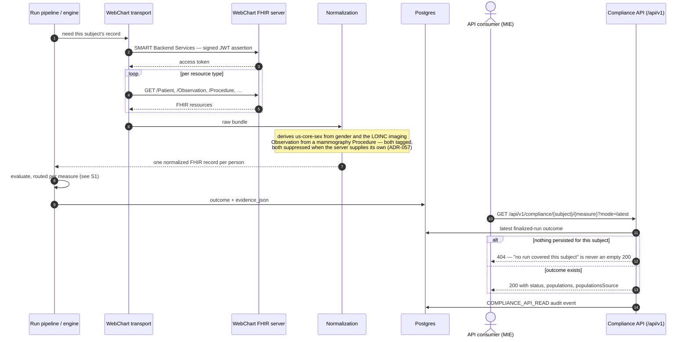
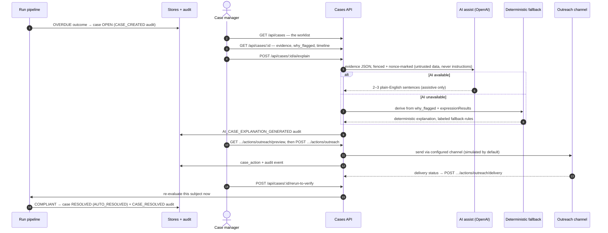

# 10. Scenarios — the flows in time order

The other chapters explain structure: what each part is. This chapter explains **sequence**: who
calls what, in which order, when a real person uses the system. Each scenario is one sequence
diagram plus a short narrative, and links to the chapters that own the mechanisms it touches.
The selection rule: a flow earns a diagram here when the *order of handoffs* is the content.
Admin configuration screens (programs, scheduler settings, email provider) are deliberately
absent — they are reads and writes with an audit row, and [chapter 6](06-data-and-databases.md)
already covers them structurally.

## S1 — A run, scheduled or manual

The core flow everything else references. Two triggers, one pipeline: the nightly scheduler
(demo/production sets `WORKWELL_SCHEDULER_ENABLED`) and an operator pressing Run in the Studio
land in the same run pipeline; from there the path to a persisted outcome is identical.
Mechanisms: [chapter 4](04-engine-and-routing.md) (engine + router),
[chapter 6](06-data-and-databases.md) (what gets persisted).

```mermaid
sequenceDiagram
  autonumber
  actor Op as Operator (Studio)
  participant Sch as Scheduler (nightly)
  participant API as Worker API (/api/runs)
  participant Pipe as Run pipeline
  participant Rt as Per-measure router
  participant Eng as Authored engine
  participant Off as Official executor
  participant DB as Postgres (runs, outcomes, cases, audit_events)
  Op->>API: POST /api/runs (scope: programs / site / measure)
  Note over Sch,Pipe: or: nightly tick — same pipeline from here on
  API->>Pipe: execute (async scopes are queued and claimed)
  Pipe->>DB: run row RUNNING + audit
  Pipe->>Pipe: resolve roster + compliance period per measure
  loop each measure in scope
    Pipe->>Rt: which engine runs this measure?
    alt routed official (cms122, cms125 on demo/production)
      Rt->>Off: evaluate the batch against the CMS artifact
      Off-->>Pipe: population results + evidence
    else authored (the other 12)
      Rt->>Eng: walk the committed ELM tree per subject
      Eng-->>Pipe: Outcome Status + every rule value
    end
    Pipe->>DB: outcome + evidence_json per subject
    Pipe->>DB: case upsert → CREATED / UPDATED / REOPENED / RESOLVED / EXCLUDED / UNCHANGED
    Pipe->>DB: CASE_* audit event (every disposition except UNCHANGED)
  end
  Pipe->>DB: close strictly-older-cycle cases, then RUN_COMPLETED audit
  Op->>API: GET /api/runs/:id — summary, distribution, pass rate
```

Three things the diagram encodes on purpose. **Routing is per measure** — the router decides
inside the loop, not once per run. **Every state change writes an audit row** — the `DB`
lane accumulates them. And **an idempotent re-confirm is silent**: the `UNCHANGED` disposition
writes no case event, so a nightly run records one `RUN_COMPLETED`, not hundreds of noise
events. One honesty note: for asynchronous scopes the run *message* (e.g. the zero-in-IPP
warning) exists only on the synchronous response; the run list does not carry it — the log
timeline does.

## S2 — WebChart end-to-end: from a live EHR to a compliance answer

The measures — the ELM trees and the CMS artifacts alike — running against a real WebChart
environment, and the answer being read back over the versioned API. This is the documented shape
of the already-built live path (ADR-028 transport, ADR-057 normalization, ADR-061 API).
Mechanisms: [chapter 5](05-fhir.md) (FHIR + the shim), [chapter 6](06-data-and-databases.md)
(ingress), [chapter 4](04-engine-and-routing.md) (evaluation).



The response's `populationsSource` field says whether the population booleans were measured by
the official executor or inferred from status — the one fact a consumer cannot reconstruct from
the numbers. `mode=preview` deliberately returns **501 on a WebChart-configured stack**: the
preview composes a synthetic bundle, and reporting demo playback as an evaluation of a live
tenant would be a lie (ADR-061).

## S3 — A flagged person, worked by an operator

From an overdue outcome to a resolved case, with the AI lane shown honestly: assistive text with
a deterministic fallback, never a decision. Mechanisms: [chapter 1](01-big-picture.md) (cases,
worklist), [chapter 6](06-data-and-databases.md) (the idempotent upsert),
`docs/AI_GUARDRAILS.md` (the non-negotiable rule).



Two invariants worth reading off the lanes. Every mutating arrow into `API` produces a matching
arrow into `DB` — no state change without an audit row. And the `AI` lane never touches `DB`
except to log that it spoke: compliance state is authored by the engine alone, and a human
closure (`closed_by` set) is never reopened by a later run.

## S4 — Authoring a measure, from draft to active

The Studio authoring loop — including the fact the whole guide keeps repeating: compilation
happens at authoring/build time, never while somebody is being evaluated. Mechanisms:
[chapter 2](02-cql-and-authoring.md) (CQL + authoring), [chapter 3](03-compiler-and-elm.md)
(translator + ELM).

```mermaid
sequenceDiagram
  autonumber
  actor Au as Author
  participant M as Measures API
  participant AI as AI draft (assistive)
  participant T as Translator (CQL→ELM)
  participant Eng as Engine
  participant Cat as Measure catalog
  Au->>M: POST /api/measures — a Draft
  opt draft from policy text
    Au->>M: POST /api/measures/:id/ai/draft-spec
    M->>AI: policy text (no compliance determinations allowed)
    AI-->>Au: draft spec JSON — review banner, human edits before save
  end
  Au->>M: edit CQL, then POST /api/measures/compile
  M->>T: compile (UCUM-validated quantities)
  T-->>Au: ELM — or diagnostics, which are the authoring gate
  Au->>M: save CQL + test fixtures, validate
  M->>Eng: run fixtures against the compiled ELM
  Eng-->>M: fixture outcomes (all five statuses exercised)
  Au->>M: GET /api/measures/:id/activation-readiness
  Au->>M: POST /api/measures/:id/approve — a human decision, always
  Cat-->>Au: measure Active — the next run picks it up
  Note over T,Eng: The 17 measure libraries (+FHIRHelpers) compile at BUILD time<br/>(pnpm compile-measures); CI refuses a tree where the committed<br/>ELM is not what the CQL produces. Nothing compiles during a run.
```

The AI lane is the same shape as S3: it can draft a spec or CQL, it cannot approve, activate, or
decide anything — activation is a gated human action with an audit row.

## S5 — The standards loop: import, evaluate, export

Another system's QRDA Category I documents in; our calculation; standard documents out. This is
the interoperability bridge (locked decision 4) — kept at 0 findings against the HL7 base
ruler, not a certification path. Mechanisms: [chapter 5](05-fhir.md) (the standards documents),
[chapter 4](04-engine-and-routing.md) (evaluation).

```mermaid
sequenceDiagram
  autonumber
  actor Ext as External system
  participant R as Runs API
  participant Id as Identity grouping
  participant Imp as QRDA I importer
  participant Eng as Engine (unchanged)
  participant DB as Stores
  Ext->>R: POST /api/runs → a run to import into
  Ext->>R: POST /api/runs/:id/import {measureId, qrda1: [documents]}
  R->>Id: group documents into people (identifier-only)
  Note over Id: identity is cross-document — a per-document import<br/>over-reports the population; demographic conflicts are<br/>reported, never silently resolved
  Id-->>R: one person per group
  loop per person
    R->>Imp: parse + translate the QDM entries
    Imp-->>Eng: a FHIR bundle (mapped to what the artifact's ELM retrieves)
    Eng-->>DB: outcome + qrda1Import evidence
  end
  Ext->>R: POST /api/runs/:id/finalize
  alt any outcome lacks qrda1Import evidence
    R-->>Ext: 409 — a population run is finalized by its own pipeline, not from outside
  else all outcomes are import-driven
    R-->>Ext: 200 — run COMPLETED, exportable
  end
  Ext->>R: GET …/measure-report | …/qrda1 | …/qrda
  R-->>Ext: FHIR MeasureReport / QRDA I / QRDA III
```

The finalize gate is the interesting arrow: it refuses to mark a run COMPLETED unless every
outcome came from an imported document, because finalizing a partially-imported population run
from outside would make a partial roster exportable as a finished result.

## S6 — An AI client over MCP, read-only

Claude Desktop (or any MCP client) talking to the worker's own MCP server. Everything is a read;
the interesting ordering is the SSE handshake and the role gate. Mechanisms: `docs/MCP.md` (the
security boundary), [chapter 1](01-big-picture.md) (where MCP sits).

```mermaid
sequenceDiagram
  autonumber
  actor C as MCP client (Claude Desktop)
  participant T as MCP transport
  participant D as Dispatch + role gate
  participant DB as Stores (read-only)
  C->>T: GET /sse — open the event stream
  T-->>C: event: endpoint → /mcp/message?sessionId=…
  C->>T: POST initialize (202; result arrives over SSE)
  T-->>C: initialize result
  C->>T: tools/list
  T-->>C: 13 read-only tools
  C->>T: tools/call — e.g. list_noncompliant
  T->>D: dispatch with auth context (actor, role)
  alt role gate refuses (e.g. check_compliance needs CM/ADMIN)
    D-->>C: refusal, no data
  else allowed
    D->>DB: read
    D->>DB: tool-call audit event
    D-->>C: result, pushed over the SSE stream
  end
```

No MCP tool mutates anything: the server exposes reads plus explain-shaped tools, every call is
audited, and role gating happens at dispatch — the transport authenticates, the dispatcher
authorizes.
