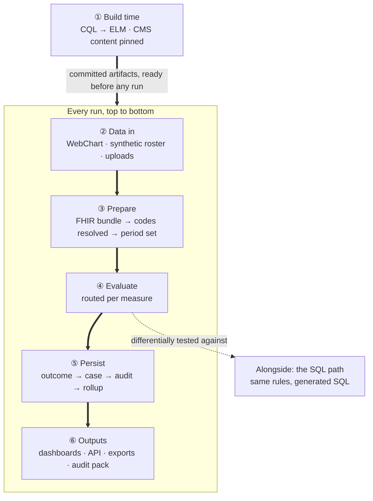

# The WorkWell guide

This is the maintained explanation of how WorkWell Measure Studio works — every mechanism, in
order, with a diagram per flow. It replaced the dated walkthrough documents in August 2026 and is
kept current: when a PR changes how something here works, the affected chapter changes in the same
PR. Volatile numbers live in [chapter 9](09-state-and-roadmap.md) with their measurement dates, so
the other chapters stay stable.

## Where to start

Read [chapter 1](01-big-picture.md) first — it is the map. After that the chapters are written to
be read in order, but each stands alone and cross-links where it leans on another. If you want one
specific question answered:

| You want to know | Read |
|---|---|
| What is this system, and what is borrowed from whom | [1. The big picture](01-big-picture.md) |
| What CQL is, and how measures get written — including from an OSHA regulation | [2. CQL and authoring](02-cql-and-authoring.md) |
| What the compiler does, what an AST is, what ELM is, what the nodes are | [3. The compiler and ELM](03-compiler-and-elm.md) |
| What "run a measure" actually does, and how CMS measures get in and get routed | [4. The engine and the router](04-engine-and-routing.md) |
| What FHIR is, how WebChart rows become it, what the standards documents are | [5. FHIR](05-fhir.md) |
| Where data comes from, and what is stored in which database | [6. Data and databases](06-data-and-databases.md) |
| Where SQL fits — all three places, including CQL→SQL | [7. SQL](07-sql-and-the-bridge.md) |
| What the two npm packages do and refuse to do | [8. The npm packages](08-packages.md) |
| Current state, the numbers, the gaps, what is next | [9. State and roadmap](09-state-and-roadmap.md) |
| The flows in time order — run, WebChart end-to-end, cases, authoring, standards loop, MCP | [10. Scenarios](10-scenarios.md) |

Three topics deliberately have no chapter of their own: **exports** split by audience (the standards
documents are in chapter 5, the product outputs in chapter 1, the import direction in chapter 6),
**where to see things in the app**, which appears as a short section at the end of most
chapters instead, and **MCP**, whose security boundary and tool posture live in
[`docs/MCP.md`](../MCP.md).

## The whole thing on one page

Worth reading last rather than first. The diagram is a one-line orientation per stage; the list
below it has the detail.

**The two arrow labels, in plain English:**

- *"committed artifacts, ready before any run"* — the line between build time and every run.
  Everything above it (compiled ELM trees, pinned CMS content) is produced once and checked into
  git; everything below it just reads those files. There is no compiling, translating, or
  downloading while a real person is being evaluated — see point 1 below. Committing rather than
  fetching-on-demand is deliberate: it keeps a JVM-only compiler and live pulls of licensed CMS
  terminology out of the request path, and it means a logic change shows up as an ordinary,
  reviewable PR diff instead of an invisible runtime recompile.
- *"differentially tested against"* — the SQL path is not part of a run's request path. It
  evaluates the same data independently, and its output is diffed against the engine's as a
  correctness check, not a second production path. That is also why it is dotted rather than
  solid — see item 7 below.

1. **① Build time** — happens once, output committed to git ([ch. 2](02-cql-and-authoring.md),
   [3](03-compiler-and-elm.md), [4](04-engine-and-routing.md)). Our 17 CQL libraries compile
   through the HL7 translator into committed ELM trees; CMS's content is vendored at a pinned
   commit, reduced and checksummed, gated on 410 of 410 test cases.
2. **② Data in** ([ch. 6](06-data-and-databases.md)) — WebChart, read over SQL and turned into
   FHIR; the synthetic roster (150 people); or a quality report uploaded from another system.
3. **③ Prepare** ([ch. 4](04-engine-and-routing.md), [5](05-fhir.md)) — one FHIR record per
   person, the code lists resolved, the compliance period decided.
4. **④ Evaluate**, routed per measure ([ch. 4](04-engine-and-routing.md)) — 12 of 14 measures run
   through our engine, walking the trees built at build time; 2 of 14 run the reference
   calculator directly against CMS's own files.
5. **⑤ Persist** ([ch. 6](06-data-and-databases.md)) — the outcome plus every rule value, a case
   keyed so it cannot duplicate, an audit row, and the monthly rollup figures.
6. **⑥ Outputs** ([ch. 1](01-big-picture.md), [5](05-fhir.md)) — the dashboard/worklist/Studio, a
   versioned API for MIE, spreadsheets, the FHIR result plus two quality-report formats, and the
   audit pack.
7. **Alongside — the SQL path** ([ch. 7](07-sql-and-the-bridge.md)) — the same rule description
   generates committed SQL that runs directly inside WebChart's database. It is dotted rather than
   solid because it is differentially tested against the engine but deliberately not wired into
   the application; whether it becomes solid is one of the two open decisions in
   [chapter 9](09-state-and-roadmap.md).

For the same flows drawn as *sequences* — who calls what, in what order — see
[chapter 10](10-scenarios.md).

## If you remember five things

1. **Nothing is compiled while somebody is being evaluated.** Our CQL becomes a tree at build time
   and the tree is committed. CMS's measures arrive already compiled and are reduced at build time
   too. When a real person is assessed there is no compiler, no download and no disk read in the
   path.
2. **Routing is per measure, not per system.** Twelve of fourteen run logic we wrote; two run
   CMS's published file untouched. Both return the same shape, and switching one over is a
   reviewed configuration change with a diff.
3. **The evidence is the product.** We keep the value of every rule the measure evaluated, not
   just the verdict. That is what lets a case screen say *why* somebody was flagged, and what an
   audit pack is assembled from.
4. **SQL never decides anything, in any of its three roles.** Postgres holds results. The shim
   turns WebChart rows into FHIR. The generated queries are checked against the engine. The engine
   is the only thing allowed to author a verdict.
5. **Almost every layer has an outside authority attached.** HL7's language and compiler, MITRE's
   engine, CMS's own test decks, the NLM's code lists, and an independent Java engine as a second
   opinion. That is what makes a claim about a real person checkable by somebody who does not
   trust us.

## Related reference documents

The guide explains; these specify. [`ARCHITECTURE.md`](../ARCHITECTURE.md) (module-level detail),
[`DATA_MODEL.md`](../DATA_MODEL.md) and [`DATA_MODEL_CONTRACTS.md`](../DATA_MODEL_CONTRACTS.md)
(schemas and contracts), [`COMPLIANCE_API.md`](../COMPLIANCE_API.md) and
[`PACKAGES.md`](../PACKAGES.md) (the two integrator contracts),
[`MEASURES.md`](../MEASURES.md) (the measure catalog in plain English),
[`STANDARDS_CONFORMANCE.md`](../STANDARDS_CONFORMANCE.md) (what we claim and refuse to claim),
[`ROADMAP_2026-08-04.md`](../ROADMAP_2026-08-04.md) (the approved plan), and
[`DECISIONS.md`](../DECISIONS.md) (the ADR record).
