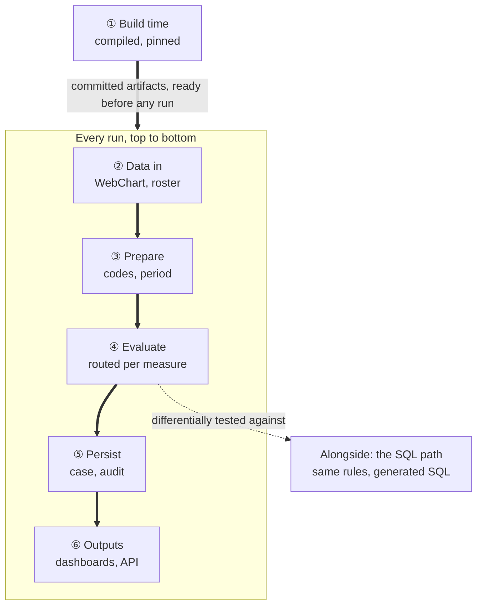

# The WorkWell guide

This is the maintained explanation of how WorkWell Measure Studio works — every mechanism, in
order, with a diagram per flow. It replaced the dated walkthrough documents in August 2026 and is
kept current: when a PR changes how something here works, the affected chapter changes in the same
PR. Volatile numbers live in [chapter 9](09-state-and-roadmap.md) with their measurement dates, so
the other chapters stay stable.

## Where to start

Read [chapter 1](01-big-picture.md) first — it is the map. After that the chapters are written to
be read in order, but each stands alone and cross-links where it leans on another. If you want one
specific question answered:

| You want to know | Read |
|---|---|
| What is this system, and what is borrowed from whom | [1. The big picture](01-big-picture.md) |
| What CQL is, and how measures get written — including from an OSHA regulation | [2. CQL and authoring](02-cql-and-authoring.md) |
| What the compiler does, what an AST is, what ELM is, what the nodes are | [3. The compiler and ELM](03-compiler-and-elm.md) |
| What "run a measure" actually does, and how CMS measures get in and get routed | [4. The engine and the router](04-engine-and-routing.md) |
| What FHIR is, how WebChart rows become it, what the standards documents are | [5. FHIR](05-fhir.md) |
| Where data comes from, and what is stored in which database | [6. Data and databases](06-data-and-databases.md) |
| Where SQL fits — all three places, including CQL→SQL | [7. SQL](07-sql-and-the-bridge.md) |
| What the two npm packages do and refuse to do | [8. The npm packages](08-packages.md) |
| Current state, the numbers, the gaps, what is next | [9. State and roadmap](09-state-and-roadmap.md) |
| The two integration flows — the scheduled population batch (built) and quality inside the encounter (target state) | [10. Scenarios](10-scenarios.md) |

Three topics deliberately have no chapter of their own: **exports** split by audience (the standards
documents are in chapter 5, the product outputs in chapter 1, the import direction in chapter 6),
**where to see things in the app**, which appears as a short section at the end of most
chapters instead, and **MCP**, whose security boundary and tool posture live in
[`docs/MCP.md`](../MCP.md).

## The whole thing on one page

Worth reading last rather than first. The diagram is a one-line orientation per stage; the list
below it has the detail.

**The two arrow labels, in plain English:**

- *"committed artifacts, ready before any run"* — the line between build time and every run.
  Everything above it (compiled ELM trees, pinned CMS content) is produced once and checked into
  git; everything below it just reads those files. There is no compiling, translating, or
  downloading while a real person is being evaluated — see point 1 below. Committing rather than
  fetching-on-demand is deliberate: it keeps a JVM-only compiler and live pulls of licensed CMS
  terminology out of the request path, and it means a logic change shows up as an ordinary,
  reviewable PR diff instead of an invisible runtime recompile.
- *"differentially tested against"* — the SQL path is not part of a run's request path. It
  evaluates the same data independently, and its output is diffed against the engine's as a
  correctness check, not a second production path. That is also why it is dotted rather than
  solid — see item 7 below.

1. **① Build time** — happens once, output committed to git ([ch. 2](02-cql-and-authoring.md),
   [3](03-compiler-and-elm.md), [4](04-engine-and-routing.md)). Our 17 CQL libraries compile
   through HL7's own JavaScript translator (no JVM anywhere) into committed ELM trees — 1.2 MB
   across those 17 libraries plus `FHIRHelpers`, bundled straight into the deployed code so the
   running worker never reads a measure from disk. CMS's content is vendored from a pinned commit,
   never `HEAD`: the ~16 MB bundle is trimmed to the Measure, Libraries and compiled ELM, its
   licensed code lists split into a gitignored sidecar whose SHA-256 is committed instead of the
   codes themselves, capped or absent value sets completed from VSAC at a pinned release, and the
   result graded against CMS's own test patients — **410 of 410 exact**, across all 8 vendored
   measures, before anything runs against a real person.
2. **② Data in** ([ch. 6](06-data-and-databases.md)) — four ways in, all producing the same
   shape. The synthetic roster: 150 employees generated from a fixed seed, carrying real LOINC/CPT
   codes so the official CMS logic has something genuine to match. WebChart, read two ways behind
   one seam — locally over SQL through the shim (56 patients, opt-in), or a live tenant over SMART
   Backend Services auth. And QRDA Category I import: someone else's patient-level quality
   documents, parsed by a hand-rolled CDA parser and mapped into the same FHIR shape — the path
   that proved the engine's answers against a third party's own published results, matching on all
   150 of 150 and 64 of 64 subjects tested.
3. **③ Prepare** ([ch. 4](04-engine-and-routing.md), [5](05-fhir.md)) — whatever the source, the
   engine only ever sees one shape: one FHIR bundle per person, holding the patient, their program
   enrollment, any documented exemption, and the clinical events the measure reads, stamped with
   the QI-Core profiles CMS's logic checks for. Code lists are resolved — a measure never says "a
   mammogram," it says "any code in this list of 92" — and the evaluation is assigned to the
   measure's own compliance cycle rather than today's date, the one decision that makes a nightly
   rerun update a case instead of duplicating it.
4. **④ Evaluate**, routed per measure ([ch. 4](04-engine-and-routing.md)) — 12 of 14 measures run
   through our own engine: the compiled tree, the resolved code lists and the bundle handed to
   `cql-execution`, about 68 ms per person, returning a value for every named rule plus the
   verdict. 2 of 14 run the CMS reference calculator directly against CMS's own unmodified file, in
   a quarantined package reached only by a lazy import, returning population membership instead —
   translated to our five verdicts using per-measure recorded semantics, because there is no safe
   default (a diabetes measure's numerator means poor control, the inverse of most).
5. **⑤ Persist** ([ch. 6](06-data-and-databases.md)) — one row per person per measure per run: the
   verdict plus the value of every rule evaluated, never just the conclusion. The case is upserted
   under a key that cannot duplicate — an operator's in-progress status is preserved, a
   human-closed case is never reopened by a machine. A re-confirmation that changed nothing writes
   no audit row; everything else writes an append-only `audit_events` row, no exceptions. Older
   open cycles for the same person and measure are closed as rolled over, the run finishes, and the
   monthly figures roll up last, once the run is already finished and structurally unable to fail
   it.
6. **⑥ Outputs** ([ch. 1](01-big-picture.md), [5](05-fhir.md)) — five kinds of output, eight
   artifacts. The dashboard, worklist and Studio for daily use. A versioned compliance API for
   MIE's own code — one person, one measure, one answer, a 404 rather than an empty success when
   no run covers the question. Spreadsheets for the compliance officer. The standards documents — a
   FHIR MeasureReport and both QRDA formats, all validating clean against their official rulers.
   And an audit pack that puts a run, its outcomes, cases, audit rows and uploaded documents into
   one artifact a surveyor can hold.
7. **Alongside — the SQL path** ([ch. 7](07-sql-and-the-bridge.md)) — a rule simple enough to have
   a second backend safely (a windowed-recency check: a day count, a due-soon threshold, a code
   list) generates both the CQL the engine runs and parameterized SQL from one shared description —
   never two independent implementations of the same measure. The SQL runs directly inside
   WebChart's own database and is differentially tested against the engine's own answer over the
   same patients: four measures, 56 patients, two evaluation dates, zero divergence today. It is
   drawn dotted because it is checked but deliberately not wired into the application; whether it
   becomes solid is one of the two open decisions in [chapter 9](09-state-and-roadmap.md).

For the same flows drawn as *sequences* — who calls what, in what order — see
[chapter 10](10-scenarios.md).

## If you remember five things

1. **Nothing is compiled while somebody is being evaluated.** Our CQL becomes a tree at build time
   and the tree is committed. CMS's measures arrive already compiled and are reduced at build time
   too. When a real person is assessed there is no compiler, no download and no disk read in the
   path.
2. **Routing is per measure, not per system.** Twelve of fourteen run logic we wrote; two run
   CMS's published file untouched. Both return the same shape, and switching one over is a
   reviewed configuration change with a diff.
3. **The evidence is the product.** We keep the value of every rule the measure evaluated, not
   just the verdict. That is what lets a case screen say *why* somebody was flagged, and what an
   audit pack is assembled from.
4. **SQL never decides anything, in any of its three roles.** Postgres holds results. The shim
   turns WebChart rows into FHIR. The generated queries are checked against the engine. The engine
   is the only thing allowed to author a verdict.
5. **Almost every layer has an outside authority attached.** HL7's language and compiler, MITRE's
   engine, CMS's own test decks, the NLM's code lists, and an independent Java engine as a second
   opinion. That is what makes a claim about a real person checkable by somebody who does not
   trust us.

## Related reference documents

The guide explains; these specify. [`ARCHITECTURE.md`](../ARCHITECTURE.md) (module-level detail),
[`DATA_MODEL.md`](../DATA_MODEL.md) and [`DATA_MODEL_CONTRACTS.md`](../DATA_MODEL_CONTRACTS.md)
(schemas and contracts), [`COMPLIANCE_API.md`](../COMPLIANCE_API.md), [`CDS_HOOKS.md`](../CDS_HOOKS.md) and
[`PACKAGES.md`](../PACKAGES.md) (the integrator contracts — one answer, one workflow surface, one library),
[`MEASURES.md`](../MEASURES.md) (the measure catalog in plain English),
[`STANDARDS_CONFORMANCE.md`](../STANDARDS_CONFORMANCE.md) (what we claim and refuse to claim),
[`ROADMAP_2026-08-04.md`](../ROADMAP_2026-08-04.md) (the approved plan), and
[`DECISIONS.md`](../DECISIONS.md) (the ADR record).
