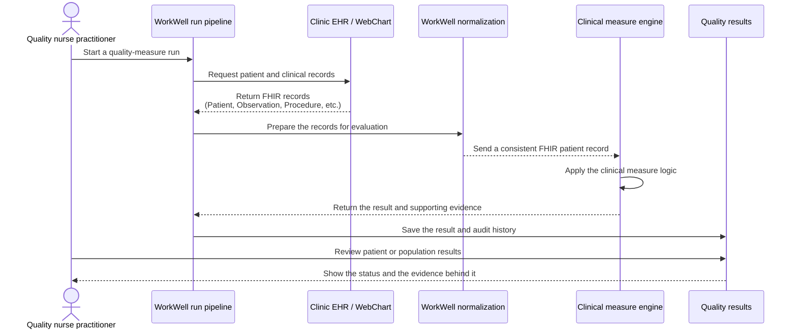

# From the clinic EHR to a quality result

**Audience:** nurses, quality leaders, clinical informaticists, and implementation teams.

This diagram shows how clinical records move from the clinic's EHR to a quality result. WorkWell calls the preparation handoff **normalization**.

The EHR provides the clinical records, normalization prepares them for evaluation, and the clinical measure engine determines the quality result.
